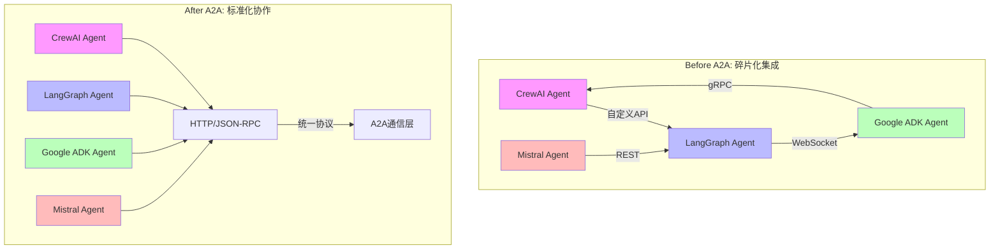
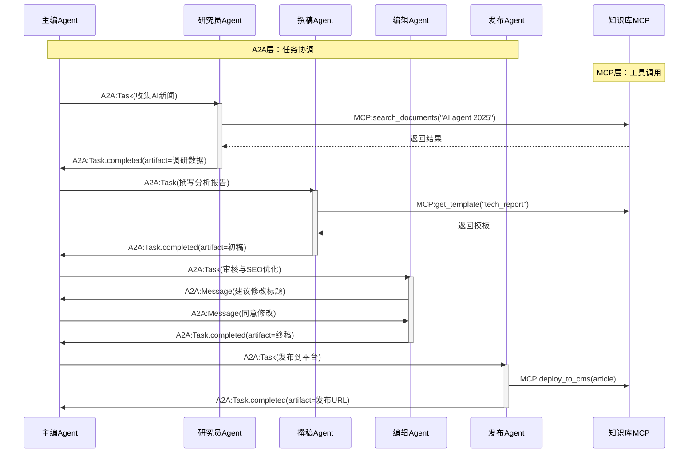
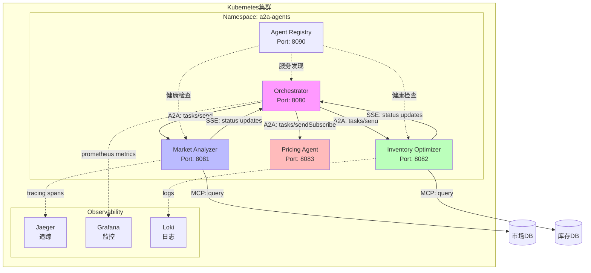
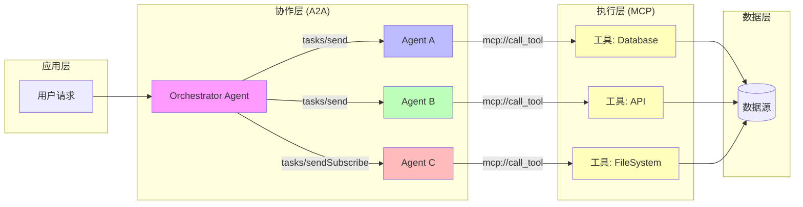

# Agent2Agent协议深度解析：构建智能体协作的"通用语言"

> 本文深入剖析Google主导的A2A（Agent2Agent）开放协议，探讨其如何打破智能体孤岛，实现跨框架、跨平台的智能体协作。我们将通过代码示例、架构对比和实际场景，全面理解这一多智能体时代的"协作标准"。

## 一、协议诞生的背景：为什么我们需要A2A？

在单体智能体向多智能体系统演进的今天，我们面临一个核心困境：**如何让不同框架、不同厂商、不同能力的AI智能体像人类团队一样协作？**

想象一个场景：你用CrewAI构建了一个数据分析Agent，同事用LangGraph开发了报告生成Agent，另一个团队用Google ADK创建了邮件推送Agent。当需要完成"分析数据→生成报告→发送邮件"的端到端流程时，传统方案需要：

- 为每个Agent编写定制的HTTP接口
- 处理各异的身份认证机制
- 实现不同的状态管理模式
- 维护脆弱的点对点集成

**A2A协议的出现，就像给智能体世界制定了"HTTP协议"**。它基于标准的HTTP(S)和JSON-RPC 2.0，让任何符合规范的智能体都能发现并通信，无需关心对方的内部实现。



## 二、核心概念解构：Agent Card与任务模型

### 2.1 Agent Card - 智能体的"数字身份证"

**Agent Card是A2A协议的灵魂**，它是一个JSON格式的元数据文件，描述了智能体的能力、端点和交互方式。就像RESTful API的OpenAPI规范，它让客户端无需人工文档就能自动发现和使用Agent。

```json
{
  "agentVersion": "1.0.0",
  "name": "WeatherResearchAgent",
  "description": "一个专门研究天气模式并提供数据分析的智能体",
  "url": "https://weather-agent.example.com",
  "provider": {
    "name": "气象数据分析团队",
    "organization": "Example Corp"
  },
  "version": "1.0.0",
  "capabilities": {
    "streaming": true,
    "pushNotifications": true,
    "stateTransitionHistory": true
  },
  "skills": [
    {
      "id": "analyze-weather-patterns",
      "name": "天气模式分析",
      "description": "分析历史天气数据，识别趋势和异常",
      "tags": ["weather", "analytics", "trend"],
      "examples": [
        "分析过去30天北京的气温变化趋势",
        "识别上海雨季的降雨模式"
      ]
    },
    {
      "id": "generate-forecast-report",
      "name": "生成预报报告",
      "description": "基于分析结果生成可视化预报报告",
      "tags": ["report", "forecast", "visualization"]
    }
  ],
  "authentication": {
    "type": "OAuth2",
    "scopes": ["read:weather", "write:reports"]
  },
  "defaultInputMode": "text",
  "defaultOutputMode": "text",
  "endpoints": {
    "a2a": "https://weather-agent.example.com/a2a"
  }
}
```

**关键字段解析**：
- `capabilities`: 声明支持的交互模式（流式、推送通知等）
- `skills`: 智能体的"技能清单"，每个技能有唯一ID和语义化描述
- `authentication`: 标准化的安全认证信息
- `endpoints.a2a`: A2A服务的入口地址

### 2.2 任务（Task）- 异步协作的基石

A2A将工作单元抽象为**Task**，它是一个有状态、可追踪的实体，经历以下生命周期：

```
任务状态机：
┌─────────────┐
│  submitted  │←─────┐
└──────┬──────┘      │
       │             │
       ▼             │
┌─────────────┐      │
│  processing │      │
└──────┬──────┘      │
       │             │
       ▼             │
┌─────────────┐      │
│   input-    │──────┘
│  required   │
└──────┬──────┘
       │
       ▼
┌─────────────┐
│  completed  │
│   /failed   │
└─────────────┘
```

每个Task包含：
- **唯一ID**：全局可追溯
- **状态**：实时反映执行阶段
- **Artifact（工件）**：实际输出内容，支持多部分、多模态
- **Message**：Agent间传递的上下文信息

## 三、A2A vs MCP：协作层与工具层的黄金组合

理解A2A的关键是**明确它与MCP（Model Context Protocol）的互补关系**。两者不是竞争，而是协同：

| 维度 | Agent2Agent (A2A) | Model Context Protocol (MCP) | 类比 |
|------|-------------------|------------------------------|------|
| **交互对象** | Agent ↔ Agent | Agent ↔ Tool/Resource | A2A像"团队协作"，MCP像"使用工具" |
| **协议层级** | 应用层/协作层 | 执行层/工具层 | A2A是"项目经理"，MCP是"技术工匠" |
| **通信模式** | 异步优先，支持长任务 | 同步请求-响应，实时性高 | A2A像"邮件协作"，MCP像"函数调用" |
| **核心目标** | 跨Agent互操作与任务编排 | 标准化工具和数据访问接口 | A2A解决"谁来做"，MCP解决"用什么做" |
| **状态管理** | 显式任务状态机 | 无状态调用 | A2A追踪端到端状态，MCP单次调用 |
| **典型场景** | 新闻编辑室多角色协作、多Agent联合决策 | 数据库查询、API调用、文件读写 | 见下方示例 |

### 协作示例：新闻编辑室的智能体工作流



**关键点**：A2A负责任务流转和角色协调，MCP提供具体工具能力。两者结合形成完整的"协作+执行"体系。

## 四、协议机制详解：从发现到任务完成

### 4.1 Agent发现机制

A2A支持三种发现模式，适应不同部署场景：

```python
# 1. Well-Known URI（适合公开服务）
# GET /.well-known/agent.json
# 标准路径，自动发现
import requests

def discover_agent(domain: str):
    well_known_url = f"https://{domain}/.well-known/agent.json"
    response = requests.get(well_known_url)
    return response.json()  # 返回Agent Card

# 2. 注册表模式（适合企业内网）
# 中央注册中心提供查询API
def find_agent_by_skill(registry_url: str, skill_tag: str):
    query = {
        "jsonrpc": "2.0",
        "method": "agents/find",
        "params": {"tags": [skill_tag]},
        "id": 1
    }
    response = requests.post(registry_url, json=query)
    return response.json()["result"]  # 返回匹配的Agent列表

# 3. 直接配置（适合私有系统）
# 配置文件中硬编码Agent信息
AGENT_CONFIG = {
    "data_analyzer": {
        "card": "path/to/analyzer_card.json",
        "endpoint": "https://internal-analyzer.corp/a2a"
    }
}
```

### 4.2 任务交互模式

A2A提供三种交互模式，满足不同场景需求：

#### 模式1：同步请求-响应（短任务）
```python
# 客户端：提交任务并等待完成
import jsonrpcclient

def analyze_data_sync(agent_endpoint: str, query: str):
    # tasks/send 方法：同步执行
    response = jsonrpcclient.request(
        agent_endpoint,
        "tasks/send",
        task={
            "id": "task-123",
            "input": {
                "parts": [{
                    "type": "text",
                    "text": query
                }]
            }
        }
    )
    
    # 立即返回最终结果或错误
    return response.data.result
```

#### 模式2：异步轮询（长任务）
```python
# 客户端：提交后通过tasks/get查询状态
def analyze_data_async(agent_endpoint: str, query: str):
    # 1. 提交任务
    task_id = "task-" + uuid.uuid4().hex
    jsonrpcclient.request(
        agent_endpoint,
        "tasks/send",
        task={
            "id": task_id,
            "metadata": {"priority": "high"},
            "input": {...}
        }
    )
    
    # 2. 轮询状态
    while True:
        status = jsonrpcclient.request(
            agent_endpoint,
            "tasks/get",
            taskId=task_id
        )
        
        if status.data.result.status in ["completed", "failed"]:
            return status.data.result.artifacts
        
        time.sleep(2)  # 等待2秒后重试
```

#### 模式3：流式订阅（实时反馈）
```python
# 客户端：通过Server-Sent Events接收增量更新
import requests

def analyze_data_stream(agent_endpoint: str, query: str):
    task_id = "task-" + uuid.uuid4().hex
    
    # 建立SSE连接
    response = requests.post(
        f"{agent_endpoint}/tasks/sendSubscribe",
        json={
            "jsonrpc": "2.0",
            "method": "tasks/sendSubscribe",
            "params": {
                "task": {
                    "id": task_id,
                    "input": {...}
                }
            },
            "id": 1
        },
        stream=True,
        headers={"Accept": "text/event-stream"}
    )
    
    # 实时处理流式Artifact
    for line in response.iter_lines():
        if line.startswith(b"data: "):
            event = json.loads(line[6:])
            if "artifact" in event:
                yield event["artifact"]  # 增量输出
```

### 4.3 消息与Artifact的多模态支持

A2A原生支持复杂的多模态内容传输：

```json
{
  "message": {
    "role": "agent",
    "parts": [
      {
        "type": "text",
        "text": "分析完成，以下是关键发现："
      },
      {
        "type": "file",
        "file": {
          "mimeType": "application/json",
          "name": "weather_data.json",
          "uri": "https://storage.example.com/data/task-123.json"
        }
      },
      {
        "type": "data",
        "data": {
          "mimeType": "image/png",
          "base64": "iVBORw0KGgoAAAANSUhEUgAAAAEAAAABCAYAAAAfFcSJAAAADUlEQVR42mNk+M9QDwADhgGAWjR9awAAAABJRU5ErkJggg=="
        }
      }
    ]
  },
  "artifacts": [
    {
      "name": "forecast_report.pdf",
      "parts": [...],
      "metadata": {"confidence": 0.92, "model_version": "gpt-4"}
    }
  ]
}
```

## 五、安全与生产实践

### 5.1 安全机制

A2A将安全性作为核心设计原则：

```yaml
# 生产环境安全配置示例
a2a_server:
  security:
    # 1. 双向TLS认证
    mtls:
      enabled: true
      client_cert_required: true
      ca_cert: "/certs/ca.pem"
    
    # 2. OAuth 2.0认证
    authentication:
      type: "OAuth2"
      issuer: "https://auth.corp.com"
      audience: "a2a-agents"
      scopes: ["a2a:execute", "a2a:read"]
    
    # 3. 能力级别的访问控制
    authorization:
      - skill: "analyze-weather-patterns"
        allowed_clients: ["research_team", "data_analysts"]
        rate_limit: 100/hour
      - skill: "generate-forecast-report"
        allowed_clients: ["editors", "publishers"]
        rate_limit: 10/hour
    
    # 4. 审计日志
    audit:
      enabled: true
      log_level: "INFO"
      sink: "https://security-logs.corp.com/a2a"
```

### 5.2 可观测性与调试

```python
# 使用A2A SDK的追踪功能
from google.a2a import A2AClient, TracingOptions

client = A2AClient(
    agent_endpoint="https://agent.example.com/a2a",
    tracing=TracingOptions(
        enable=True,
        tracer_name="my_app",
        export_to="https://jaeger.corp.com"
    )
)

# 每个A2A调用自动产生分布式追踪
task = client.tasks.send(
    task_id="task-debug-123",
    input={"text": "分析Q3销售数据"}
)

# 追踪包含：
# - 任务状态转换时间戳
# - 每个Artifact的生成耗时
# - 消息往返延迟
# - 错误堆栈和上下文
```

## 六、实战案例：构建可扩展的多Agent分析平台

### 场景：跨境电商的智能运营中心

假设我们要构建一个跨境电商智能运营系统，包含市场分析、库存优化、定价策略三个专业Agent：

```python
# 1. 定义市场分析Agent（基于CrewAI）
# market_analyzer/agent.py
from crewai import Agent
from google.a2a.server import A2AServer

class MarketAnalyzerAgent(Agent):
    def __init__(self):
        super().__init__(
            role='市场分析师',
            goal='分析市场趋势和竞品动态',
            backstory='10年电商数据分析经验'
        )
    
    def analyze_trend(self, category: str, region: str):
        # 业务逻辑...
        return {
            "growth_rate": 15.3,
            "top_competitors": ["BrandA", "BrandB"],
            "insights": ["移动端增长迅猛", "价格敏感度高"]
        }

# 包装为A2A服务
server = A2AServer(
    agent_card="market_analyzer_card.json",
    skills=[{
        "id": "analyze-market-trend",
        "handler": MarketAnalyzerAgent().analyze_trend
    }]
)
server.start(port=8081)

# 2. 定义库存优化Agent（基于LangGraph）
# inventory_optimizer/graph.py
from langgraph.graph import StateGraph
from google.a2a.server import A2AServer

def optimize_inventory(state):
    # 复杂的库存优化逻辑
    return {"recommendation": "增加SKU-123库存30%"}

graph = StateGraph(...)
graph.add_node("optimize", optimize_inventory)
compiled_graph = graph.compile()

# 暴露为A2A技能
server = A2AServer(
    agent_card="inventory_optimizer_card.json",
    skills=[{
        "id": "optimize-inventory",
        "handler": lambda input: compiled_graph.invoke(input)
    }]
)
server.start(port=8082)

# 3. 协调Agent（使用A2A客户端编排）
# orchestrator/main.py
from google.a2a.client import A2AClient

class ECommerceOrchestrator:
    def __init__(self):
        self.market_client = A2AClient("http://localhost:8081/a2a")
        self.inventory_client = A2AClient("http://localhost:8082/a2a")
    
    def run_weekly_analysis(self, category: str):
        # Step 1: 并行调用市场分析和库存分析
        market_task = self.market_client.tasks.send(
            task_id=f"market-{category}",
            input={"category": category, "region": "北美"}
        )
        
        inventory_task = self.inventory_client.tasks.send(
            task_id=f"inventory-{category}",
            input={"category": category}
        )
        
        # Step 2: 聚合结果并制定定价策略
        market_data = market_task.await_completion()
        inventory_data = inventory_task.await_completion()
        
        strategy = self.formulate_pricing(
            market_data["growth_rate"],
            inventory_data["recommendation"]
        )
        
        return strategy
    
    def formulate_pricing(self, growth_rate, inventory_rec):
        # 业务规则引擎
        if growth_rate > 10:
            return {"action": "premium_pricing", "discount": 0}
        else:
            return {"action": "aggressive_promotion", "discount": 0.15}

# 4. 动态发现与注册（生产环境）
# registry/service.py
from google.a2a.discovery import AgentRegistry

registry = AgentRegistry("https://registry.corp.com")

# Agent启动时自动注册
registry.register({
    "agent_id": "market-analyzer-v1",
    "agent_card_url": "http://analyzer:8081/.well-known/agent.json",
    "health_check_url": "http://analyzer:8081/health"
})

# 协调器动态发现可用Agent
available_agents = registry.find_skills(tags=["inventory", "optimization"])
# 返回: [{agent_id, endpoint, skills, load_average}]
```

**部署架构**：


## 七、性能优化与最佳实践

### 7.1 连接池与复用

```python
# 避免为每个请求创建新连接
from google.a2a.client import A2AClientPool

# 初始化时创建连接池
pool = A2AClientPool([
    "http://analyzer:8081/a2a",
    "http://optimizer:8082/a2a",
    "http://publisher:8083/a2a"
], max_connections=10)

# 复用连接
async def batch_process(categories: List[str]):
    tasks = [
        pool.get_client("analyzer").tasks.send(
            task_id=f"batch-{cat}",
            input={"category": cat}
        )
        for cat in categories
    ]
    return await asyncio.gather(*tasks)
```

### 7.2 智能重试与熔断

```python
from google.a2a.retry import ExponentialBackoff
from google.a2a.circuit_breaker import CircuitBreaker

circuit_breaker = CircuitBreaker(
    failure_threshold=5,
    recovery_timeout=60,
    expected_exception=("TimeoutError", "ConnectionError")
)

@circuit_breaker
def reliable_task_send(client, task):
    return ExponentialBackoff.retry(
        lambda: client.tasks.send(task),
        max_attempts=3,
        initial_delay=1.0
    )
```

### 7.3 资源限制与QoS

```json
{
  "task": {
    "id": "task-qos-123",
    "metadata": {
      "priority": "high",
      "timeoutMillis": 300000,
      "maxArtifacts": 10,
      "resourceConstraints": {
        "maxMemoryMB": 4096,
        "maxCPUCore": 2
      }
    }
  }
}
```

## 八、总结：A2A的价值与演进方向

Agent2Agent协议通过三个核心创新，解决了多智能体系统的根本性挑战：

1. **标准化协作界面**：基于HTTP和JSON-RPC，将异构Agent的通信复杂度从O(n²)降低到O(n)，每个Agent只需实现一次协议即可与生态内所有Agent互操作。

2. **异步任务抽象**：显式任务状态机+Artifact模型，使得长流程协作变得可管理、可观测、可恢复，支持真正的大规模分布式智能。

3. **能力发现机制**：Agent Card让系统从"硬编码集成"演进为"动态能力组合"，为构建自适应、自组织的Agent网络奠定基础。

### A2A与MCP的共生关系

两者构成现代AI系统的"双螺旋"架构：
- **A2A是"协作骨架"**：定义"谁做什么"、"如何协调"
- **MCP是"执行血肉"**：提供"用什么工具"、"如何访问数据"



### 面向开发者的行动建议

1. **立即开始**：访问[a2a-protocol.org](https://a2a-protocol.org/)获取官方SDK（Python/JS/Java/C#）
2. **渐进式采纳**：先将现有Agent暴露一个A2A端点，无需重构内部逻辑
3. **优先实现Agent Card**：这是融入生态的"敲门砖"
4. **关注混合架构**：新项目同时考虑A2A（协作）+MCP（工具）的设计
5. **生产化准备**：务必实现mTLS、OAuth和熔断机制

A2A协议标志着AI系统从"单打独斗"走向"团队协作"的转折点。随着Google、Salesforce、SAP等巨头的推动，它有望成为智能体时代的"TCP/IP"，为构建可扩展、可组合、可信的多智能体系统奠定坚实基础。作为开发者，现在正是参与这一生态、构建下一代AI应用的最佳时机。

---

**参考资料**
- [A2A官方规范](https://a2a-protocol.org/latest/specification/)
- [Google A2A GitHub](https://github.com/google/A2A)
- [MCP官方网站](https://modelcontextprotocol.io/)
- [Elastic A2A实践案例](https://www.elastic.co/search-labs/cn/blog/a2a-protocol-mcp-llm-agent-newsroom-elasticsearch)
