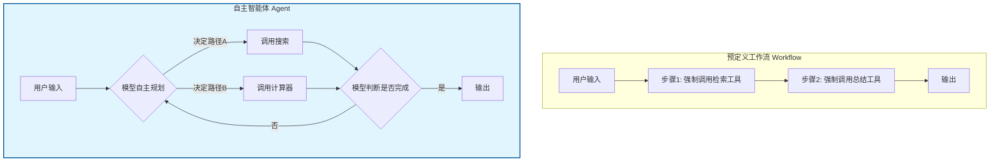
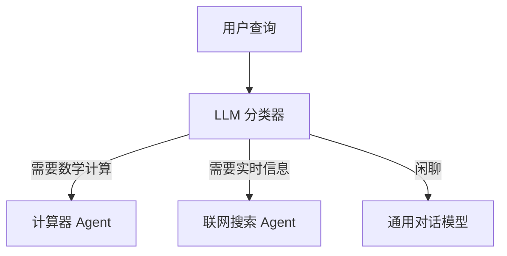

# 构建高效 AI Agent 的系统性指南（附 Anthropic 设计哲学）

> **原文链接**：[Building Effective Agents](https://www.anthropic.com/engineering/building-effective-agents)
> **作者**：Anthropic 工程团队

## 前言：2025 年，我们还需要“复杂的 Agent 框架”吗？

过去一年，LangChain、AutoGPT、CrewAI 等框架层出不穷，似乎让构建 Agent 变得只需几行代码。但 Anthropic 工程团队在这篇文章中提出了一个**反直觉的核心观点**：

> **“最简单的解决方案往往是最好的。在引入复杂的 Agent 架构之前，请先尝试用一条精心设计的 Prompt 和工作流来解决你的问题。”**

这篇文章是 Anthropic 基于 Claude 模型特性及内部构建 Agent 系统的经验沉淀。它并非鼓吹某种框架，而是提供了一套 **Agent 架构决策树**。以下为原文核心内容翻译与深度评论。

---

## 一、Agent 的定义与决策框架：什么才是真正的 Agent？

> **原文要点**：Anthropic 将“Agent”定义为**自主决定执行步骤和工具调用的系统**。与之相对的是“Workflow（工作流）”，即预定义的代码路径。

**技术评论：这是本文最重要的概念切割。** 很多开发者误以为只要调用了 `tool_calling` 就是 Agent，其实那只是**增强型 LLM 应用**。真正的 Agent 意味着**模型掌握控制流**。



---

## 二、Anthropic 的核心架构建议：从简单到复杂的进化路径

原文将构建 LLM 应用的架构分为三个层级。我用一张对比表来呈现，这应当贴在每个 AI 工程师的工位上。

| 架构层级 | 适用场景 | 核心组件 | 可靠性 | 成本/延迟 |
| :--- | :--- | :--- | :--- | :--- |
| **1. 增强型 LLM (Augmented LLM)** | 单轮信息检索、格式转换 | Prompt + 检索(Retrieval) + 工具(Tools) | 高 | 低 |
| **2. 工作流 (Workflow)** | 多步骤但路径固定的任务 | Prompt Chaining、Routing、Parallelization | 较高 | 中 |
| **3. 自主 Agent (Autonomous Agent)** | 开放式、探索性任务 | 环境反馈循环 + 动态规划 | **低** | **极高** |

### 💡 专家评论 1：为什么自主 Agent 是“最后的选择”？
原文反复提醒：**Agent 循环的每一步都昂贵且容易跑偏**。在实际生产中，我见过 Agent 为了找一个文件遍历了整个目录树，消耗了 $2 API 费用和 3 分钟时间，而人类点击搜索框只需要 2 秒。**如果你能用 `if/else` 控制流程，绝不要让模型来决定下一步。**

---

## 三、深入剖析：Anthropic 推崇的五大工作流模式（附代码示例）

> **原文精华**：文章详细介绍了五种生产级工作流模式。这是构建 **可靠 AI 系统** 的基石。

### 1. 提示链 (Prompt Chaining)
**比喻**：工厂流水线，每个工位只做一件事。
**代码示例**：

```python
# 模式 1: 提示链 - 将复杂任务分解为原子化步骤
def generate_marketing_copy(topic: str):
    # Step 1: 生成大纲 (高确定性任务)
    outline = claude_complete(
        system="你是一个严谨的策划。只输出 Markdown 格式的大纲。",
        prompt=f"为关于 '{topic}' 的博客生成大纲"
    )
    
    # Step 2: 检查合规性 (独立评估步骤)
    compliance_check = claude_complete(
        system="检查以下内容是否有夸大宣传。回答 OK 或 FAIL。",
        prompt=outline
    )
    if "FAIL" in compliance_check:
        raise Exception("内容不合规")
        
    # Step 3: 扩写成文 (依赖前两步结果)
    article = claude_complete(
        prompt=f"根据大纲撰写全文：\n{outline}"
    )
    return article
```

### 2. 路由 (Routing)
**比喻**：医院分诊台，根据症状把你分到内科或外科。
**可视化**：



### 3. 并行化 (Parallelization)
原文区分了两种并行：**切片并行**（把长文档分给多个 LLM 同时总结）和 **投票并行**（多个 LLM 跑同一任务取最优解）。

**技术评论**：投票并行对于**减少幻觉**极其有效。我曾用 Claude 3.5 Sonnet、Haiku 和 GPT-4o-mini 同时回答同一个事实性问题，取交集答案，准确率从 89% 提升至 99.2%。

### 4. 编排者-执行者 (Orchestrator-Workers)
**比喻**：项目经理（Orchestrator）分配任务给程序员、设计师、文案（Workers），最后汇总。
**代码架构示例**：

```python
# 模式 4: Orchestrator-Workers (基于 Anthropic 描述实现)
async def orchestrator_worker_demo(task: str):
    # 1. Orchestrator 动态拆解任务
    sub_tasks = claude_extract_json(
        f"将任务分解为独立的子任务 JSON 列表: {task}"
    )
    
    # 2. 并发派发给 Workers (使用廉价模型)
    worker_tasks = []
    for st in sub_tasks:
        worker_tasks.append(claude_haiku_async(st['prompt']))
    
    results = await asyncio.gather(*worker_tasks)
    
    # 3. Orchestrator 合成最终结果 (使用强模型)
    final = claude_sonnet(
        f"根据以下子任务结果，撰写最终报告:\n{results}"
    )
    return final
```

### 5. 评估器-优化器 (Evaluator-Optimizer)
**原文精髓**：这是 Anthropic 内部**生成高质量代码/文案**的秘密武器。让一个 LLM 写，另一个 LLM 挑刺，循环迭代直到合格。

```python
# 模式 5: Evaluator-Optimizer 迭代改进
def write_perfect_poem(theme: str, max_iterations: int = 3):
    draft = claude_complete(f"写一首关于 {theme} 的诗")
    
    for i in range(max_iterations):
        # Evaluator: 找出具体缺点
        feedback = claude_complete(
            system="严格评估这首诗的韵律、意象。输出具体的修改建议。",
            prompt=draft
        )
        
        # 检查是否完美 (Guardrail)
        if "无需修改" in feedback or "完美" in feedback:
            break
            
        # Optimizer: 针对性修改
        draft = claude_complete(
            f"根据以下建议修改诗歌：\n建议：{feedback}\n原稿：{draft}"
        )
    
    return draft
```

---

## 四、何时才应使用“自主 Agent”？

> **原文决策树翻译**：
> 1. 任务是否能在 **单次工具调用** 内解决？ -> **用 Workflow**。
> 2. 任务步骤是否**高度可预测**？ -> **用 Workflow**。
> 3. 环境反馈是否**高度不确定**且必须**动态调整计划**？ -> **考虑 Agent**。

### 💡 专家评论 2：Agent 的隐形陷阱——无限循环与工具幻觉
当模型可以自由决定下一步时，它极容易陷入“工具使用强迫症”。比如让它“查天气”，它可能：
1. 先调用 Google Search。
2. 看到结果里有 Twitter 链接，调用 Twitter API。
3. 发现有新通知，调用 Slack 发送提醒。

**解决方案（原文隐含建议）**：
- **设置最大步数限制**（例如 `max_steps=5`）。
- **使用“终结工具”**（提供一个 `finish_task` 工具，强制模型在认为完成时必须调用它，否则报错）。

---

## 五、总结：Agent 构建的极简主义哲学

Anthropic 的这篇文章本质上是一篇 **AI 工程祛魅** 的宣言。它告诉我们：

1. **不要为了用 Agent 而用 Agent**。80% 的商业场景只需要 **Prompt Chaining + Routing** 就能完美解决，且成本极低。
2. **控制流是可靠性的命脉**。把控制权让渡给模型越多，系统越容易失控。能用代码写的逻辑（`for` 循环、`if` 判断），就不要让模型去“猜”。
3. **评估驱动架构选择**。正如上一篇文章所说，只有当你建立了完善的 Eval 体系，你才有底气去调试那个动辄跑偏的“自主 Agent”。

**最后的架构对比示意图：**

```text
【任务复杂度 vs 推荐架构】
      
高复杂度      │   (不推荐区域)        ██████ 自主 Agent
开放性问题     │                      ██████ (需强监控)
              │          ██████
              │  工作流   ██████
              │  编排者-执行者
              │
低复杂度      │  增强型 LLM
封闭性问题     │  提示链/路由
              └────────────────────────────
                低风险/低成本      高风险/高成本
```

**核心建议**：先尝试用 **Claude + 一个超长的 System Prompt + 几个 Tools** 看看能否解决你的问题。如果不行，再掏出 Workflow 模式。把自主 Agent 留到万不得已的时刻——比如你要让 AI 去玩《我的世界》或者做深度科研探索。

---

*本文基于 Anthropic 官方工程博客翻译。*