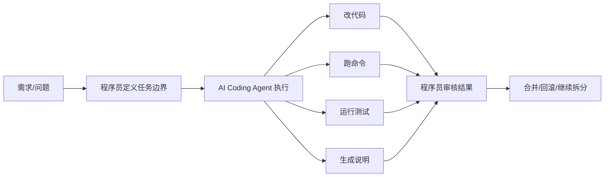
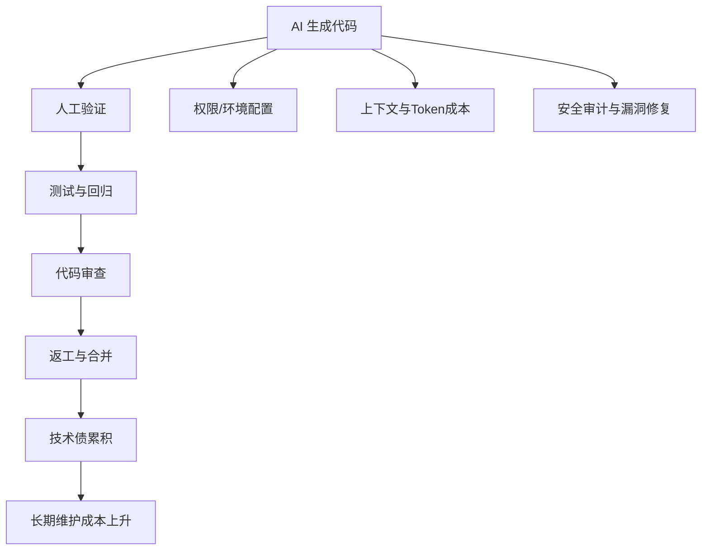
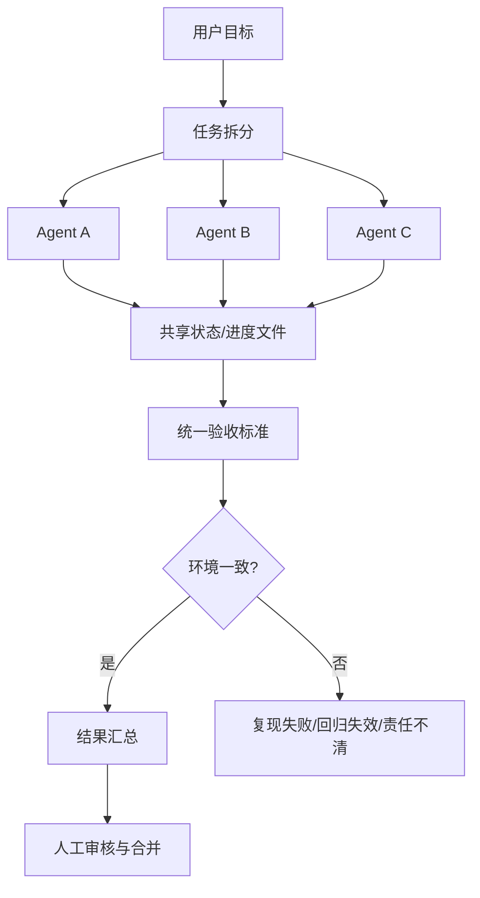

# AI Coding Agent 正在改变程序员角色：真正贵的不是写代码，真正难的也不是多 Agent

过去两年，大家聊 AI Coding，最容易聊偏的地方有两个。

第一个偏差，是把焦点全放在“它能不能多写几百行代码”。第二个偏差，是一看到多 Agent，就默认它代表更高级的生产力。

我现在越来越确定，这两个判断都已经落后了。

AI Coding Agent 真正带来的变化，不是把程序员从键盘前赶走，而是把程序员的主战场，从“亲手写每一行代码”，慢慢挪到“定义任务、管理上下文、审核结果、兜住风险”。同样地，AI 写代码最贵的部分，也早就不是 token 单价，而是验证、返工、审查、安全、环境和技术债。至于多 Agent，看起来像是把一个人变成一个团队，落地之后你才会发现，真正卡住它的往往不是模型智力，而是交接、状态、验收和权限边界这些很土、但很硬的工程问题。

如果把这三件事放在一起看，一个更现实的结论就出来了：AI Coding Agent 正在改变程序员角色，但它改变的方向，不是“程序员没用了”，而是“程序员越来越像一个工程编排者”。

---

## 程序员的工作，正在从“写代码”转向“定义工作”

很多人第一次接触 AI 编程工具时，心里默认的参照物还是代码补全。你写一半，模型补一半；你写函数签名，模型补函数体。这个阶段里，程序员当然还是主写手，AI 更像一个速度快一点的自动联想器。

但 2025 年之后，产品形态已经明显变了。

GitHub 在 2025 年 6 月专门写过一篇文章，明确区分了 Agent Mode 和 Coding Agent。前者像“同步协作的资深开发”，后者像“异步处理工单的队友”。这其实已经不是补全逻辑了，而是在重新定义分工：你负责拆任务、给边界、写清验收标准，Agent 去实现，最后你再 review。Google 在 2025 年 7 月发布 Gemini Code Assist Agent Mode 时，也把流程设计得很直白：Agent 会先给出修改计划，列出将修改哪些文件、为什么改，等你批准之后才执行。Anthropic 在 2025 年底写 long-running agents 的工程复盘时，干脆把这种分工彻底工程化了：feature list、progress log、git checkpoint、端到端验证，一个都不能少。

这几件事放在一起看，信号非常清楚：AI Coding Agent 不是在替程序员多敲几下键盘，它是在把程序员往三个新角色上推。

第一个角色，是任务定义者。你要先把模糊需求压成可执行任务，不然 Agent 不是误解你，就是把活做大。第二个角色，是上下文管理者。你得决定给它哪些文件、哪些日志、哪些依赖，哪些内容绝对不能碰。第三个角色，是结果审核者。你不再只审代码风格，而是要审“这次任务切分有没有问题”“它改的东西有没有越界”“它声称完成的部分到底有没有真的通过验证”。



你会发现，这张图里程序员并没有消失，但位置变了。

以前程序员更像主施工的人，现在越来越像现场总工。代码当然还是要懂，而且要懂得更深。只是你的核心价值，正在从“把代码写出来”，转向“把工作定义清楚、把上下文组织清楚、把产物验收清楚”。

---

## AI 写代码真正贵的，不是生成那一刻，而是后面的账

如果只看产品定价，AI Coding 很容易让人产生错觉。一个订阅看起来不贵，一次调用看起来更不贵，于是大家下意识会觉得：写代码这件事的边际成本正在快速下降。

这话只说对了一半。

AI 生成代码的表面成本确实在下降，但真实工程成本常常在后面排队。最近一年里，几组数据已经把这个问题说得很清楚。

Syntax.ai 在 2025 年 11 月给出过一个偏企业视角的测算：500 人团队表面上的 AI 编程工具许可费用大约是 11.4 万美元，但第一年实际总成本可能到 65.9 万美元。这里面最贵的不是 license，而是培训爬坡、调试负担、安全合规和工具泛滥。这个研究带有厂商立场，需要谨慎看待，但它指出的成本结构并不离谱。更值得注意的是，METR 的研究显示，经验丰富的开发者在某些真实开发任务里使用 AI 工具后，生产力反而下降了 19%，但主观感受却觉得自己提升了 20%。这意味着一个很危险的事实：AI Coding 的很多成本，不仅高，而且容易被低估。

再看代码质量和技术债。2026 年 3 月的一项大规模实证研究分析了 6275 个 GitHub 仓库、304362 个已验证的 AI 生成提交，发现这些提交一共引入了 484606 个问题，其中 24.2% 到仓库最新版本时仍然存活。GitClear 更早一点的数据也指出，AI 辅助编码流行之后，代码流失率明显上升，复制粘贴式代码增多。换句话说，AI 很擅长把“今天能跑”的代码交给你，但它并不天然关心三个月之后这个仓库是不是还好维护。

安全账更吓人。Veracode 2025 年的报告提到，主流 AI 代码生成工具产出的代码里，大约 45% 存在安全漏洞，Java 场景甚至超过 70%。而且这些漏洞并不只是低级失误，很多直接落在 OWASP 高危类别里。也就是说，AI 不只是可能写错代码，它还可能在你毫无察觉的情况下，把一笔更贵的安全账写进未来。

可以把这件事理解成下面这张成本链路图。



真正的问题不是“AI 会不会写”，而是“它写出来之后，谁来承担后续账单”。

这也是为什么我越来越不认同“AI 让程序员更轻松”这种简单说法。更准确的说法应该是：AI 把程序员从一部分编码劳动里解放出来，但同时把更多验证劳动、审核劳动、上下文劳动和兜底劳动推了回来。

为了避免把问题说得过满，也要补一句反例。GitHub 在 2024 年的随机对照实验里发现，使用 Copilot 的开发者在受控任务中，代码功能完整性、可读性和可维护性都有提升。这说明 AI 并不是天然拉低质量，尤其在边界清楚、任务短、环境干净的场景里，它确实能显著提效。

问题在于，真实工程环境很少像实验室那么干净。系统有遗留包袱，有历史约束，有跨模块依赖，有团队规范，有不完整文档。AI 一旦进到这种环境，省下来的往往只是前半段写代码的时间，后半段验证、返工、合并和修债的账，还是要人来买单。

---

## 多 Agent 的真正瓶颈，不是模型不够聪明，而是工程壳不够硬

很多人对多 Agent 的想象都很美：一个 Agent 读需求，一个 Agent 写后端，一个 Agent 补测试，一个 Agent 做 review，像多开了几个高级工程师。

这个画面当然诱人，但落地时最常见的情况不是“协作飞起”，而是“消息乱飞”。

OpenAI Agents SDK 把 handoff 这件事讲得很明白：交接不是喊另一个 Agent 来帮忙，而是一次显式委派，要定义交接描述、输入过滤、启停条件和目标边界。Anthropic 在 long-running agents 的文章里也给了相同结论：每轮只做一个 feature，留下进度日志、功能清单和 git checkpoint，否则上下文一长，后面的 Agent 接手就像夜班工程师接一个没写交接班记录的系统。

多 Agent 真正会卡住的地方，我觉得主要有五个。

第一，是任务切分。不是拆得越细越好，拆得太碎，交接成本会迅速吃掉收益。第二，是共享状态。聊天记录不是状态系统，公共账本才是。feature_list.json、进度文件、git 历史、统一的测试入口，这些工件比“大家都在群里说过了”可靠得多。第三，是上下文漂移。上一个 Agent 做过什么、为什么这么做、哪些地方不要再动，如果没有明确的交接协议，后一个 Agent 很容易从错误现场继续施工。第四，是验收标准。没有评分表的任务，看起来最忙，结果往往最假。第五，是权限和环境。Agent 一旦能跑命令、装依赖、改文件，问题就不再是“答错了”，而是“动坏了”。



这里最容易被忽略的一点，是“状态外部化”。

很多团队一开始做多 Agent，喜欢把上下文全塞进对话历史里，觉得只要历史够长，后面的 Agent 就能接上。问题在于，对话历史很快会变成信息垃圾场。真正能让多 Agent 稳定协作的，不是更长的聊天记录，而是更少但更硬的公共工件：任务清单、进度日志、环境脚本、测试基线、失败快照、统一 diff。

所以我现在对多 Agent 的判断也越来越简单：多 Agent 增加的，首先不是能力，而是协作成本。只有当你的任务足够长、足够复杂，而且你已经把交接、状态、验收和权限这些基础设施打牢了，多 Agent 才会开始给你正收益。否则，它只是把一个模型的混乱，变成多个模型的混乱。

---

## 以后更值钱的程序员，不一定是写得最快的人

把前面三部分合在一起看，程序员的价值坐标其实已经在变。

未来更值钱的程序员，不一定是那个手写代码最快的人，而更可能是下面这几类人。

第一类，是能把模糊需求压成清晰任务的人。第二类，是知道该给 Agent 什么上下文、不该给什么上下文的人。第三类，是能快速判断“这段代码虽然能跑，但以后会出大事”的人。第四类，是会设计工作流和验收标准的人。第五类，是知道什么时候该放权给 Agent，什么时候该把权限收回来的人。

换句话说，程序员的能力重心正在从“代码产出”向“工程判断”倾斜。

这不是说编码不重要了。恰恰相反，代码能力仍然是底座。你如果看不懂系统、看不懂 diff、看不出 bug、看不穿技术债，你就不可能当一个合格的编排者。只是现在，单纯把“写得快”当作程序员最核心的竞争力，已经越来越不够了。

一个更现实的工作流，可能会长这样：

```bash
# 1. 先把需求压成明确任务
cat issue.md

# 2. 让 Agent 先给计划，而不是直接改
agent "阅读 issue.md 和代码库，先输出修改计划、影响文件和验收标准"

# 3. 人类审核计划后再执行
agent "按计划修改代码，并运行最小测试集"

# 4. 人类只审核关键产物
git diff --stat
pytest tests/payment -q
reviewer "检查是否越界修改、是否引入技术债、是否缺少回归测试"
```

再往前走一步，如果你真要用多 Agent，我反而建议先把“单一真相源”写出来，而不是急着多开几个模型：

```json
{
  "task": "修复 payment timeout 并补齐回归测试",
  "done_when": [
    "timeout 根因被定位并修复",
    "payment 相关测试全部通过",
    "新增一条覆盖超时重试的回归测试",
    "diff 不修改无关模块"
  ],
  "shared_artifacts": [
    "feature_list.json",
    "progress.log",
    "git commits",
    "test report"
  ],
  "restricted_paths": [
    ".env",
    "infra/prod",
    "scripts/release"
  ]
}
```

这段 JSON 比再多开两个 Agent 更重要。因为它定义的是秩序，不是算力。

---

## 最后

我觉得现在讨论 AI Coding，最值得警惕的一种叙事，就是把它说成“程序员会不会被替代”。

这个问题太粗了，粗到把真正发生的变化都盖住了。

真正发生的变化是：程序员的工作重心正在迁移。AI Coding Agent 让“把代码写出来”这一步越来越便宜，但让“把任务定义清楚、把上下文交代清楚、把结果审核清楚、把风险兜住”这些事情越来越重要。于是，真正贵的部分不再只是生成代码，真正难的部分也不再只是让一个模型变聪明，而是让整个工程流程变得可交接、可验证、可回滚、可复现。

所以，AI Coding Agent 不是在消灭程序员，它是在抬高程序员的工程角色。

以后区分强弱程序员的标准，可能不会只是“谁写得更快”，而是“谁能让人和 Agent 一起稳定地把系统往前推”。

这件事，才刚刚开始。

---

## 参考资料

1. [The difference between coding agent and agent mode in GitHub Copilot](https://github.blog/developer-skills/github/less-todo-more-done-the-difference-between-coding-agent-and-agent-mode-in-github-copilot/)
2. [Introducing GitHub Copilot agent mode (preview)](https://code.visualstudio.com/blogs/2025/02/24/introducing-copilot-agent-mode)
3. [Gemini Code Assist’s June 2025 updates: Agent Mode arrives](https://blog.google/innovation-and-ai/technology/developers-tools/gemini-code-assist-updates-july-2025/)
4. [Effective harnesses for long-running agents](https://www.anthropic.com/engineering/effective-harnesses-for-long-running-agents)
5. [Building Effective AI Agents](https://www.anthropic.com/research/building-effective-agents)
6. [Debt Behind the AI Boom: A Large-Scale Empirical Study of AI-Generated Code in the Wild](https://arxiv.org/abs/2603.28592)
7. [The Hidden Costs of Coding With Generative AI](https://sloanreview.mit.edu/article/the-hidden-costs-of-coding-with-generative-ai/)
8. [Does GitHub Copilot improve code quality? Here’s what the data says](https://github.blog/news-insights/research/does-github-copilot-improve-code-quality-heres-what-the-data-says/)
9. [AI Coding Tools True Cost 2025: $659K vs $114K Budget](https://syntax.ai/blogs/ai-coding-tools-true-cost-roi-2025-hidden-expenses.html)
10. [AI代码生成器安全隐患突出，近半成输出含漏洞](https://psa.ngo/news/ai-code-generator-security-issues-veracode-2025/)
11. [Demystifying evals for AI agents](https://www.anthropic.com/engineering/demystifying-evals-for-ai-agents)
12. [Handoffs - OpenAI Agents SDK](https://openai.github.io/openai-agents-python/handoffs/)
13. [Guardrails - OpenAI Agents SDK](https://openai.github.io/openai-agents-python/guardrails/)
14. [SWE-bench Verified](https://www.swebench.com/verified.html)
15. [OpenHands: An Open Platform for AI Software Developers as Generalist Agents](https://openreview.net/forum?id=OJd3ayDDoF)
