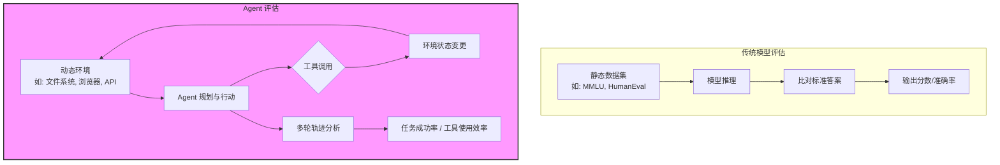

# 深度翻译与解析：揭秘 AI Agent 的评估体系（附 Anthropic 工程实践）

> **原文链接**：[Demystifying Evals for AI Agents](https://www.anthropic.com/engineering/demystifying-evals-for-ai-agents)
> **作者**：Anthropic 工程团队

## 前言：为什么 Agent 评估如此特殊？

在传统的软件开发中，我们有单元测试、集成测试，代码对不对跑一遍 `pytest` 就知道了。但在构建 **AI Agent**（智能体）时，我们面对的是一个**非确定性系统**。同样的输入，模型可能给出不同的工具调用路径；甚至因为环境延迟，结果天差地别。

Anthropic 作为 Claude 模型的创造者，在将 Claude 从“聊天助手”进化为“自主执行任务的 Agent”过程中，积累了一套独特的评估哲学。这篇文章的核心论点是：**Agent 评估不同于模型评估，它必须衡量“工具使用”与“环境交互”的闭环能力。**

以下为原文核心内容翻译，并结合我的实战经验穿插解读。

---

## 一、模型评估 vs. Agent 评估：两种范式的对决

> **原文要点**：模型评估（Model Eval）衡量的是知识压缩与生成质量，而 Agent 评估（Agent Eval）衡量的是**在真实、有状态的环境中完成多步骤任务的成功率**。

对于中高级开发者而言，理解这个区别是避免“线上事故”的前提。我用一张 Mermaid 流程图来可视化两者的差距：



### 💡 专家评论 1：为什么你不能直接用 LLM-as-Judge 评估 Agent？
原文提到了 Anthropic 大量使用 **LLM-as-Judge**，但在 Agent 场景下，**Judge 必须能看到环境状态**。举个例子：

- **错误做法**：只看 Agent 最后输出的文字“我已经帮你订好了机票”。
- **正确做法**：检查后台的 **SQLite 数据库** 里是否真的生成了订单记录，或者浏览器 DOM 里是否出现了“预订成功”的弹窗。

---

## 二、核心方法论：Agent 评估的三大支柱

原文将 Agent 评估拆解为三个关键维度，这也是 Anthropic 内部工程师日常迭代 Claude Agent 能力的依据。

| 评估维度 | Anthropic 的关注点 | 工程落地建议（我的评论） |
| :--- | :--- | :--- |
| **1. 任务成功率** | 端到端是否解决了用户的真实问题？ | 不要只看 `success=True`，要看 `success & 副作用最小化`。比如 Agent 通过删除系统文件“修复”了报错，这算成功吗？ |
| **2. 工具使用准确性** | 是否调用了正确的工具？参数是否正确？ | 这是最容易被截断指标。Anthropic 强调需要**奖励“短路径”**，避免 Agent 兜圈子。 |
| **3. 安全性与护栏** | 是否拒绝了不安全指令？是否泄露了 Prompt？ | 这一点是 Anthropic 的看家本领。在评估集中，必须有大量的“诱导越狱”和“错误工具滥用”的对抗样本。 |

---

## 三、深入代码：如何构建一个 Agent 评估套件

> **原文核心**：Anthropic 分享了他们使用的评估架构，强调 **Eval Harness（评估夹具）** 的重要性——需要像写集成测试一样写 Eval，能够 Mock 外部 API，能够重置环境。

以下是我根据文章描述，抽象出的一个**最小可行性 Agent Eval 框架配置示例（Python）**，这能让你直观感受 Anthropic 强调的“环境重置”是什么意思。

```python
# 文件名：agent_eval_harness.py
# 说明：模拟 Anthropic 文章中提到的评估夹具设计模式

import pytest
import asyncio
from pathlib import Path
import shutil
from typing import Dict, Any

class AgentEvalHarness:
    """
    评估夹具：负责为每一次独立的评估案例提供“干净”的环境
    对应原文： "We need to reset the world for each eval run"
    """
    def __init__(self, test_workspace: Path):
        self.workspace = test_workspace
        self.backup_state = None

    def setup(self):
        """环境初始化：创建一个隔离的沙盒"""
        if self.workspace.exists():
            shutil.rmtree(self.workspace)
        self.workspace.mkdir(parents=True)
        # 放置一些初始文件让 Agent 操作
        (self.workspace / "data.txt").write_text("Initial Content")
        
    def teardown(self):
        """清理环境"""
        shutil.rmtree(self.workspace, ignore_errors=True)

    def validate_side_effects(self, expected_files: list) -> bool:
        """验证 Agent 是否对环境产生了预期的改变（而不是只验证文字输出）"""
        actual_files = [f.name for f in self.workspace.iterdir()]
        return set(expected_files).issubset(set(actual_files))

# ===============================================
# 模拟一个 Agent 评估用例（以文件操作为例）
# ===============================================
class TestAgentFileOps:
    
    @pytest.mark.asyncio
    async def test_agent_rename_file_correctly(self):
        """
        测试案例：让 Agent 把 data.txt 重命名为 backup.txt
        原文精神：不仅要看它说"我完成了"，要看文件系统是否真的变了。
        """
        harness = AgentEvalHarness(Path("/tmp/agent_sandbox_test"))
        harness.setup()
        
        try:
            # 这里是调用你的 Agent 逻辑，假设返回轨迹
            trajectory = await run_agent_claude(
                prompt="请将工作区里的 data.txt 文件重命名为 backup.txt",
                tools=["bash_tool"],
                workspace=str(harness.workspace)
            )
            
            # 1. 评估工具调用轨迹 (原文关注点：是否调用了正确的工具)
            assert any(call['name'] == 'bash_tool' and 'mv' in call['args']['command'] 
                       for call in trajectory['tool_calls']), "Agent 没有尝试使用 mv 命令"
            
            # 2. 评估环境副作用 (原文核心：Environment Validation)
            assert (harness.workspace / "backup.txt").exists(), "文件没有被重命名！"
            assert not (harness.workspace / "data.txt").exists(), "旧文件依然存在！"
            
            # 3. 评估效率 (专家评论：统计 Step 数，避免 Agent 在简单任务上浪费 Token)
            assert len(trajectory['tool_calls']) <= 2, "Agent 步骤过多，效率低下"
            
        finally:
            harness.teardown()
```

### 💡 专家评论 2：Mock 外部世界的艺术
文章暗示了一个痛点——Agent 经常调用真实的 API（如 Slack、Gmail）。**绝对不要在 Eval 里调用真实 API**。Anthropic 的解法是构建 **Deterministic Simulator**（确定性模拟器）。你需要一个中间层：

```python
# 示例：替换 Agent 的工具绑定
if EVAL_MODE:
    agent.tools["slack_send"] = MockSlackSend(always_return={"ok": True})
else:
    agent.tools["slack_send"] = RealSlackSend()
```

---

## 四、Anthropic 的实战经验：如何管理 Eval 的复杂度

原文后半部分提到了几个高阶概念，我将其提炼并加入了自己的理解：

### 1. 轨迹的自动分级 (Auto-Grading Trajectories)
原文提到他们使用 **Claude 本身来给 Claude Agent 打分**（LLM-as-Judge）。
**风险提示**：原文虽然没说，但实际工程中这里有**自我偏好偏差**（Self-bias）。如果你用 Claude 3.5 Sonnet 给 Claude Agent 打分，往往会比用 Gemini 打分高。**建议**：引入不同厂商的模型做交叉验证 Judge。

### 2. 回归测试与版本漂移
> **原文原意**：模型每次更新（例如从 Claude 3.5 Sonnet v1 到 v2），Agent 的**隐含行为**会变。昨天还能稳定调用的 JSON 格式，今天可能多了一个逗号导致解析失败。

**文本示意图：模型更新带来的隐式指令漂移**

```
[Claude 3.5 Sonnet v1] 
输入："列出文件" 
输出：```json {"action": "list"}```

[Claude 3.5 Sonnet v2] 
输入："列出文件" 
输出：Based on the user's request, I will now list the files.
      ```json {"action": "list_files"}``` 
      ^^^ 多了一句话 + 工具名变了！
Agent Eval 必须能捕获这种漂移导致的工具调用失败。
```

### 3. 评估集的生命周期管理
Anthropic 强调：**好的评估集是会“贬值”的**。如果一个评估案例被 Agent 完美解决了 1000 次，它就不再提供有效信号（除了确保不退化）。你需要一个 **Eval Garden**：

- **核心回归集**：必须 100% 通过的硬骨头。
- **探索集**：用户最新上报的 Bad Case，验证通过后移入核心集。
- **对抗集**：专门用来测安全护栏的恶意 Prompt。

---

## 五、总结：对中高级开发者的启示

Anthropic 的这篇文章揭示了一个残酷的真相：**构建一个能跑通的 Agent Demo 只需要一下午，但让它能在生产中稳定运行（99.9% 成功率）需要半年，而这半年全在写 Eval。**

| 维度 | 传统应用测试 | AI Agent 评估 |
| :--- | :--- | :--- |
| **确定性** | 确定，相同输入必然相同输出 | **不确定**，受温度和采样策略影响 |
| **验证对象** | 代码逻辑 | 代码逻辑 **+ 模型推理边界 + 环境状态** |
| **断言方式** | `assertEqual(expected, actual)` | **概率性断言** 或 **轨迹模式匹配** |
| **维护成本** | 低，随业务线性增长 | **高**，需要随模型版本迭代不断微调 Judge Prompt |

**我的最终建议**：
不要试图用一套 Prompt 调出一个完美的 Agent。**你的护城河不是 Prompt，而是那一套能精确衡量 Agent 是否“犯傻”的评估体系。** 正如 Anthropic 在这篇文章中所暗示的——只有量化了不确定性，才能工程化地管理不确定性。

---

*本文基于 Anthropic 官方工程博客翻译并加入了个人技术评论，旨在帮助中文开发者跨越“Agent 工程落地”的鸿沟。*