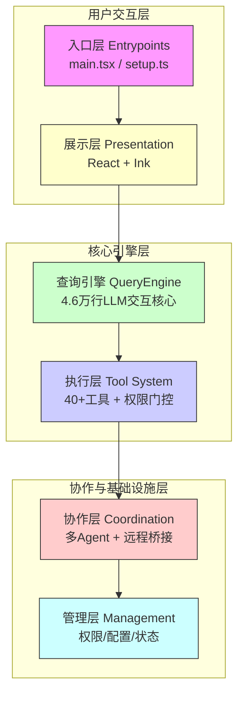
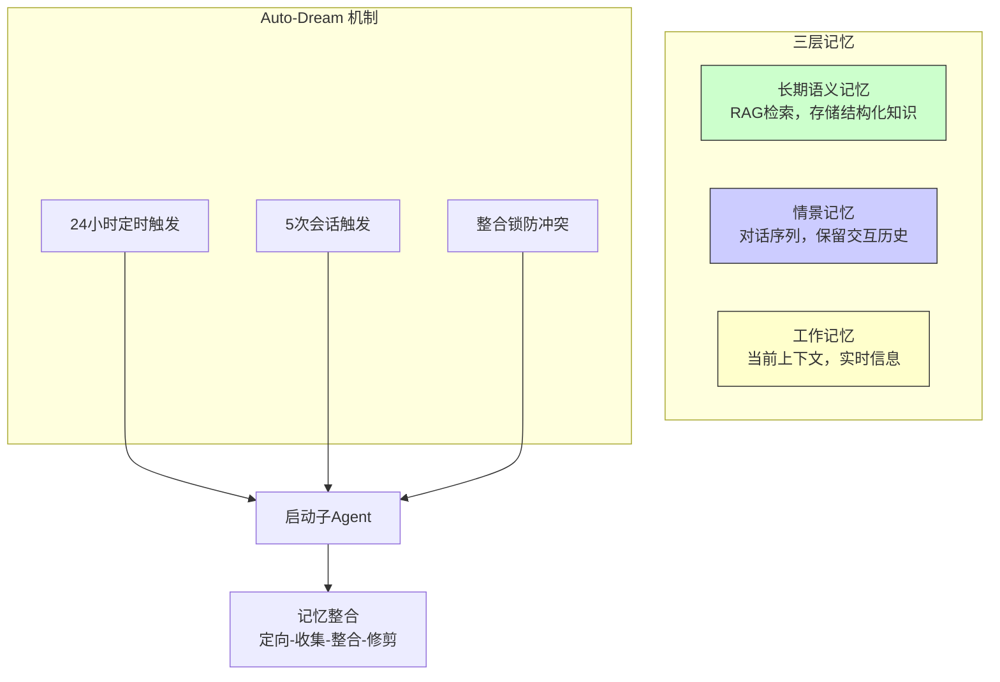

# 从 Claude Code 源码泄露看 AI Coding：乌龙事件背后的技术真相

> 2026 年 3 月 31 日，Anthropic 因一个 59.8MB 的 source map 文件泄露了 Claude Code 的全部 51 万行 TypeScript 源码。这不是一次黑客攻击，而是 CI/CD 流水线上一个 `.npmignore` 缺失的连锁反应。本文将深度解析这次泄露事件中暴露的技术细节、架构设计和工程教训。

---

## 1. 事件还原：一次“教科书级”的低级失误

2026 年 3 月 31 日，Anthropic 向 npm 发布了 Claude Code v2.1.88 版本。安全研究员 Chaofan Shou 在检查 npm 包时发现，其中包含一个 59.8MB 的 `cli.js.map` 文件——这个本应只存在于开发环境的 source map，被完整打包进了生产发布物中。

### 1.1 为什么会泄露？

Source map 是前端/Node.js 开发中的标准调试工具，它记录了压缩/编译后代码与原始源码的映射关系。在 Claude Code 的构建流程中，Bun 默认会生成 source map，而构建流水线既没有在 `.npmignore` 中排除 `*.map` 文件，也没有在 Bun 配置中关闭 source map 生成，最终导致 59.8MB 的 source map 文件被发布到 npm registry。

更致命的是，这个 source map 的 `sourcesContent` 字段直接嵌入了完整的原始 TypeScript 源码，指向 Anthropic Cloudflare R2 存储桶上的一个无鉴权 zip 文件。任何人都可以通过这个文件一键还原全部源代码。

### 1.2 这不是第一次

讽刺的是，这已经是 Claude Code 第二次因同样原因翻车。2025 年 2 月 24 日，Claude Code 发布当天，开发者 Dave Shoemaker 就在同一 npm 包中发现了 1800 万字符的内联 source map，Anthropic 在 2 小时内撤回。13 个月后，同样的错误再次发生——`.npmignore` 中依然缺少 `*.map` 一行。

> 两个内部安全机制（Undercover Mode 和 ANTI_DISTILLATION）专门设计来防止泄密，而构建流水线却自己把门打开了。

---

## 2. 泄露内容概览

| 维度 | 数据 |
| :--- | :--- |
| 源文件数量 | 1,906 个 |
| 代码行数 | 约 51.2 万行 TypeScript |
| 运行时 | Bun（非 Node.js） |
| UI 框架 | React + Ink（终端 React 渲染器） |
| 核心引擎 | QueryEngine.ts（单文件 46,000 行） |
| 命令数量 | 103 个命令文件 + 87+ 斜杠命令 |
| 工具模块 | 约 40 个独立工具模块 |
| Hooks 系统 | 85+ hooks |
| Feature Flags | 35 个编译时特性标志 + 120+ 隐藏环境变量 |
| 未发布功能 | BUDDY（电子宠物）、KAIROS（常驻智能体）、ULTRAPLAN（深度规划）等 |

泄露代码包含了约 40 个独立工具模块、103 个命令文件、146 个 UI 组件、85+ 个 hooks，以及一个单文件长达 4.6 万行的 `QueryEngine.ts`——承担了与 AI 模型交互的全部核心逻辑。

---

## 3. 六层架构深度拆解

Claude Code 并非外界普遍认为的“LLM API 套壳工具”，而是一套完整的六层分层系统。



### 3.1 入口层：多端统一路由

入口层负责统一路由 CLI、桌面端及 SDK，实现多端输入标准化。泄露代码显示，Claude Code 的入口设计采用了**插件化架构**，支持第三方扩展，同时维护了多端一致的交互体验。

### 3.2 引擎层：4.6 万行的 QueryEngine

这是整个系统的心脏。`QueryEngine.ts` 单文件长达 4.6 万行，负责 LLM API 调用、流式输出、工具调用循环、上下文窗口管理以及重试与恢复逻辑。其核心是一个精心编排的 Agent 循环，每次模型返回结果后，引擎会解析工具调用、执行工具、将结果写回上下文，然后继续下一轮。

### 3.3 工具系统：模块化的原子能力

泄露代码中包含约 40 个独立工具模块，每个工具都遵循统一的接口设计：输入验证（通过 Zod 或类似 schema 库）、权限检查（调用权限门控系统）、执行逻辑（核心功能实现）、输出格式化（标准化的返回结构）。这种设计确保了工具的可扩展性和安全性——新增工具只需实现标准接口，无需修改核心引擎。

### 3.4 命令系统：丰富的交互方式

Claude Code 内置了 87+ 个斜杠命令，按功能分为会话管理（`/clear`、`/history`、`/continue`）、文件操作（`/edit`、`/cat`、`/ls`）、代码搜索（`/grep`、`/find`）、Git 操作（`/commit`、`/push`、`/branch`）等类别。

### 3.5 权限与安全：六级验证系统

泄露代码揭示了一套严格的六级权限验证系统，用于精细控制 AI 对用户环境的每一次操作。每一次工具调用——无论是执行 Shell 命令、读写文件还是网络请求——都必须经过至少两层验证。此外，执行阶段内建超过 25 个 bash 安全验证器，展现了相当成熟的安全工程设计。然而，正如安全公司 Straiker 的分析所指出的：产品内部安全机制再完善，CI/CD 管线的疏漏仍可能导致灾难性后果。

---

## 4. 三层记忆系统与“梦境”机制

泄露代码还揭示了一套精密的记忆架构。



三层记忆各司其职：**长期语义记忆**负责 RAG 检索和结构化知识存储；**情景记忆**记录完整对话序列；**工作记忆**管理当前会话的实时上下文。

更令人惊艳的是 **Auto-Dream（自动做梦）** 机制——系统内置了一个后台进程，每 24 小时或每 5 次会话后自动触发。它会启动子代理进行记忆整合：先**定向**收集需要处理的记忆，然后**收集**相关信息，接着**整合**零散信息为结构化知识，最后**修剪**冗余内容。整个过程由“三重门控触发”（24 小时 + 5 次会话 + 整合锁）精确控制，防止冲突。

> 这好比 AI 在你睡觉时默默整理笔记，把零散的碎片记忆固化成长久可用的知识。每次会话开始时，AI 不再是“一张白纸”，而是带着之前的积累继续工作。

---

## 5. 未发布功能：泄露的路线图

代码中暴露了大量被 feature flag 关闭的隐藏模块，揭示了 Anthropic 的产品路线图。

| 功能 | 代号 | 状态 | 核心特点 |
| :--- | :--- | :--- | :--- |
| **常驻智能体** | KAIROS | 开发中 | 跨会话持久化记忆，夜间“梦境”整合，支持 GitHub Webhook 订阅与 Cron 定时刷新，主动启动任务 |
| **深度规划** | ULTRAPLAN | 实验性 | 使用 Opus 4.6 模型支持最长 30 分钟的云端远程规划，适合复杂项目的全流程设计 |
| **电子宠物** | BUDDY | 愚人节彩蛋 | Tamagotchi 风格 ASCII 宠物，18 种物种+6 种稀有度+5 个属性，由用户 ID 唯一生成“灵魂描述” |
| **卧底模式** | Undercover Mode | 已实现 | 向开源代码提交 PR 时自动移除 AI 归属痕迹，伪装成人类贡献者 |
| **多 Agent 协调** | Multi-Agent | 开发中 | 支持同时启动多个独立 Agent 实例分工协作，处理并行任务效率提升 3 倍以上 |
| **守护进程模式** | Daemon Mode | 开发中 | 会话管理器，像系统服务一样在后台运行 Claude 会话 |
| **跨会话进程通信** | UDS Inbox | 开发中 | 同一机器上多个 Claude 会话可互相发送消息 |
| **反蒸馏机制** | ANTI_DISTILLATION | 已实现 | 向 API 响应中注入虚假工具定义，防止竞争对手通过 API 流量训练自己的模型 |

BUDDY 系统尤为特别：它是一个完整的类似 Tamagotchi 的 AI 伴侣系统，拥有确定性抽卡机制、物种稀有度等级（从普通到闪光）、程序化生成的属性，以及由 Claude 在首次孵化时撰写的“灵魂描述”。每个用户的宠物由账户 ID 唯一生成，全世界独一份。物种包含鸭子、龙、蝾螈、水豚、蘑菇、幽灵等 18 种，稀有度从普通到 1% 的传说级不等，还有帽子、闪亮变种等装饰物。每只宠物有五个属性：调试、耐心、混乱、智慧、吐槽。从代码中的时间戳来看，Buddy 原计划 4 月 1 日首次亮相，大概率是一个愚人节彩蛋。

KAIROS 是一个持久化助手模式，让 Claude 拥有跨会话的长期记忆。当你不使用 Claude Code 的时候，KAIROS 会自动执行四阶段记忆整合：定向、收集、整合、修剪。代码中甚至详细说明了午夜边界处理机制，确保梦境进程不会出错。

---

## 6. 启动性能优化：19 行代码的艺术

泄露代码中还有一个容易被忽略的细节——启动优化。为了让 AI 编程助手在启动时“无感”，Claude Code 的前 19 行代码采用了并行预取优化：

```typescript
// main.tsx 第 1-19 行
const tasks = Promise.all([
  profileCheckpoint(),      // 性能分析
  startMdmRawRead(),        // MDM 配置读取
  startKeychainPrefetch()   // OAuth/API 钥匙串预取
])
```

三个任务同时执行，用 `Promise.all` 等待所有任务完成，大大减少了串行操作的时间消耗。这种优化减少了约 135ms 的启动时间——对于 CLI 工具来说，每一毫秒都在影响“第一印象”。

---

## 7. 双重安全危机：泄露之后的连锁反应

源码泄露本身已经足够严重，但更危险的是紧随其后的二次攻击。

### 7.1 伪造仓库与窃密软件

Zscaler 的研究团队发现，攻击者在 GitHub 上建立了标题为“Leaked Claude Code”的伪造仓库，以“解锁版”为诱饵散布恶意软件。仓库的 releases 区段包含名为“Claude Code – Leaked Source Code (.7z)”的恶意压缩包，内含一个 Rust 编写的投放器，一旦执行便会部署 **Vidar v18.7 信息窃取程序**（专门窃取浏览器密码、加密货币钱包、会话 cookie 等敏感数据）和 **GhostSocks 网络流量代理工具**（用于代理网络流量以隐匿攻击者行踪）。该仓库经过 SEO 优化，在 Google 搜索“leaked Claude Code”时一度出现在结果前列。

### 7.2 DMCA 误伤

Anthropic 在事发后启动了 DMCA（数字千年版权法）投诉工具以删除泄露代码的副本。结果变成了“无差别攻击”，直接导致数千个合法、无辜的 GitHub 开发者仓库被连坐误删。这引发了开发者社区的强烈不满——本应是受害者的一方，反而成了“加害者”。

---

## 8. 行业反思：AI 公司的工程成熟度

这次事件暴露了一个深层矛盾：**AI 公司在模型能力上达到世界顶尖水平，却在最基础的工程安全流程上连续犯错**。

### 8.1 “技术先进、工程落后”的结构性矛盾

这不是孤立的意外。3 月 26 日，Anthropic 刚刚因第三方 CMS 配置错误泄露了近 3000 份内部文件，其中包含未发布模型“Claude Mythos”的相关细节。一周之内两次安全事件，根源都是“配置失误”。

### 8.2 从 Claude Code 看 AI Coding 的未来方向

尽管泄露事件令人遗憾，但 Claude Code 的架构设计代表了 AI Coding 工具的未来方向：**不是单纯的“套壳”工具，而是围绕模型构建完整运行时系统**。其六层架构、三层记忆、权限门控、多 Agent 协调等设计理念，为整个行业提供了宝贵的技术参考。

安全公司 Straiker 的工程师 Jun Zhou 指出：Claude Code 在执行阶段内建了超过 25 个 bash 安全验证器，展现出相当成熟的安全工程设计，但发布流程却缺乏基本的检查机制。这恰恰说明了 AI 公司在工程实践中需要补齐的短板——产品安全能力 ≠ 工程流程安全能力。

### 8.3 对开发者的启示

1. **构建流水线审查**：在 CI/CD 流程中加入自动化检查，确保 `.npmignore` 或打包配置正确排除了调试文件。
2. **Source Map 管理策略**：生产环境的 source map 应上传到内部监控系统（如 Sentry），而非打包进发布物。
3. **零信任架构**：不要假设任何公开的“泄露代码”仓库是安全的。Zscaler 建议：不要下载、fork、构建或运行任何声称是“泄露 Claude Code”的 GitHub 仓库中的代码，仅通过官方渠道验证。

---

## 9. 总结

Claude Code 源码泄露事件，表面上看是一个低级失误，但其背后暴露的问题值得整个 AI 行业深思：

1. **工程成熟度是 AI 落地的真正门槛**：模型能力再强，没有成熟的工程体系支撑，就无法转化为可靠的产品。
2. **安全是系统工程**：产品内部的安全机制再完善，CI/CD 管线的疏漏仍可能造成灾难性后果。需要从代码提交到发布的全链路安全审查。
3. **透明度是最好的防御**：Anthropic 在事发后 2 小时内确认了事件并采取行动，但其后续的 DMCA 误伤行为损害了社区信任。危机应对需要兼顾速度和精准度。

对于开发者而言，这次泄露也是一次难得的“白捡”学习机会——它让我们得以一窥顶级 AI 编程工具的完整架构。Claude Code 不是 API 套壳，而是一套六层分层、三层记忆、权限门控、多 Agent 协调的工业级复杂系统。更重要的是，它揭示了 AI Coding 的未来方向：**Harness Engineering**——围绕模型构建的完整运行时系统，才是真正的技术壁垒。

---

**延伸阅读**：
- [Zscaler ThreatLabz: Claude Code Leak Analysis](https://www.zscaler.com/blogs/security-research/anthropic-claude-code-leak)
- [Layer5: The Claude Code Source Leak](https://layer5.io/blog/cloud-native-ecosystem/claude-code-source-leak)
- [网易智能：Claude Code 翻车深度解析](https://m.163.com/news/article/KPCQ2PG500097U7T.html)

*（本文基于 2026 年 4 月的公开资料整理，事件仍在发酵中，请以官方公告为准。）*