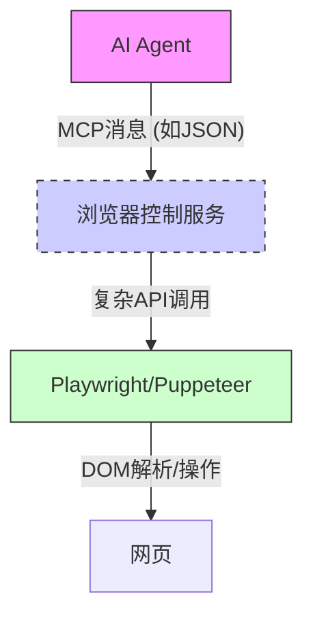
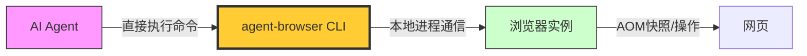
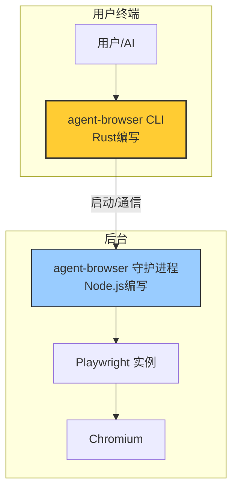

# 看了 agent-browser，我终于明白 CLI 为什么能取代 MCP 了

在之前的讨论中，我们从理论层面分析了 CLI 范式对比 MCP（消息控制协议）的优越性。但直到我深入研究了 Vercel 最新开源的 **[agent-browser](https://github.com/vercel-labs/agent-browser)**，才真正从实践层面理解了这场革命的必然性。

agent-browser 是一个专为 AI Agent 设计的浏览器自动化 CLI。它不仅仅是一个工具，更是一个完美的范例，展示了如何用 CLI 的简洁哲学，解决过去需要复杂协议栈才能处理的难题。本文将带你深度拆解 agent-browser 的设计，看看它如何用 CLI 的方式，实现了比传统 MCP 方案更优雅、更高效的浏览器交互。

---

## 1. 传统浏览器自动化的“MCP式”困境

在 agent-browser 出现之前，让 AI 操作浏览器通常走的是“MCP 风格”的路线：一个中央控制器（如 AI 大脑）通过消息协议，指挥一个复杂的浏览器驱动服务。



这种模式的问题，和 MCP 如出一辙：
1.  **上下文爆炸**：服务需要把整个 DOM 树（动辄几万行 HTML）塞进消息里发给 AI，导致 Token 费用飙升，AI 也容易在冗余信息中“迷失”。
2.  **交互复杂**：AI 需要学习如何用复杂的 CSS 选择器或 XPath 定位元素，消息格式和指令集都极其臃肿。
3.  **架构笨重**：浏览器驱动服务本身就是一个需要独立部署、维护的中间件，增加了系统的复杂度和延迟。

这就像用一套繁复的邮政系统来控制一个机器人，每一步都需要写一封信、封装、投递、等待回信。

---

## 2. agent-browser 的 CLI 哲学：给 AI 装上一双“极简的手”

agent-browser 彻底推翻了这种模式。它将浏览器自动化能力，直接封装为一系列极致简单的 CLI 命令。



这个转变带来的改变是根本性的：

*   **无中间件**：不再需要常驻的浏览器控制服务。CLI 命令可以直接启动、控制和销毁浏览器实例。
*   **上下文极小化**：它不传整个 DOM，而是传一个极度精简的“交互式快照”。
*   **指令原子化**：每个命令只做一件事：`open`、`snapshot`、`fill`、`click`。AI 的学习和使用成本几乎为零。

接下来，我们深入其核心设计，看看它是如何实现这些飞跃的。

---

## 3. 核心设计揭秘：CLI 如何实现“降维打击”

### 3.1 从 DOM 到 AOM：减少 93% 上下文的魔法

这是 agent-browser 最惊艳的设计。传统方法会这样将网页发给 AI：

**传统 DOM 片段（极其冗长）：**
```html
<div class="flex items-center p-4 bg-white shadow-md rounded-lg">
  <input type="text" id="search-input" class="... (几十个class) ..." placeholder="搜索..." value="">
  <button onclick="submitSearch()" class="... (几十个class) ..." style="background-color: blue;">
    <span class="icon">🔍</span>
    搜索
  </button>
</div>
```

而 agent-browser 通过 `snapshot -i --json` 命令，提供给 AI 的是这样的信息：

```json
[
  {"ref": "e1", "role": "textbox", "name": "搜索...", "value": ""},
  {"ref": "e2", "role": "button", "name": "搜索"}
]
```

**奥秘在于 AOM（无障碍对象模型）**。它只提取浏览器为辅助技术（如读屏软件）准备的标准语义信息。这相当于：

> **比喻**：传统方式是把整栋楼的建筑蓝图（DOM）给 AI，里面有承重墙、水电管线。而 AOM 只给了 AI 一张楼层导览图：“这里是门（按钮），那里是窗户（输入框）。” AI 不再需要理解复杂的结构，只需知道“哪里可交互”即可。

### 3.2 Ref 系统：为 CLI 交互设计的“身份证”

有了精简的 AOM 快照，AI 如何精确操作元素？agent-browser 引入了 **Ref 系统**。每个可交互元素在快照中都有一个唯一且短暂的引用 ID（如 `e1`、`e2`）。

AI 的操作指令因此变得异常简洁：

```bash
# AI 不再需要写复杂的选择器，只需要说（执行命令）：
agent-browser fill @e1 "我的搜索关键词"
agent-browser click @e2
```

这种设计完美契合了 CLI 的哲学：
*   **确定性**：`@e1` 是当前页面状态下元素的直接指针，消除了 AI 因选择器写错而导致误操作的可能。
*   **无状态**：Ref 只在当前快照上下文中有效，无需跨请求维护复杂的状态。

### 3.3 混合架构：Rust 的 CLI 前端 + Node.js 的守护进程

为了兼顾 CLI 的快速响应和浏览器操作的性能，agent-browser 采用了精妙的双进程架构：



*   **前端 CLI (Rust)**：负责解析命令、参数，并快速派发。Rust 保证了启动的瞬时性和低资源占用。当你执行 `agent-browser open` 时，这个 CLI 进程会迅速启动，检查并连接（或启动）一个后台守护进程。
*   **后端守护进程 (Node.js)**：这是一个常驻进程，内部运行着 Playwright 来真正控制浏览器。浏览器实例、页面对象都在这里管理，避免了每次执行命令都要冷启动浏览器的巨大开销。

这种“**快 CLI + 常驻服务**”的模式，既保留了 CLI “即用即走”的交互体验，又通过后台进程解决了性能瓶颈，是工具设计的典范。

### 3.4 组合性：Shell 脚本即工作流

CLI 最大的优势之一——**可组合性**，在 agent-browser 上体现得淋漓尽致。你可以用简单的 Shell 脚本，组合出一个完整的 AI 自动化工作流：

```bash
#!/bin/bash
# 一个由 agent-browser 命令组合的搜索工作流

# 1. 打开搜索页
agent-browser open "https://github.com/search" --headed

# 2. 获取快照，提取输入框的 ref（假设 AI 解析后得知是 @e5）
#    这里为了演示，我们直接用稳健的选择器方式（也支持）
agent-browser fill "[aria-label='Search GitHub']" "vercel/agent-browser"

# 3. 提交搜索
agent-browser press "Enter"

# 4. 等待结果加载，截图保存
sleep 3
agent-browser screenshot "result.png"

echo "工作流完成！"
```

这种能力意味着，**任何能用 Shell 脚本表达的逻辑，都能无缝集成 agent-browser**。它不再是封闭系统中的一个组件，而是整个 Unix 哲学生态的一部分。

---

## 4. CLI vs. MCP：在 agent-browser 上的完美印证

结合 agent-browser 的具体设计，我们再来对比 CLI 和 MCP 的差异，就一目了然了：

| 维度 | 传统 MCP 方案（假如实现浏览器操作） | CLI 方案（agent-browser） |
| :--- | :--- | :--- |
| **交互协议** | 定义复杂的 JSON-RPC 消息，包含 `action`、`selector`、`params` 等字段。 | 简单的命令行参数和标准输入/输出。如 `click @e1`。 |
| **上下文传递** | 将整个 DOM 或复杂的页面状态封装成消息体传递，冗余巨大。 | 通过 `snapshot` 命令按需获取极小化的 AOM 快照（JSON）。 |
| **状态管理** | 服务端需要维护浏览器会话状态，客户端需在消息中携带 session ID。 | 无状态命令。后台守护进程管理状态，CLI 命令通过进程通信与之交互，对用户透明。 |
| **可调试性** | 需要模拟 MCP 客户端发送消息，或查看服务端日志，链路长。 | 直接在终端运行命令，可加 `--headed` 看浏览器界面，符合开发者直觉。 |
| **生态系统** | 局限于特定的 MCP 框架和语言。 | 可以融入任何 Shell 脚本、Makefile、CI/CD 流程，与现有工具链无缝衔接。 |

---

## 5. 总结：从 agent-browser 看到的未来

agent-browser 的价值远不止于一个浏览器自动化工具。它是一个完美的缩影，展示了 **CLI 是如何以一种更底层、更本质的方式，解决了过去需要复杂协议才能解决的问题**。

它证明了：
1.  **极致精简的交互界面（CLI）**，可以比复杂的消息协议（MCP）更高效地与复杂系统（如浏览器）交互。
2.  **善用现有标准和语义（AOM）**，远比发明新的私有协议更聪明。
3.  **工具的设计应遵循 Unix 哲学**：做一件事，并做到极致，然后通过组合释放无限可能。

对于中高级开发者而言，agent-browser 不仅是一个趁手的工具，更是一种思维模式的启发：**在构建 AI Agent 或任何系统集成时，不妨先停下来想一想——这个问题，能否用更简单、更符合直觉的 CLI 方式来解决？**

未来，我相信会有越来越多像 agent-browser 这样的 CLI 工具出现，它们将共同构成 AI 操作物理世界和数字世界的“工具箱”。而 MCP 这类复杂的消息协议，或许将退居幕后，只在真正需要异构系统长连接通信的特定场景下才会被想起。**简单，往往是最强大的设计。**