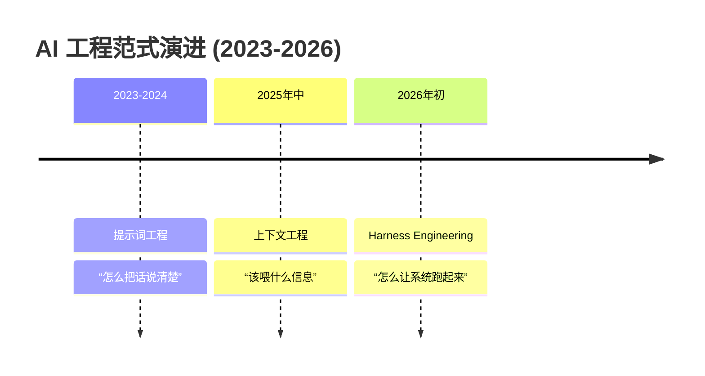
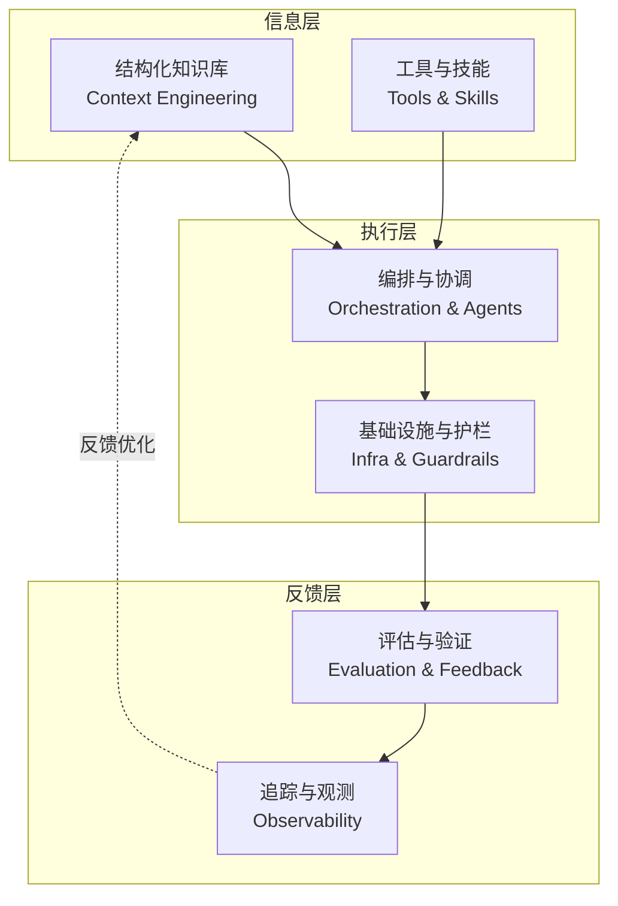

# Harness Engineering 深度解析：AI Agent 时代的“马具”工程

> 当模型不再是瓶颈，工程师的职责正从“调教模型”转变为“驾驭系统”。本文将深入拆解 Harness Engineering 的核心理念、架构设计与一线实践，探讨它如何成为 AI Agent 从“实验室玩具”迈向“生产级工具”的关键一跃。

---

## 1. 引言：为什么我们需要 Harness？

2026 年初，硅谷 AI 工程圈悄然完成了一次认知跃迁。HashiCorp 联合创始人 Mitchell Hashimoto 在 2 月 5 日的博客中，将一种新兴的工程实践正式命名为 **Harness Engineering**[reference:0]。六天后，OpenAI 发布内部实验报告，标题直接引用了这个词。一个月内，Harness Engineering 从一篇博客变成了开发者社区的高频词[reference:1]。

这场热潮并非空穴来风。LangChain 的编码 Agent 在 Terminal Bench 2.0 基准测试中，**仅通过优化外部环境，排名从全球第 30 位跃升至第 5 位，得分从 52.8% 飙升至 66.5%，底层模型一个参数都没改**[reference:2]。OpenAI 则用更直观的方式验证了这个范式：**5 名工程师，5 个月，零行手写代码，通过 Codex Agent 协作交付了超过 100 万行代码的生产级软件产品**[reference:3]。

这些数字揭示了一个根本性的转向：在 AI Agent 编码领域，决定结果好坏的最大变量，往往不是模型有多聪明，而是**模型被放在了一个什么样的环境里**[reference:4]。这个“环境”，就是 Harness。

## 2. 核心定义：Harness Engineering 是什么？

### 2.1 一个“马具”的比喻

最直观的理解 Harness 的方式，是把它想象成一匹马和它的马具。

- **大模型**：是一匹拥有惊人体能、在荒野中横冲直撞的野马[reference:5]。
- **Harness**：是那套精良的马具——缰绳、马鞍、马镫[reference:6]。
- **骑手**：是你（业务场景）和你的商业目标[reference:7]。

野马跑得快，但无法预期它在赛场上的表现。只有套上马具，才能将它转化为能上赛场、稳定输出的赛马[reference:8]。套上马具的过程，就是 **Harness Engineering**。

### 2.2 从“调教”到“驾驭”的范式跃迁

Harness Engineering 被定义为：**为 AI 智能体构建一套完整的运行环境、约束规则与反馈闭环，让 AI 可靠、自主地完成复杂工作**[reference:9]。

这个定义的革命性在于“重心转移”。此前 AI 工程的重心在“模型本身”——如何通过提示词或上下文“调教”它。Harness Engineering 将重心转移到了“系统层面”，强调 **不只看模型还要看环境**，通过让驾驭模型的系统环境更专业来提升效果[reference:10]。

百度云相关业务负责人云周精准地指出了这一范式的价值：“**没有模型能支持所有 Agent 场景**。通用模型的泛化性在复杂的真实环境中是有限的，而 Harness Engineering 正是弥补这一鸿沟的关键路径”[reference:11]。

### 2.3 范式演进时间线

这场演进的驱动力非常清晰：当 AI 从单轮 Chatbot 进化为需要处理复杂任务的 Agent 时，单条指令的局限性暴露无遗[reference:12]。随后业界意识到，焦点应从“写好一条指令”扩展到“设计一个动态系统来组装上下文”[reference:13]。最终，当 Agent 被投入真实生产环境，人们发现光有好的上下文依然不够——它需要一个更外层的 Harness 来保持稳定[reference:14]。

在 Harness Engineering 框架下，工程师的角色发生了根本性转变：**从“码农”变成“系统设计师和环境构建者”**。核心哲学是 OpenAI 总结的一句话：**“Humans steer, agents execute”**（人类掌舵，代理执行）[reference:15]。

## 3. Harness 的核心架构

LangChain CEO Harrison Chase 将 Harness 定义为“一个执行环境，让 AI 模型能够循环运行、调用工具并执行长时间任务”[reference:16]。

综合 OpenAI、Anthropic、LangChain 等一线团队的实践，一个完整的 Harness 架构通常包含以下核心模块：

### 3.1 结构化知识库：从“百科全书”到“索引地图”

OpenAI 在百万行代码实验中的第一个教训，是关于 `AGENTS.md` 的。最初它是一本“成百上千页的巨型说明书”，但大量的说明指令反而带来了负面效果[reference:17]。问题的根源在于三个方面：**上下文稀缺**（巨大的指令文件挤占了任务和代码的空间）、**指令失效**（过多规则导致模型模式匹配而非真正理解）、**知识腐烂**（手册缺乏有效维护机制，变成陈旧规则的坟场）[reference:18]。

解决方案是彻底的范式重构。工程师将 `AGENTS.md` 从“百科全书”变成“索引地图”，大小压缩到仅 100 行左右[reference:19]。核心原则是 **“渐进式披露”**：Agent 从一个极小的切入点开始，按需、分层地获取信息，而不是一次性淹没在信息海洋中。

### 3.2 架构约束：用代码强制执行规则

当文档不够用时，OpenAI 的工程师将规则升级为可执行工具。他们将 **依赖层级强制规定**，要求 Agent 严格按 Types → Config → Repo → Service → Runtime → UI 的顺序流转，通过 **自定义 Linter 和结构测试** 自动验证合规性，防止模块化分层被破坏[reference:20]。

### 3.3 工具与技能：做减法比做加法更重要

OpenAI Codex 开源负责人 Michael Bolin 认为，Harness 应该“尽可能小”，而模型应“尽可能强”[reference:21]。Codex 的设计理念是**减少工具数量、避免过度干预**，让模型在更接近真实计算环境的空间中自主探索解决路径[reference:22]。

这种思路的核心逻辑是：**Agent 的强大不在于工具箱里有多少工具，而在于它能否用几把“万能扳手”解决复杂问题**。

### 3.4 编排与协调：Agent 的团队协作

Anthropic 为长时间运行的编码 Agent 设计了一套**双智能体架构**[reference:23]：
- **初始化 Agent**：首次运行时设置环境，编写功能需求列表，创建进度文件和初始 Git 提交。
- **编码 Agent**：后续会话中，每次只处理一个功能，通过阅读进度文件和 Git 日志了解现状，完成后提交描述性信息。

LangChain 则将这一思想扩展为更复杂的 **Deep Agents** 架构，具备规划能力、虚拟文件系统、上下文管理、代码执行，以及将任务委托给**子 Agent** 的能力。子 Agent 拥有不同的工具和配置，可并行工作，其上下文与主 Agent 隔离，避免了相互污染[reference:24]。

### 3.5 可观测性：让黑盒变透明

OpenAI 将 Chrome DevTools 协议接入 Agent 运行时，创建处理 DOM 快照、截图和导航的技能，同时提供本地可观测性堆栈，使 Agent 能够使用 LogQL 和 PromQL 查询日志、指标和追踪记录[reference:25]。

LangChain 则更进一步，创建了一个 **“Trace Analyzer”Agent Skill**。该技能从 LangSmith 获取实验追踪数据，生成并行错误分析 Agent，由主 Agent 汇总发现并提出改进建议。这形成了一个**可重复的错误分析和 Harness 优化循环**[reference:26]。

## 4. 一线实战案例深度剖析

### 4.1 OpenAI 的百万行代码实验

2025 年 8 月下旬，OpenAI 的一个工程团队开始了一项激进的实验：构建并交付一款软件产品的内部 Beta 版，其中**没有一行代码是人工编写的**[reference:27]。

**关键转折**：实验早期进展远低于预期。这并非因为 Codex 不具备相应能力，而是因为**环境的规范不够明确**：智能体缺乏实现高级目标所需的工具、抽象层和内部结构[reference:28]。

**工程对策**：工程师从“编写代码”转向了“设计系统、架构约束和反馈回路”[reference:29]。他们创造了一套“错误即信号”的文化：**“当 Agent 遇到困难时，我们将其视为一个信号：识别缺少什么——工具、护栏、文档——然后将其反馈到仓库中”**[reference:30]。

### 4.2 LangChain 的“Harness 杠杆效应”

LangChain 在 Terminal Bench 2.0 上的跃升是 Harness 价值的极致体现：仅通过优化 Agent 运行的 Harness，不改变模型权重，排名从三十名开外直接冲进前五[reference:31]。

LangChain 的改进集中在三方面[reference:32]：
1. **系统提示词**：清晰定义 Agent 的角色、目标和行为边界。
2. **工具选择**：精选最必要的工具，避免工具泛滥导致的决策困难。
3. **中间件**：在模型和工具调用周围插入钩子，用于日志记录、错误处理和性能监控。

### 4.3 Anthropic 的双智能体接力协作

Anthropic 面对的核心挑战是 Agent 在跨越多上下文窗口的长任务中的“失忆”问题[reference:33]。

**失败模式一**：试图“一口气做完所有事”。模型在实现过程中耗尽上下文，在功能只实现了一半、文档也没写清楚的状态下就被迫结束会话[reference:34]。

**失败模式二**：过早“宣布完成”。后续 Agent 实例“看一眼”当前项目状态，觉得“好像差不多了”就直接结束[reference:35]。

他们的解法是引入 **“工作制度”**——让 Agent 像轮班工程师一样接力协作[reference:36]。每个 Agent 实例在工作结束前必须留下**结构化的进度文件**，使下一个轮班的 Agent 能够无缝接续。这本质上是通过 **将状态外置** 来突破上下文窗口的限制。

## 5. Harness 的设计原则与最佳实践

### 5.1 信息层：渐进式披露与结构化知识

- **原则 1：渐进式披露**。核心入口（如 `AGENTS.md`）只放最关键的目录和索引，具体细节按需分层加载。
- **原则 2：结构化知识**。文档应是机器可读的。将架构约束、依赖规则编码为 Linter 规则，而非自然语言描述。

### 5.2 执行层：最小工具集与状态外置

- **原则 3：最小工具集**。给 Agent 的工具越少越精越好。每增加一个工具，Agent 的决策空间就会指数级扩大。
- **原则 4：状态外置**。将 Agent 的工作进度、中间结果、决策记录等状态**存储在 Harness 中**，而非依赖模型的上下文窗口。

### 5.3 反馈层：自动化验证与可观测性

- **原则 5：自动化反馈回路**。当 Agent 生成代码后，应自动运行测试、验证、Linter 检查，将结果作为下一轮迭代的输入。
- **原则 6：让 Agent“看见”自己**。提供足够的可观测性数据，让 Agent 能够诊断自己的错误。

## 6. Harness Engineering 的争议与未来

Harness Engineering 并非没有争议。当全行业都在拼命“做厚”Harness 时，Anthropic 已经开始在“做薄”的方向上探索。

### 6.1 “做厚”与“做薄”之争

- **“做厚”派（Anthropic 为代表）**：认为只要框架足够健壮，就能撑起最复杂的任务。他们的 Harness 包括结构化交接、多智能体协作（规划器、生成器、评估器分工）、上下文重置机制等严密组件[reference:37]。

- **“做薄”派（OpenAI Codex 为代表）**：认为 Harness 应“尽可能小”，模型应“尽可能强”。减少人为规则对模型的束缚，把更多决策权交还给模型本身[reference:38]。

随着 Opus 新版本的迭代，Anthropic 开始拆除当年费力搭起来的控制组件。**模型能力每提升一个台阶，Harness 中对应的一部分组件就可能变得冗余**[reference:39]。

### 6.2 Harness vs. Environment Engineering

硅谷已出现“Harness 将死，未来属于 Environment Engineering”的声音[reference:40]。核心逻辑是：底层大模型正在以 API 的形式吞噬掉开发者熬夜写出的编排逻辑，只要把系统的“环境接口”重写成对 Agent 友好的结构化形态，模型根本不需要复杂的 Harness 就能展现能力[reference:41]。

但 **Harness 不会消失**。大语言模型本质上是概率性的非确定性系统，而真实的商业世界要求的却是确定性结果[reference:42]。无论模型多强，概率与确定性之间的鸿沟都需要工程手段来填补——这正是 Harness 的核心价值。

## 7. 对比总结：提示词工程、上下文工程与 Harness 工程

| 维度 | 提示词工程 | 上下文工程 | Harness 工程 |
| :--- | :--- | :--- | :--- |
| **核心关注** | 如何写好单条指令 | 如何组装动态上下文 | 如何构建运行环境 |
| **解决的核心问题** | 让模型“听懂话” | 让模型“看到该看的” | 让模型“稳定完成任务” |
| **工程师角色** | 提示词写手 | 上下文编排者 | 系统架构师 |
| **主要产出** | 精心设计的 Prompt | RAG 系统、记忆管理 | 马具、工具链、反馈回路 |
| **适用场景** | 单轮对话 | 多轮复杂问答 | 长时间、多步骤 Agent 任务 |
| **局限** | Agent 无法应对长任务 | Agent 仍会“失控” | 设计与维护成本较高 |

---

## 8. 结论

Harness Engineering 不是对提示词工程或上下文工程的否定，而是一次 **“外围系统”对“核心模型”的范式超越**。

其核心逻辑可以提炼为三个层次：
1. **工程师角色的重构**：从“调教模型的人”变为“驾驭系统的人”。工程师的核心能力不再是写出精妙的提示词，而是设计环境、明确意图、构建反馈回路。
2. **瓶颈的外移**：当模型能力过线后，瓶颈从“模型智力”转向“系统驾驭力”。LangChain 的实验证明，仅优化 Harness 就能带来 13.7 个百分点的跃升。
3. **从概率到确定性的桥梁**：无论模型多强，概率与确定性之间的鸿沟都需要工程手段来填补——这正是 Harness Engineering 的不可替代性所在。

### 关键启示
*   **环境是新的模型**：在 AI Agent 时代，你为 Agent 构建的 Harness，可能比模型本身更能决定最终产出。
*   **规则即代码**：当文档不够用时，把规则升级为可执行工具——Linter、结构测试、CI 作业。
*   **错误即信号**：当 Agent 犯错时，不要只想着“再试一次”，而是问：“我缺了什么环境配置？”
*   **做减法**：一个“小而精”的 Harness，往往比“大而全”的 Harness 更有效。

Harness Engineering 仍在快速演进中。一方面，模型能力持续提升，会不断吞噬 Harness 的部分功能，推动 Harness 向“做薄”的方向发展；另一方面，真实世界的复杂性和不确定性，又决定了 Harness 作为“确定性桥梁”的角色始终存在[reference:43]。无论最终形态如何，有一点可以确定：**未来的软件工程，将越来越考验我们驾驭 AI 的能力，而不仅仅是编写代码的能力。**

---

**延伸阅读**：
- [OpenAI: Harness Engineering](https://openai.com/index/harness-engineering/)
- [Anthropic: Harness design for long-running application development](https://www.anthropic.com/engineering/harness-design-long-running-apps)
- [Martin Fowler: Harness Engineering](https://martinfowler.com/articles/exploring-gen-ai/harness-engineering.html)
- [Mitchell Hashimoto: My AI Adoption Journey](https://mitchellh.com/writing/my-ai-adoption-journey)

*（本文基于 2026 年 Q1 的行业公开资料整理，Harness Engineering 仍在快速演进中，建议关注一线团队的最新分享。）*