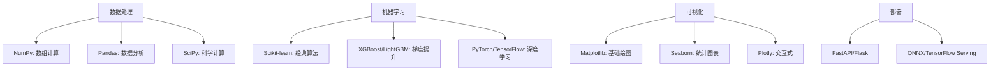
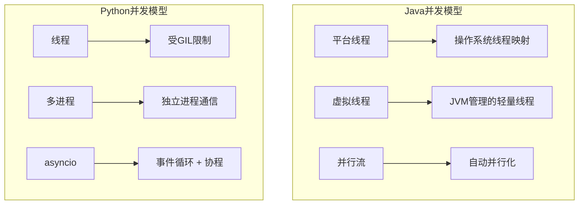
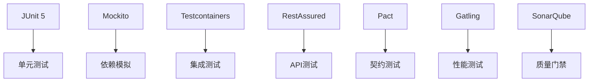
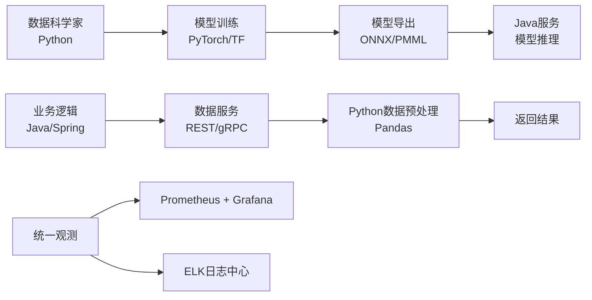

# Java与Python生态对决：构建工具、框架与运行时深度对比

作为中高级开发者，我们往往需要跳出“语言之争”的思维定式，真正关注的是**生态工具链**如何解决实际问题。Java与Python作为企业级开发和数据科学领域的两大主流，它们的组件和工具各有千秋，甚至在现代架构中形成了互补。

本文将从构建工具、Web框架、数据访问层、测试工具、性能分析以及AI/ML生态等多个维度，深入对比Java和Python的典型组件，帮助你在跨语言开发或技术选型时做出更明智的决策。

---

## 1. 生态定位与哲学差异

在深入工具之前，先理解两种语言的**设计哲学**如何影响了它们的工具生态：

| 维度 | Java | Python |
|------|------|--------|
| **类型系统** | 静态强类型，编译时检查 | 动态强类型，运行时确定 |
| **核心哲学** | "显式优于隐式"，严谨的工程化 | "简洁胜于复杂"，开发效率优先 |
| **性能倾向** | 多线程、JIT编译，适合CPU密集型 | GIL限制，但C扩展优化，适合I/O密集型 |
| **部署模型** | 编译为字节码，依赖JVM | 解释执行（或预编译为字节码） |
| **企业级特性** | 天生支持事务、高并发、集群 | 需第三方组件增强 |

这两种哲学导致Java生态倾向于**标准化、集成化**的工具套件（如Spring全家桶），而Python生态则呈现**碎片化、专业化**的特点（每个领域有专属库）。

---

## 2. 构建工具与依赖管理

### 2.1 Java：Maven vs Gradle

Java生态的构建工具经历了Ant→Maven→Gradle的演进，目前Maven和Gradle两分天下。

**Maven**（2004年发布）：
- **核心理念**：约定优于配置，标准的项目结构
- **配置文件**：XML（pom.xml），声明式依赖管理
- **生命周期**：clean、compile、test、package、install、deploy
- **依赖管理**：中央仓库（Maven Central），传递性依赖自动解析

```xml
<!-- Maven pom.xml 示例 -->
<project>
    <modelVersion>4.0.0</modelVersion>
    <groupId>com.example</groupId>
    <artifactId>my-app</artifactId>
    <version>1.0.0</version>
    <packaging>jar</packaging>
    
    <dependencies>
        <dependency>
            <groupId>org.springframework.boot</groupId>
            <artifactId>spring-boot-starter-web</artifactId>
            <version>3.1.5</version>
        </dependency>
    </dependencies>
</project>
```

**Gradle**（2012年崛起）：
- **核心理念**：灵活性 + 性能，基于Groovy/Kotlin DSL
- **配置文件**：build.gradle（Groovy）或 build.gradle.kts（Kotlin）
- **优势**：增量构建、构建缓存、守护进程加速

```kotlin
// Gradle Kotlin DSL 示例
plugins {
    java
    id("org.springframework.boot") version "3.1.5"
}

dependencies {
    implementation("org.springframework.boot:spring-boot-starter-web")
    testImplementation("org.junit.jupiter:junit-jupiter:5.9.2")
}

tasks.test {
    useJUnitPlatform()
}
```

### 2.2 Python：pip + requirements.txt vs Poetry/Pipenv

Python的构建工具长期处于“百家争鸣”状态，直到近年来才趋于规范化。

**传统方式（pip + requirements.txt）**：
- **简单直接**：`pip install package` 安装到全局或虚拟环境
- **依赖锁定**：`pip freeze > requirements.txt` 生成依赖列表
- **痛点**：缺乏版本锁定与依赖解析的严格性，无依赖解析树

```bash
# requirements.txt 示例
django==4.2.7
requests==2.31.0
pandas>=2.0.0
```

**现代方案（Poetry）**：
- **依赖解析**：类似Maven/Gradle的依赖解析器
- **锁文件**：poetry.lock 确保环境一致性
- **项目打包**：内置构建和发布功能

```toml
# pyproject.toml (Poetry)
[tool.poetry]
name = "my-project"
version = "0.1.0"

[tool.poetry.dependencies]
python = "^3.11"
fastapi = "^0.104.0"
uvicorn = {extras = ["standard"], version = "^0.24.0"}

[build-system]
requires = ["poetry-core"]
build-backend = "poetry.core.masonry.api"
```

**关键对比**：

| 特性 | Java (Maven/Gradle) | Python (传统) | Python (现代) |
|------|---------------------|---------------|---------------|
| 依赖解析 | ✅ 成熟完善 | ❌ 基本无 | ✅ Poetry/Pipenv |
| 版本锁定 | ✅ (依赖树) | ⚠️ (requirements.txt) | ✅ (lock文件) |
| 虚拟环境隔离 | ❌ (JVM自带) | ✅ (venv) | ✅ (内置) |
| 多模块管理 | ✅ 原生支持 | ❌ 需手动 | ⚠️ 有限支持 |

---

## 3. Web框架：企业级 vs 敏捷开发

### 3.1 Java：Spring Boot 生态系统

Spring Boot 已经成为Java企业级开发的**事实标准**，它通过自动配置和starter依赖大幅简化了Spring应用的搭建。

```java
// Spring Boot REST Controller
@RestController
@RequestMapping("/api/users")
public class UserController {
    
    @Autowired
    private UserService userService;
    
    @GetMapping("/{id}")
    public ResponseEntity<UserDto> getUser(@PathVariable Long id) {
        return ResponseEntity.ok(userService.findById(id));
    }
    
    @PostMapping
    @ResponseStatus(HttpStatus.CREATED)
    public UserDto createUser(@Valid @RequestBody UserCreateRequest request) {
        return userService.create(request);
    }
}
```

**Spring生态核心组件**：
- **Spring MVC**：Web层框架
- **Spring Data**：统一的数据访问抽象
- **Spring Security**：认证授权
- **Spring Cloud**：微服务全家桶
- **Spring Batch**：批处理框架

### 3.2 Python：三驾马车

Python Web框架呈现**分层化**特点，开发者可以根据项目规模灵活选择。

**Django**（大而全）：
- 内置ORM、Admin后台、认证系统
- 适合内容管理系统、电商平台

```python
# Django ViewSet (使用DRF)
from rest_framework import viewsets
from .models import User
from .serializers import UserSerializer

class UserViewSet(viewsets.ModelViewSet):
    queryset = User.objects.all()
    serializer_class = UserSerializer
    # 分页、过滤、认证几乎零配置
```

**Flask**（轻量灵活）：
- 微内核+扩展
- 适合微服务、API原型

```python
# Flask 应用
from flask import Flask, jsonify, request

app = Flask(__name__)

@app.route('/api/users/<int:user_id>', methods=['GET'])
def get_user(user_id):
    user = database.get_user(user_id)
    return jsonify(user.to_dict())
```

**FastAPI**（现代异步）：
- 基于Starlette + Pydantic
- 自动OpenAPI文档、类型提示驱动
- 适合高并发API、AI模型服务

```python
# FastAPI 应用
from fastapi import FastAPI, HTTPException
from pydantic import BaseModel

app = FastAPI()

class UserCreate(BaseModel):
    name: str
    email: str

@app.post("/users", response_model=UserResponse)
async def create_user(user: UserCreate):
    # 异步数据库操作
    return await user_service.create(user)
```

### 3.3 框架对比

| 维度 | Spring Boot | Django | Flask | FastAPI |
|------|-------------|--------|-------|---------|
| **设计理念** | 集成化、约定优先 | 全栈、内置一切 | 微核、扩展即用 | 现代、类型驱动 |
| **性能** | 高（线程模型） | 中 | 中 | 高（异步） |
| **学习曲线** | 陡 | 中高 | 平缓 | 中 |
| **ORM** | JPA/Hibernate | Django ORM | SQLAlchemy（可选） | SQLAlchemy/Tortoise |
| **API文档** | SpringDoc/SpringFox | Django REST Swagger | Flask-RESTX | 自动生成 |
| **企业特性** | 极完善 | 较完善 | 需组装 | 快速发展中 |

---

## 4. 数据科学与AI/ML生态

这是Python的**绝对主场**，但Java在企业级部署中正在追赶。

### 4.1 Python：数据科学生态链



**典型工作流示例**：
```python
# 数据预处理 + 模型训练
import pandas as pd
from sklearn.ensemble import RandomForestClassifier
from sklearn.model_selection import train_test_split

# 加载数据
df = pd.read_csv('data.csv')
X = df.drop('target', axis=1)
y = df['target']

# 训练模型
X_train, X_test, y_train, y_test = train_test_split(X, y)
model = RandomForestClassifier()
model.fit(X_train, y_train)

# 评估
accuracy = model.score(X_test, y_test)
```

### 4.2 Java：企业级AI工具链

虽然Python主导模型训练，但Java在**模型部署和生产环境**中优势明显。

**Java AI/ML框架**：

| 框架 | 定位 | 特点 |
|------|------|------|
| **DL4J** (Deeplearning4j) | 深度学习 | 支持分布式训练，与Spark集成 |
| **Weka** | 经典机器学习 | 100+算法，GUI工具，工业级稳定 |
| **Tribuo** (Oracle) | 企业级ML | 类型安全API，模型解释性 |
| **Java-ML** | 算法集合 | 轻量级，易集成 |

**Java调用深度学习模型**：
```java
// 使用DL4J加载训练好的模型
MultiLayerNetwork model = MultiLayerNetwork.load(new File("model.zip"), true);

// 预测
INDArray input = Nd4j.create(new double[]{1.2, 3.4, 5.6});
INDArray output = model.output(input);
System.out.println("预测结果: " + output);
```

### 4.3 跨语言协同：最佳实践

现代企业AI架构通常采用 **"Python训练 + Java部署"** 的混合模式。

**方案一：PMML模型交换**
```python
# Python端导出PMML
from sklearn2pmml import sklearn2pmml
from sklearn.ensemble import RandomForestClassifier

model = RandomForestClassifier()
model.fit(X_train, y_train)
sklearn2pmml(model, "model.pmml", with_repr=True)
```

```java
// Java端加载PMML
PMML pmml = PMMLUtil.unmarshal(new File("model.pmml"));
ModelEvaluator evaluator = ModelEvaluatorFactory.newInstance()
    .newModelEvaluator(pmml);
// 进行预测
```

**方案二：gRPC微服务**
```protobuf
// 定义AI服务接口
service AIService {
    rpc Predict (ImageRequest) returns (ClassificationResult);
}

message ImageRequest {
    bytes image_data = 1;
}
```

```python
# Python实现模型服务
class AIServicer(aiservice_pb2_grpc.AIServiceServicer):
    def Predict(self, request, context):
        # 使用PyTorch进行预测
        result = pytorch_model.predict(request.image_data)
        return ClassificationResult(label=result.label)
```

```java
// Java客户端调用
AIServiceGrpc.AIServiceBlockingStub stub = ...;
ClassificationResult result = stub.predict(request);
```

根据Azul的调查，**50%的Java开发者所在组织正在使用Java开发AI应用**，这一趋势正在加速。

---

## 5. 数据库访问层

### 5.1 Java：JPA规范与Hibernate

Java通过**JPA（Jakarta Persistence）**规范统一了ORM标准，Hibernate是主流实现。

```java
// JPA实体类
@Entity
@Table(name = "users")
public class User {
    @Id
    @GeneratedValue(strategy = GenerationType.IDENTITY)
    private Long id;
    
    @Column(nullable = false)
    private String username;
    
    @OneToMany(mappedBy = "user", cascade = CascadeType.ALL)
    private List<Order> orders = new ArrayList<>();
    
    // getters/setters
}

// Spring Data JPA仓库
public interface UserRepository extends JpaRepository<User, Long> {
    Optional<User> findByUsername(String username);
    
    @Query("SELECT u FROM User u WHERE u.email = ?1")
    User findByEmailAddress(String email);
}
```

### 5.2 Python：SQLAlchemy vs Django ORM

Python的ORM呈现**两强并立**格局：

**SQLAlchemy**（工业级ORM）：
- 提供Core（SQL抽象层）和ORM两层API
- 支持异步（1.4+版本）

```python
# SQLAlchemy 2.0 异步示例
from sqlalchemy.ext.asyncio import create_async_engine, AsyncSession
from sqlalchemy.orm import sessionmaker, declarative_base

engine = create_async_engine("sqlite+aiosqlite:///database.db")
AsyncSessionLocal = sessionmaker(engine, class_=AsyncSession)

# 定义模型
Base = declarative_base()
class User(Base):
    __tablename__ = 'users'
    id = Column(Integer, primary_key=True)
    username = Column(String, nullable=False)
    
# 异步查询
async def get_user(username: str):
    async with AsyncSessionLocal() as session:
        result = await session.execute(
            select(User).where(User.username == username)
        )
        return result.scalar_one_or_none()
```

**Django ORM**（全栈集成）：
- 与Django框架深度集成
- API设计简洁，类似Ruby on Rails

```python
# Django模型
class User(models.Model):
    username = models.CharField(max_length=100)
    email = models.EmailField(unique=True)
    created_at = models.DateTimeField(auto_now_add=True)
    
    def __str__(self):
        return self.username

# 查询API
users = User.objects.filter(email__contains="@gmail.com")
user = User.objects.get(username="admin")
```

### 5.3 对比总结

| 特性 | JPA/Hibernate | SQLAlchemy | Django ORM |
|------|---------------|------------|------------|
| **设计哲学** | 标准规范、企业级 | 灵活、SQL优先 | 简单、框架集成 |
| **学习曲线** | 陡峭 | 中等到陡峭 | 平缓 |
| **性能调优** | 一级/二级缓存 | 细粒度控制 | 有限控制 |
| **异步支持** | 需额外配置 | ✅ 原生异步 | ⚠️ 有限 |
| **复杂查询** | JPQL/Criteria | SQL/ORM混合 | ORM为主 |

---

## 6. 测试工具链

### 6.1 Java：JUnit + Mockito + 集成测试

Java测试生态成熟且标准化：

```java
@SpringBootTest
@AutoConfigureMockMvc
class UserControllerTest {
    
    @Autowired
    private MockMvc mockMvc;
    
    @MockBean
    private UserService userService;
    
    @Test
    void shouldReturnUser() throws Exception {
        // 准备测试数据
        User user = new User(1L, "john");
        given(userService.findById(1L)).willReturn(user);
        
        // 执行并验证
        mockMvc.perform(get("/api/users/1"))
            .andExpect(status().isOk())
            .andExpect(jsonPath("$.username").value("john"));
        
        // 验证调用
        verify(userService, times(1)).findById(1L);
    }
}
```

**工具链**：
- **JUnit 5**：单元测试框架
- **Mockito**：对象模拟
- **AssertJ**：流畅断言
- **Testcontainers**：真实依赖测试
- **JaCoCo**：测试覆盖率

### 6.2 Python：pytest + unittest.mock

Python测试生态更灵活：

```python
# pytest + mock 示例
import pytest
from unittest.mock import Mock, patch

def test_get_user():
    # 模拟服务层
    mock_service = Mock()
    mock_service.get_user.return_value = {"id": 1, "name": "john"}
    
    # 调用被测函数
    result = user_controller.get_user(1, mock_service)
    
    # 断言
    assert result["name"] == "john"
    mock_service.get_user.assert_called_once_with(1)

# 使用fixture管理依赖
@pytest.fixture
def db_session():
    session = create_test_session()
    yield session
    session.rollback()

def test_database_query(db_session):
    result = db_session.query(User).all()
    assert len(result) > 0
```

**工具链**：
- **pytest**：主力测试框架
- **unittest.mock**：内置模拟库
- **factory_boy**：测试数据生成
- **pytest-cov**：覆盖率统计

---

## 7. 性能与并发模型

这是两种语言**最本质的差异点**。

### 7.1 Java：多线程王者

Java从语言层面支持多线程，拥有强大的并发工具：

```java
// Java 虚拟线程示例
ExecutorService executor = Executors.newVirtualThreadPerTaskExecutor();

List<Future<String>> futures = new ArrayList<>();
for (int i = 0; i < 1000; i++) {
    int taskId = i;
    futures.add(executor.submit(() -> {
        return processTask(taskId);  // 每个任务独立线程
    }));
}

// 收集结果
for (Future<String> future : futures) {
    results.add(future.get());
}
```

**Java并发优势**：
- 平台线程 vs 虚拟线程（Project Loom）
- 丰富的并发集合（ConcurrentHashMap）
- 锁机制（synchronized, ReentrantLock）
- 无锁编程（Atomic类）

### 7.2 Python：GIL的约束与突破

Python的**全局解释器锁（GIL）**限制同一进程内多线程并行执行Python字节码。

```python
# 多线程示例（受GIL限制）
import threading

def cpu_intensive():
    for i in range(1000000):
        _ = i * i

# 多线程不会提升CPU密集型任务性能
threads = []
for _ in range(4):
    t = threading.Thread(target=cpu_intensive)
    threads.append(t)
    t.start()
```

**Python并发方案**：
- **多进程**：`multiprocessing`绕过GIL
- **异步I/O**：`asyncio`处理高并发I/O
- **C扩展**：在C层释放GIL

```python
# asyncio高并发示例
import asyncio
import aiohttp

async def fetch_url(session, url):
    async with session.get(url) as response:
        return await response.text()

async def main():
    async with aiohttp.ClientSession() as session:
        tasks = [fetch_url(session, f"https://api.example.com/item/{i}") 
                for i in range(1000)]
        results = await asyncio.gather(*tasks)
```

### 7.3 并发模型对比



| 特性 | Java | Python |
|------|------|--------|
| **线程模型** | 1:1 内核线程 + 虚拟线程 | 1:1 内核线程（GIL限制） |
| **并行计算** | 原生支持 | 需多进程或C扩展 |
| **I/O密集型** | 线程池/虚拟线程 | asyncio（最优） |
| **CPU密集型** | 多线程并行 | 多进程（IPC开销） |
| **内存占用** | 较高（JVM） | 较低 |

---

## 8. 测试工具链深度对比

### 8.1 Java测试生态：严谨与集成



**Spring Boot测试切片**：
```java
@WebMvcTest(UserController.class)  // 只加载Web层
class ControllerTest {
    // ...
}

@DataJpaTest  // 只加载JPA组件
class RepositoryTest {
    // ...
}

@SpringBootTest  // 加载完整上下文
@AutoConfigureTestDatabase(replace = Replace.NONE)  // 使用真实数据库
class IntegrationTest {
    // ...
}
```

### 8.2 Python测试生态：灵活与轻量

```python
# pytest的高级特性：参数化测试
@pytest.mark.parametrize("input,expected", [
    ("hello", 5),
    ("world", 5),
    ("python", 6),
])
def test_string_length(input, expected):
    assert len(input) == expected

# 使用fixture实现依赖注入
@pytest.fixture
def api_client():
    client = TestClient(app)
    yield client
    # 清理代码

def test_api_endpoint(api_client):
    response = api_client.get("/users/1")
    assert response.status_code == 200

# mock外部服务
@patch("requests.get")
def test_external_api(mock_get):
    mock_get.return_value.json.return_value = {"data": "mocked"}
    result = call_external_api()
    assert result["data"] == "mocked"
```

### 8.3 测试工具对比

| 维度 | Java | Python |
|------|------|--------|
| **单元测试框架** | JUnit 5（标准） | pytest（主流）/ unittest（内置） |
| **模拟库** | Mockito（成熟） | unittest.mock（内置）/ pytest-mock |
| **断言风格** | AssertJ/Hamcrest | pytest断言（简单） |
| **集成测试** | Testcontainers | pytest-docker |
| **性能测试** | JMeter/Gatling | locust |
| **覆盖率** | JaCoCo | pytest-cov |

---

## 9. 生产环境工具链

### 9.1 Java：APM与可观测性

Java在生产环境有成熟的监控体系：

- **指标收集**：Micrometer + Prometheus
- **链路追踪**：OpenTelemetry + Jaeger
- **日志聚合**：SLF4J + Logback + ELK
- **性能分析**：JFR（Java Flight Recorder）+ Async Profiler

```java
// Micrometer指标示例
@RestController
public class MetricController {
    private final Counter requestCounter;
    
    public MetricController(MeterRegistry registry) {
        this.requestCounter = Counter.builder("api.requests")
            .tag("endpoint", "/users")
            .register(registry);
    }
    
    @GetMapping("/users")
    public List<User> getUsers() {
        requestCounter.increment();
        return userService.findAll();
    }
}
```

### 9.2 Python：现代可观测性栈

Python同样有完善的观测工具：

- **指标**：prometheus_client
- **追踪**：OpenTelemetry Python
- **日志**：structlog + python-json-logger
- **性能分析**：py-spy + Scalene

```python
# Prometheus指标示例
from prometheus_client import Counter, Histogram, generate_latest
from fastapi import FastAPI
import time

app = FastAPI()
REQUEST_COUNT = Counter("http_requests_total", "Total HTTP requests")
REQUEST_TIME = Histogram("http_request_duration_seconds", "Request duration")

@app.middleware("http")
async def metrics_middleware(request, call_next):
    REQUEST_COUNT.inc()
    start = time.time()
    response = await call_next(request)
    duration = time.time() - start
    REQUEST_TIME.observe(duration)
    return response

@app.get("/metrics")
def get_metrics():
    return Response(content=generate_latest(), media_type="text/plain")
```

---

## 10. 总结：如何选择？

### 10.1 场景化选型建议

| 项目类型 | 推荐语言 | 核心组件组合 | 理由 |
|---------|---------|-------------|------|
| **企业级后端** | Java | Spring Boot + JPA + Kafka | 稳定性、事务支持、生态成熟 |
| **快速原型/初创产品** | Python | Django/Flask + PostgreSQL | 开发效率高，快速验证 |
| **高并发API** | Java/Go | Spring WebFlux / Vert.x | 线程模型优秀 |
| **AI模型服务** | Python | FastAPI + PyTorch/TF | 直接加载模型，生态原生 |
| **数据中台** | 混合 | Python训练 + Java部署 | 兼顾灵活与性能 |
| **微服务架构** | 混合 | Spring Cloud + gRPC | 服务治理完善 |
| **数据分析/ETL** | Python | Pandas + Spark | 数据处理生态强大 |

### 10.2 协同开发最佳实践

当团队同时使用Java和Python时，推荐以下模式：



### 10.3 最终建议

**学习Java生态**，如果你：
- 需要构建大型、长期演进的系统
- 追求类型安全和高可维护性
- 面对高并发、分布式场景
- 在金融、电信等企业级领域工作

**深耕Python生态**，如果你：
- 专注数据科学、AI/ML领域
- 需要快速迭代和原型验证
- 处理文本、数据处理任务
- 团队规模小，追求开发效率

**成为双栖开发者**，如果你：
- 参与现代AI系统的全流程开发
- 在大型组织中负责技术整合
- 希望拥有更广阔的职业发展空间

---

> 技术选型不是非此即彼的对立，而是根据场景找到最合适的工具。Java提供了工程化的严谨与稳定，Python带来了敏捷与数据洞察力。在现代软件架构中，它们更像是互补的左右手，共同构建完整的技术解决方案。掌握两种生态的核心工具，将让你在面对复杂问题时拥有更全面的视角和更灵活的解决方案。