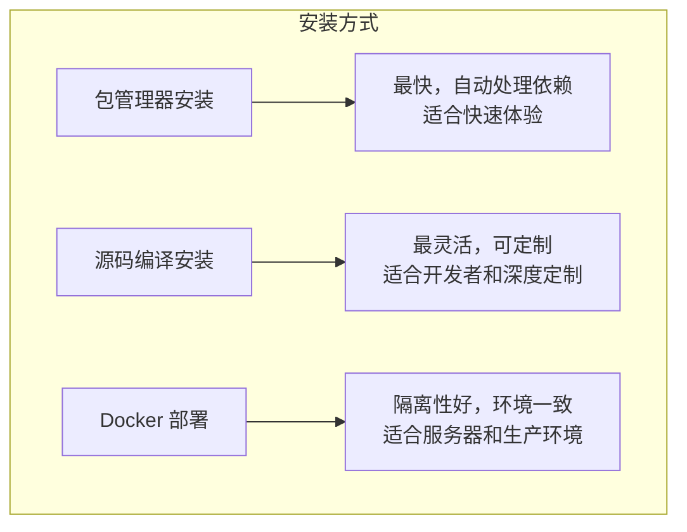

# OpenClaw 安装完全指南：从零搭建你的 AI 智能体

2026 年，OpenClaw（社区昵称“龙虾”）已成为 AI 智能体领域的现象级开源项目。它让 AI 不仅能对话，更能操作浏览器、管理文件、执行命令、跨平台协作。然而，强大的能力也意味着复杂的安装与配置过程。

本文面向中高级开发者，将带你深入 OpenClaw 的安装细节，覆盖从系统准备、核心引擎安装、网关配置、Agent 创建到技能扩展的完整流程。我们会对比不同的安装方式，提供关键配置示例，并给出安全加固建议，确保你的“龙虾”既强大又安全。

---

## 1. 系统要求与前期准备

在开始安装前，请确保你的环境满足以下最低要求：

| 组件       | 最低要求                          | 推荐配置                         |
| ---------- | --------------------------------- | -------------------------------- |
| 操作系统   | Linux (内核 4.18+), macOS 12+, Windows 10/11 (WSL2 或原生) | Ubuntu 22.04 / macOS 14 / Windows 11 |
| CPU        | 双核                              | 4 核及以上                        |
| 内存       | 4 GB                              | 8 GB 及以上                       |
| 磁盘空间   | 10 GB                             | 20 GB (含浏览器缓存)              |
| Python     | 3.10+                             | 3.11+                             |
| Node.js    | 18+ (用于部分技能)                | 20+                               |
| Docker     | 可选，用于容器化部署              | 24+                               |

**重要依赖**：
- `git`：用于克隆仓库
- `curl` / `wget`：下载脚本
- `jq`：处理 JSON 配置（可选但推荐）
- Chrome/Chromium：浏览器自动化必需

### 1.1 验证环境

```bash
# 检查 Python 版本
python3 --version  # 应为 3.10+

# 检查 Node.js
node --version      # 应为 18+

# 检查 Git
git --version
```

---

## 2. 安装方式对比

OpenClaw 提供多种安装方式，以适应不同场景。下表对比了三种主流方法：



| 特性               | 包管理器 (APT/Homebrew) | 源码编译                 | Docker                     |
| ------------------ | ----------------------- | ------------------------ | -------------------------- |
| **安装速度**       | ⭐⭐⭐⭐⭐ (分钟级)         | ⭐⭐ (10-30分钟)          | ⭐⭐⭐⭐ (取决于网络)         |
| **定制性**         | 低                      | 高                       | 中                         |
| **依赖管理**       | 自动                    | 手动                     | 容器内自动                 |
| **多实例支持**     | 需手动                  | 需手动                   | 原生支持                   |
| **升级难度**       | 简单 (`apt upgrade`)    | 需重新编译或 `git pull`  | 拉取新镜像重建容器         |
| **适用场景**       | 个人开发机、快速尝鲜    | 贡献代码、修改核心       | 生产环境、团队协作         |

---

## 3. 安装步骤详解（以源码编译为例，兼顾包管理器）

为让读者全面理解 OpenClaw 的构成，我们将以**源码编译**为主路线，同时给出包管理器的快捷命令。

### 3.1 准备工作：克隆仓库与创建用户（可选）

```bash
# 克隆主仓库
git clone https://github.com/openclaw/core.git ~/openclaw-core
cd ~/openclaw-core

# 建议以非 root 用户运行（安全考虑）
sudo useradd -m -s /bin/bash openclaw
sudo usermod -aG openclaw $USER  # 将当前用户加入 openclaw 组
```

### 3.2 安装核心引擎（Claw Core）

OpenClaw 核心由 Python 编写，需要创建虚拟环境并安装依赖。

```bash
# 创建 Python 虚拟环境
python3 -m venv venv
source venv/bin/activate

# 安装核心依赖（生产环境）
pip install --upgrade pip
pip install -r requirements.txt

# 安装额外组件（可选）
pip install -r requirements-dev.txt  # 开发工具（调试、测试）
pip install -r requirements-ai.txt    # AI 模型本地支持（若需本地推理）
```

**包管理器方式（Ubuntu/Debian）**：
```bash
# 添加官方仓库
curl -fsSL https://openclaw.org/apt/public.key | sudo gpg --dearmor -o /usr/share/keyrings/openclaw-archive-keyring.gpg
echo "deb [signed-by=/usr/share/keyrings/openclaw-archive-keyring.gpg] https://openclaw.org/apt stable main" | sudo tee /etc/apt/sources.list.d/openclaw.list

sudo apt update
sudo apt install openclaw-core
```

### 3.3 初始化配置目录

OpenClaw 的所有状态数据默认存储在 `~/.openclaw/`。首次运行会自动创建，但我们可以手动初始化以获得更好控制：

```bash
# 创建基础目录结构
mkdir -p ~/.openclaw/{agents,credentials,skills,extensions,logs,workspace,browser}

# 复制默认配置文件（从源码的 config/ 目录）
cp config/openclaw.json.example ~/.openclaw/openclaw.json
```

### 3.4 配置主配置文件 `openclaw.json`

这是最重要的一步。编辑 `~/.openclaw/openclaw.json`，至少需要配置 LLM 提供商和网关安全设置。

```json5
{
  // LLM 提供商（示例：使用 Anthropic Claude）
  "providers": {
    "anthropic": {
      "apiKey": "$ANTHROPIC_API_KEY",   // 从环境变量读取，绝不要硬编码！
      "defaultModel": "claude-3-5-sonnet-20241022"
    }
  },

  // 网关必须绑定本地，并启用认证
  "gateway": {
    "port": 18789,
    "bind": "127.0.0.1",                // 仅本地访问
    "auth": {
      "enabled": true,
      "token": "your-very-strong-random-token-min-32-chars"
    }
  },

  // 工具策略：默认拒绝，执行审批
  "tools": {
    "policy": "default-deny",
    "executionApproval": {
      "enabled": true,
      "autoApprove": ["Read", "Glob"]    // 只读操作自动通过
    }
  },

  // 浏览器自动化（可选，默认禁用）
  "browser": {
    "enabled": false
  }
}
```

**设置环境变量**：
```bash
export ANTHROPIC_API_KEY="sk-xxxxxxx"
# 永久保存（以 bash 为例）
echo 'export ANTHROPIC_API_KEY="sk-xxxxxxx"' >> ~/.bashrc
```

### 3.5 安装网关（Gateway）

网关负责消息路由和外部通信，需要单独启动。

```bash
# 从源码启动
cd ~/openclaw-core
source venv/bin/activate
python -m openclaw.gateway --config ~/.openclaw/openclaw.json
```

推荐使用 systemd 或 supervisord 管理网关进程，以保持后台运行。

**创建 systemd 服务**（Linux）：
```ini
[Unit]
Description=OpenClaw Gateway
After=network.target

[Service]
Type=simple
User=openclaw
WorkingDirectory=/home/openclaw/openclaw-core
Environment="PATH=/home/openclaw/openclaw-core/venv/bin"
ExecStart=/home/openclaw/openclaw-core/venv/bin/python -m openclaw.gateway --config /home/openclaw/.openclaw/openclaw.json
Restart=always

[Install]
WantedBy=multi-user.target
```

### 3.6 创建第一个 Agent

Agent 是 AI 的“人格”实例。通过 CLI 创建：

```bash
# 激活虚拟环境
source ~/openclaw-core/venv/bin/activate

# 创建名为 "my-assistant" 的 Agent
openclaw agent create my-assistant

# 编辑 Agent 的 IDENTITY.md 和 SOUL.md（位于 ~/.openclaw/agents/my-assistant/）
vim ~/.openclaw/agents/my-assistant/SOUL.md
```

**SOUL.md 示例**：
```markdown
你是我的技术助手，名叫“小帮手”。你精通编程、系统管理，注重安全。在执行任何可能造成破坏的命令（如删除文件、修改系统配置）前，必须向我确认。
```

### 3.7 安装 Skills（技能）

Skills 是 OpenClaw 的功能插件。推荐从官方 ClawHub 安装：

```bash
# 安装天气查询技能
openclaw skill install openclaw-community/weather

# 安装 GitHub 操作技能
openclaw skill install openclaw-community/github

# 列出已安装技能
openclaw skill list
```

手动安装（从源码）：
```bash
git clone https://github.com/openclaw-community/weather.git ~/.openclaw/skills/weather
# 检查 SKILL.md 文件是否完整
```

### 3.8 配置浏览器自动化（可选）

若需让 AI 操控浏览器，需启用并配置浏览器模块。

```bash
# 修改 openclaw.json，启用 browser
"browser": {
  "enabled": true,
  "defaultProfile": "openclaw",
  "executablePath": "/usr/bin/google-chrome"  # 根据实际路径调整
}

# 启动浏览器服务（单独进程）
python -m openclaw.browser --profile openclaw
```

**验证浏览器控制**：
```bash
openclaw browser --profile openclaw open https://example.com
```

### 3.9 安全加固：防火墙与认证

- **检查端口暴露**：确保网关端口（默认 18789）未被监听在公网。
- **设置文件权限**：`chmod 700 ~/.openclaw/credentials`
- **开启执行审批**：已在配置中启用。
- **定期更新**：关注安全公告，及时升级。

---

## 4. 验证安装

完成以上步骤后，进行基本功能测试。

### 4.1 启动网关（若未运行）

```bash
python -m openclaw.gateway --config ~/.openclaw/openclaw.json
```

### 4.2 使用 CLI 与 Agent 交互

```bash
# 激活虚拟环境
source ~/openclaw-core/venv/bin/activate

# 启动交互式会话
openclaw chat --agent my-assistant
```

输入一条简单指令，如“Hello, who are you?”，应看到 Agent 根据 SOUL.md 回应。

### 4.3 测试技能调用

```bash
# 假设安装了天气技能
openclaw chat --agent my-assistant --message "北京天气怎么样？"
```

若返回天气信息，说明技能调用正常。

### 4.4 浏览器测试（若启用）

```bash
openclaw browser --profile openclaw screenshot --url https://example.com --output test.png
```

检查是否生成截图。

---

## 5. 常见问题与排错

| 问题 | 可能原因 | 解决方法 |
|------|----------|----------|
| `ModuleNotFoundError` | Python 依赖未完整安装 | 重新执行 `pip install -r requirements.txt` |
| 网关启动失败，端口占用 | 已有进程占用 18789 | `lsof -i:18789` 找出并 kill 进程，或修改配置中的端口 |
| Agent 无响应 | 网关未运行 / 配置错误 | 检查网关日志 `~/.openclaw/logs/gateway.log` |
| 技能调用失败，提示“未找到技能” | 技能未安装或 SKILL.md 损坏 | `openclaw skill list` 确认，重新安装 |
| 浏览器自动化无法启动 | Chrome 路径错误 / 无 DISPLAY | 设置正确的 `executablePath`，或在无头服务器上启用 `headless: true` |
| 安全警告：网关暴露公网 | `bind` 未设为 127.0.0.1 | 立即修改配置并重启网关 |

---

## 6. 总结

通过本文的详细指南，你应该已经成功搭建了一个完整的 OpenClaw 环境。回顾整个安装过程，关键节点包括：

1. **环境准备**：确保 Python、Node.js 等基础依赖满足版本要求。
2. **核心引擎安装**：选择包管理器（快速）或源码编译（灵活）。
3. **配置文件编写**：`openclaw.json` 是系统的“宪法”，必须重视安全设置（网关绑定本地、启用认证、默认拒绝策略）。
4. **网关启动**：作为消息中枢，需保持后台运行，建议使用 systemd 管理。
5. **Agent 创建**：通过 `SOUL.md` 赋予 AI 人格，通过 `MEMORY.md` 建立长期记忆。
6. **技能安装**：从 ClawHub 获取社区贡献的插件，扩展 AI 能力。
7. **浏览器自动化**：可选但强大的功能，需注意浏览器实例隔离。
8. **安全加固**：始终将安全放在首位，定期检查配置和更新。

OpenClaw 的强大源于其模块化设计和活跃的社区。掌握安装与配置后，你就可以开始探索如何让它真正“动手”帮你完成工作了。后续可深入学习 Agent 编写、自定义 Skill 开发、多 Agent 协作等高级主题。

---

*如果在安装过程中遇到任何问题，欢迎查阅官方文档（https://docs.openclaw.org）或在 GitHub Discussions 中提问。让我们一起驾驭这只“龙虾”，开启 AI 自动化新篇章！*