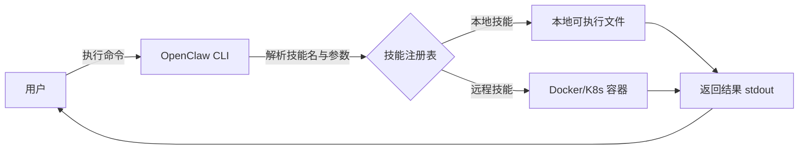

# OpenClaw 安装后不知所措？这份全场景技能指南让你玩转 AI 助手

> 从新闻资讯到炒股助手，从代码编程到日程管理——OpenClaw 不是另一个“装完即忘”的工具，而是一个可无限扩展的 AI 技能平台。本文将带你探索 7 大典型场景，并提供可直接上手的技能推荐与配置示例。

---

## 1. 开篇：为什么你装完 OpenClaw 就“卡住了”？

很多开发者在第一次接触 **OpenClaw** 时，会经历这样的心路历程：
- 按文档装完 CLI → `openclaw --help` 看到一堆命令 → 兴奋。
- 但真正想让它做点“有用的事”时，却不知道从何下手。

**原因很简单**：OpenClaw 本身只是一个“技能运行器”。就像安装了 Python 却没有装任何库一样，你需要安装具体的 **技能（Skill）** 才能让它真正干活。

本文将为你绘制一张 OpenClaw 的技能地图，覆盖 7 大高频场景，并提供开箱即用的配置和流程。无论你是开发者、运营、还是自由职业者，都能在这里找到适合自己的技能组合。

---

## 2. OpenClaw 核心概念速览

在进入具体场景前，先快速过一遍 OpenClaw 的运作机制（如果你已经熟悉，可以跳到第三节）：



- **技能（Skill）**：一个可执行的程序（脚本、二进制、容器），遵循 OpenClaw 的输入输出约定。
- **技能注册表**：存储已安装技能的元数据（名称、版本、入口、依赖等）。
- **调用方式**：`openclaw run <技能名> [--input key=value]`，输入通常通过 stdin、环境变量或参数传入。

---

## 3. 七大场景 + 技能推荐 + 实战流程

### 场景一：新闻资讯聚合 —— 每天 10 秒掌握天下事

**推荐技能**：`news-digest`、`hacker-news`、`rss-reader`

**知识点**：技能可以通过 HTTP 请求抓取新闻源，并利用 LLM 生成摘要。

**配置示例** (`~/.openclaw/skills/news-digest/skill.yaml`)：
```yaml
name: news-digest
version: 1.0.0
entry: digest.py
inputs:
  topics:
    type: string
    from: arg
    default: "technology,ai"
output:
  type: string
  format: markdown
```

**使用流程**：
```bash
# 安装技能
openclaw install news-digest
# 获取科技+AI 头条摘要
openclaw run news-digest --topics "technology,ai"
```

**扩展**：配合 cron 定时执行，将结果推送到邮件或 Telegram。

### 场景二：自媒体内容创作 —— 从选题到发布全自动

**推荐技能**：`blog-writer`、`social-post-generator`、`seo-analyzer`

**知识点**：技能可以组合工作，例如先用 `topic-research` 挖掘热点，再用 `blog-writer` 生成大纲，最后用 `social-post-generator` 拆解为多平台文案。

**组合工作流（Shell 脚本）**：
```bash
#!/bin/bash
TOPIC="Claude 3.7 vs GPT-5"

# 生成博客正文
echo "$TOPIC" | openclaw run blog-writer --style technical > blog.md

# 生成三条推文
openclaw run social-post-generator --input blog.md --platform twitter > tweets.txt

# 检查 SEO 关键词
openclaw run seo-analyzer --input blog.md
```

**配置要点**：技能之间通过管道传递数据，充分利用 CLI 的可组合性。

### 场景三：代码编程 —— 你的 AI 结对程序员

**推荐技能**：`code-review`、`unit-test-generator`、`docstring-writer`、`bug-fixer`

**知识点**：技能可以直接读取本地文件，并将结果写回或 diff 展示。

**示例：自动为 Python 函数添加 docstring**
```bash
# 安装技能
openclaw install docstring-writer

# 为当前目录所有 .py 文件中的函数添加文档
openclaw run docstring-writer --path ./src --write
```

**高级用法**：结合 Git hooks，在 commit 前自动运行 `code-review` 技能，防止低质量代码进入仓库。

### 场景四：编写文案 —— 营销邮件、产品描述一键生成

**推荐技能**：`copywriter`、`email-campaign`、`ad-copy-generator`

**输入格式**：支持 JSON 结构化输入，便于程序化调用。

**示例：生成产品邮件**
```bash
cat <<EOF | openclaw run email-campaign
{
  "product": "OpenClaw Pro",
  "target_audience": "developers",
  "tone": "friendly",
  "call_to_action": "Start free trial"
}
EOF
```

### 场景五：电商运营 —— 商品描述、竞品分析自动化

**推荐技能**：`product-description`、`price-monitor`、`review-summarizer`

**知识点**：技能可以调用外部 API（如电商平台开放接口），并将结果结构化存储。

**配置环境变量**（`.env`）：
```bash
AMAZON_API_KEY=xxx
ALIBABA_API_KEY=yyy
```

**使用示例**：
```bash
# 抓取某商品评论并生成情感摘要
openclaw run review-summarizer --asin B09G9D7K5S
```

### 场景六：工作人员日程管理 —— 会议纪要、待办事项智能提取

**推荐技能**：`meeting-minutes`、`todo-extractor`、`calendar-sync`

**输入**：可以从语音转文字（如 Whisper）后的文本，或直接粘贴会议录音转写稿。

**示例流程**：
1. 用 `whisper` 技能将会议录音转为文本。
2. 将文本输入 `meeting-minutes` 生成结构化纪要。
3. 用 `todo-extractor` 提取行动项。
4. 通过 `calendar-sync` 自动创建日历事件。

### 场景七：邮件处理 —— 智能分类、自动回复、摘要生成

**推荐技能**：`email-classifier`、`auto-reply`、`email-summary`

**知识点**：技能可以集成 IMAP/SMTP，实现对真实邮箱的操作。

**配置示例** (`~/.openclaw/skills/email-summary/config.json`)：
```json
{
  "imap_server": "imap.gmail.com",
  "username": "you@gmail.com",
  "password_env": "EMAIL_PASSWORD",
  "lookback_days": 1
}
```

**使用**：
```bash
# 获取今日邮件摘要
openclaw run email-summary --date today
# 对未读邮件自动分类
openclaw run email-classifier --action classify_unread
```

### 场景八：炒股人助手 —— 行情分析、财报解读、量化提醒

**推荐技能**：`stock-quote`、`earnings-summarizer`、`technical-indicator`

**知识点**：技能可以实时获取市场数据，结合技术分析库（如 TA-Lib）生成信号。

**示例：获取某股票当前价格和简单技术指标**
```bash
openclaw run stock-quote --symbol AAPL --indicators "SMA20,RSI"
```

**高级集成**：将技能与调度器结合，当股价突破某阈值时发送告警。

---

## 4. 技能管理最佳实践

### 4.1 安装与卸载
```bash
# 从注册表安装
openclaw install <技能名>

# 从本地目录安装（用于开发）
openclaw install ./my-skill

# 卸载
openclaw uninstall <技能名>
```

### 4.2 查看已安装技能
```bash
openclaw list
```

### 4.3 技能配置优先级
- 技能自带默认配置（`skill.yaml`）
- 用户全局配置（`~/.openclaw/config.yaml`）
- 环境变量（`OPENCLAW_<SKILL>_<KEY>`）
- 命令行参数（`--<key>=<value>`）

### 4.4 组合技能：使用 Shell 脚本构建工作流
```bash
#!/bin/bash
# 组合技能示例：从 RSS 抓取文章 -> 生成摘要 -> 发布到博客
openclaw run rss-reader --url "https://example.com/rss" | \
  openclaw run blog-writer --format markdown | \
  openclaw run wp-publish --site "myblog.com"
```

---

## 5. 对比：传统脚本 vs OpenClaw 技能

| 维度 | 传统 Shell 脚本 | OpenClaw 技能 |
| :--- | :--- | :--- |
| **复用性** | 脚本之间难以共享元数据和配置 | 技能拥有统一的元数据、输入输出规范，易于发现和组合 |
| **分发** | 手动拷贝或依赖包管理器 | `openclaw install` 一键安装，自动处理依赖 |
| **版本管理** | 靠命名或目录区分 | 内置版本字段，支持语义化版本 |
| **远程执行** | 需要手动 ssh/scp | 支持 `--remote k8s` 等后端，透明执行 |
| **输入校验** | 脚本内自行处理 | 通过 `skill.yaml` 声明 schema，自动校验 |

---

## 6. 总结：从“装完不知道干啥”到“万物皆可技能”

OpenClaw 的强大之处，恰恰在于它的“不预设”——它不告诉你该做什么，而是让你通过安装技能来**自己定义**它能做什么。

本文介绍的 7 大场景和对应的技能，只是一个起点。真正的价值在于：
- **CLI 的可组合性**让你像搭积木一样构建复杂工作流。
- **统一的技能规范**让社区贡献的技能即装即用。
- **本地优先的执行模型**保证了数据隐私和低延迟。

如果你刚装完 OpenClaw 还在发愁，不妨从今天开始，挑选一个你最痛点的场景，安装对应的技能，尝试跑通第一个自动化流程。你会发现，OpenClaw 不是“另一个工具”，而是**你自己创造的工具箱**。

---

**附录：推荐技能清单（持续更新）**

| 分类 | 技能名 | 功能 |
| :--- | :--- | :--- |
| 新闻 | `news-digest` | 多源新闻聚合+摘要 |
| 自媒体 | `blog-writer` | 根据主题生成技术博客 |
| 编程 | `code-review` | 自动代码审查 |
| 文案 | `copywriter` | 营销文案生成 |
| 电商 | `product-description` | 电商商品描述生成 |
| 日程 | `meeting-minutes` | 会议纪要生成 |
| 邮件 | `email-summary` | 邮件摘要与分类 |
| 炒股 | `stock-quote` | 实时行情+技术指标 |

*安装方式：`openclaw install <技能名>`，详细用法请查看各技能自带的帮助：`openclaw run <技能名> --help`*

希望这份指南能帮你真正打开 OpenClaw 的大门。如果你有自己开发的技能，欢迎分享到社区！