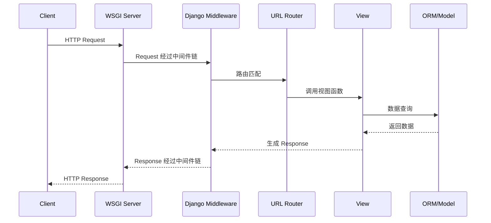
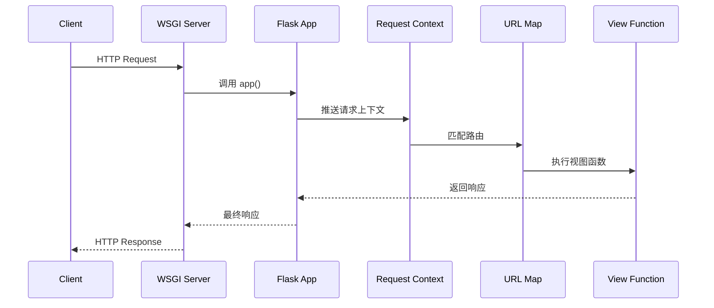
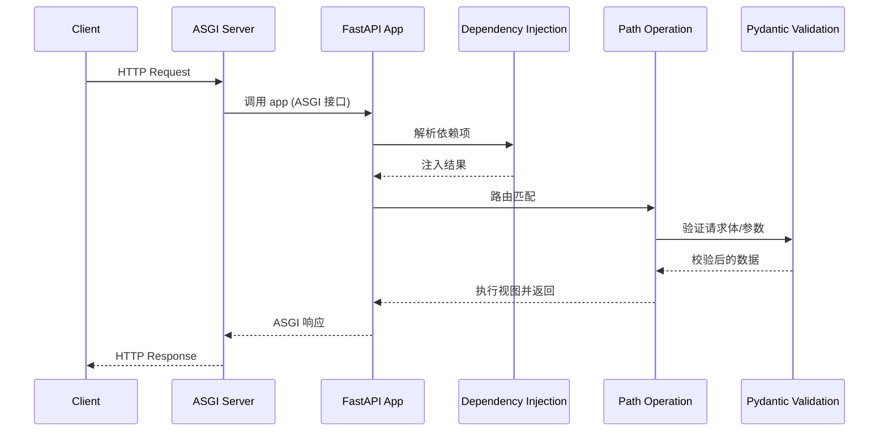
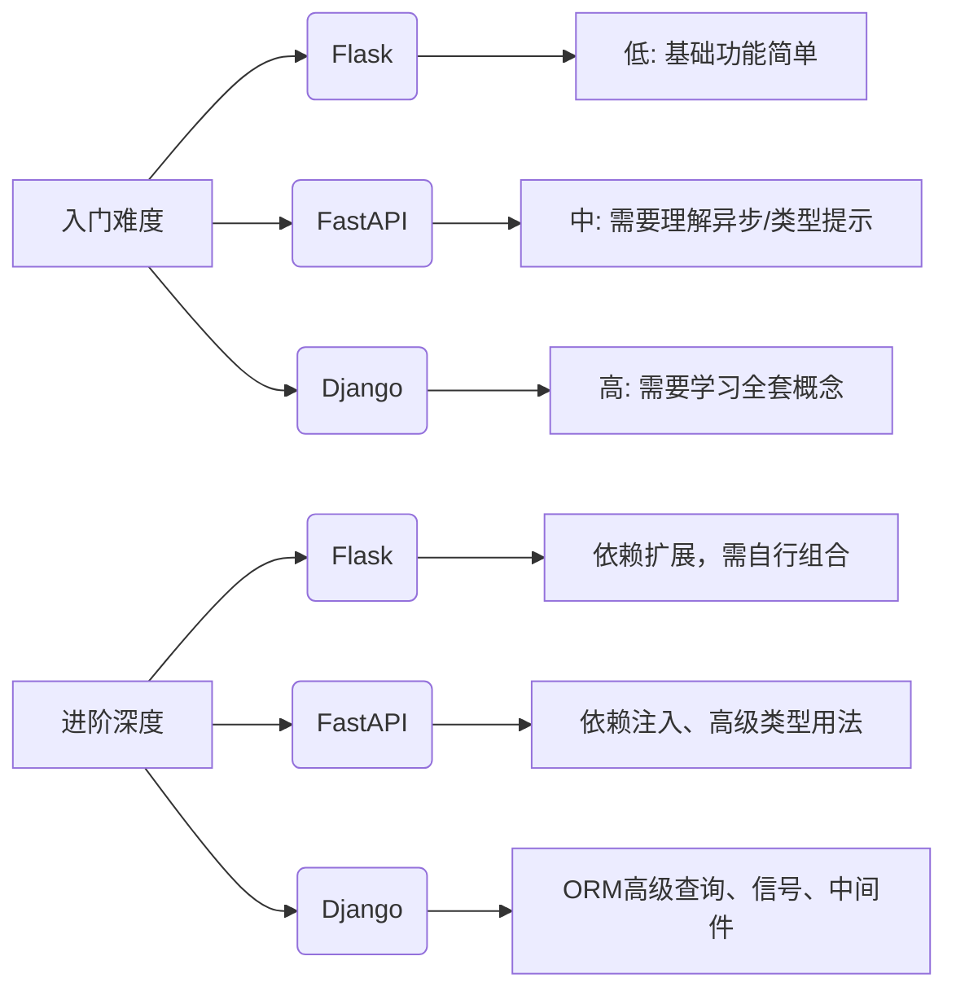

# Python Web 框架三强争锋：Django、Flask 与 FastAPI 深度对比

作为 Python 开发者，选择 Web 框架时常常面临“幸福的烦恼”。Django、Flask 和 FastAPI 是目前最主流的三个选项，它们各有千秋，适用于不同的场景。本文将从架构理念、核心特性、性能表现、开发体验等多个维度进行深入对比，并通过代码和图示帮助中高级开发者理解其底层机制，以便在项目中做出更明智的选择。

---

## 1. 框架概览与设计哲学

| 框架    | 诞生年份 | 设计哲学                 | 核心关键词                     | 典型应用场景               |
| ------- | -------- | ------------------------ | ------------------------------ | -------------------------- |
| Django  | 2005     | “Batteries included”     | 全栈、大而全、ORM、Admin       | 内容管理系统、电商平台     |
| Flask   | 2010     | 微内核 + 扩展            | 轻量、灵活、可扩展             | 微服务、REST API、原型开发 |
| FastAPI | 2018     | 现代异步 + 类型提示驱动  | 高性能、自动文档、依赖注入     | 高并发 API、实时应用       |

### 1.1 Django —— 大而全的“企业级”框架
Django 遵循“包含一切”的理念，自带 ORM、模板引擎、表单处理、认证系统、国际化、Admin 后台等组件。开发者几乎不需要纠结技术选型，开箱即用。它采用 MTV（Model-Template-View）模式，强调 DRY（Don't Repeat Yourself）原则。

### 1.2 Flask —— 灵活小巧的“微”框架
Flask 核心只包含路由、调试和 Werkzeug 提供的 WSGI 功能，其他一切（数据库、表单、认证）都通过第三方扩展实现。它没有默认的 ORM 或模板，开发者可以自由选择组件，项目结构非常灵活。

### 1.3 FastAPI —— 异步优先的“现代”框架
FastAPI 基于 Starlette（异步 ASGI 框架）和 Pydantic（数据验证库），充分利用 Python 3.6+ 的类型提示。它的核心特性包括：原生异步支持、自动生成交互式 API 文档（Swagger UI / ReDoc）、基于依赖注入的组件管理，性能可与 Node.js 或 Go 媲美。

---

## 2. 核心特性与代码对比

为了直观感受三个框架的差异，我们实现一个最简单的 GET 接口，返回 JSON 格式的欢迎信息，并包含一个路径参数。

### 2.1 Django 实现
```python
# views.py
from django.http import JsonResponse

def hello(request, name):
    return JsonResponse({"message": f"Hello, {name}!"})

# urls.py
from django.urls import path
from . import views

urlpatterns = [
    path('hello/<str:name>/', views.hello),
]
```
**特点**：Django 需要明确创建视图函数、配置 URL，使用 `JsonResponse` 手动序列化。虽然没有强制使用 ORM，但通常会结合 Model 和 Serializer。

### 2.2 Flask 实现
```python
from flask import Flask, jsonify

app = Flask(__name__)

@app.route('/hello/<name>')
def hello(name):
    return jsonify({"message": f"Hello, {name}!"})

if __name__ == '__main__':
    app.run()
```
**特点**：代码简洁，通过装饰器直接绑定路由，`jsonify` 自动将字典转为 JSON 响应。

### 2.3 FastAPI 实现
```python
from fastapi import FastAPI
from pydantic import BaseModel

app = FastAPI()

# 也可以不使用 Pydantic 模型，直接返回字典
@app.get("/hello/{name}")
async def hello(name: str):
    return {"message": f"Hello, {name}!"}
```
**特点**：支持异步函数，利用类型提示声明路径参数，返回字典会自动转为 JSON。FastAPI 会自动生成 OpenAPI 文档，访问 `/docs` 即可查看交互式 API 文档。

---

## 3. 请求生命周期与架构对比

理解每个框架处理请求的完整流程，有助于掌握其性能瓶颈和扩展点。

### 3.1 Django 请求处理流程（WSGI）

- 中间件可以介入请求前和响应后。
- 视图可以是函数（FBV）或类（CBV）。
- 默认同步阻塞，Django 3.1+ 支持异步视图，但整个生态仍以同步为主。

### 3.2 Flask 请求处理流程（WSGI）

- Flask 依赖请求上下文和应用上下文，通过 `request`、`g` 等代理对象访问当前请求数据。
- 扩展通常通过 `before_request`、`after_request` 钩子实现类似中间件的功能。

### 3.3 FastAPI 请求处理流程（ASGI）

- FastAPI 充分利用 Python 异步特性，视图函数可定义为 `async def`。
- 依赖注入系统可自动处理权限、数据库会话、重复逻辑。
- 基于 Pydantic 的校验和序列化在请求进入时完成，类型安全且性能高。

---

## 4. 多维度深度对比

### 4.1 性能

| 指标         | Django (同步) | Flask (同步) | FastAPI (异步) |
| ------------ | ------------- | ------------ | -------------- |
| 纯 API 请求  | 中            | 中           | 高             |
| 并发处理     | 依赖 WSGI 服务器 | 依赖 WSGI 服务器 | 原生异步，支持高并发 |
| I/O 密集型任务 | 需使用异步或 Celery | 需使用异步或 Celery | 原生异步支持   |

**解析**：
- FastAPI 基于 ASGI，可充分利用异步 I/O，在大量并发连接下表现优异。
- Django 和 Flask 是同步框架，若部署在异步服务器（如 Daphne、Uvicorn）上也能处理异步，但生态中的数据库驱动（如 Django ORM）仍多为同步，需谨慎使用。

### 4.2 开发效率与易用性

- **Django**：提供全套解决方案，尤其适合包含复杂后台管理的项目。但学习曲线较陡，需要理解 MTV、ORM 的复杂查询、信号等。
- **Flask**：极简入门，适合快速原型。但项目变大后需要自己组装扩展，可能面临选择困难。
- **FastAPI**：类型提示让 IDE 自动补全友好，自动文档节省了大量编写 API 文档的时间。依赖注入系统使代码复用和测试变得简单。

### 4.3 生态与扩展

| 领域       | Django                 | Flask                          | FastAPI                      |
| ---------- | ---------------------- | ------------------------------ | ---------------------------- |
| 数据库 ORM | 内置强大 ORM           | 可选 SQLAlchemy、Peewee 等     | 可选 SQLAlchemy、Databases、Tortoise-ORM |
| 认证授权   | 内置                   | Flask-Login、Flask-JWT-Extended | FastAPI Users、python-jose   |
| 后台管理   | 内置 Admin             | Flask-Admin                    | 需自行实现或使用第三方       |
| 表单       | Django Forms           | Flask-WTF                      | 依赖 Pydantic 模型           |
| 任务队列   | Celery、django-q       | Celery                         | Celery、BackgroundTasks      |
| 社区       | 最庞大，企业应用多     | 非常活跃，扩展丰富             | 快速增长，现代项目首选       |

### 4.4 异步支持

- **Django**：3.0 开始支持 ASGI，但异步视图内不能直接调用同步 ORM，需要 `sync_to_async` 转换，使用受限。
- **Flask**：本身是同步框架，但可通过 `gevent` 或迁移到其异步孪生框架 Quart（API 与 Flask 几乎一致）。
- **FastAPI**：从头设计为异步，但也可以定义同步视图（FastAPI 会自动在线程池中运行），灵活性高。

### 4.5 学习曲线对比图



---

## 5. 深入知识点解析

### 5.1 Django MTV 与 ORM 懒加载
Django 的 ORM 是懒加载的，例如：
```python
books = Book.objects.filter(author='Tom')  # 此时未执行SQL
for book in books:  # 迭代时才会执行查询
    print(book.title)
```
但要注意 N+1 查询问题，可以使用 `select_related` 或 `prefetch_related` 预加载关联数据。

### 5.2 Flask 上下文机制
Flask 通过线程局部变量（`werkzeug.local.Local`）实现请求上下文和应用上下文。这使得在函数中可以直接使用 `request` 对象而不需要显式传递。
```python
from flask import request

@app.route('/login')
def login():
    username = request.args.get('username')  # request 是代理对象
```
实现原理：每个请求进入时，Flask 将当前请求的 `Request` 对象推入栈中，`request` 代理从栈顶获取实际对象。异步环境下，则需要使用 `contextvars` 替代线程局部变量（Quart 已实现）。

### 5.3 FastAPI 依赖注入系统
依赖注入（Dependency Injection）是 FastAPI 的核心特性之一。你可以定义一个函数作为依赖，它也可以有子依赖，且支持异步和同步混用。
```python
from fastapi import Depends, FastAPI

app = FastAPI()

def common_parameters(q: str = None, skip: int = 0, limit: int = 100):
    return {"q": q, "skip": skip, "limit": limit}

@app.get("/items/")
def read_items(commons: dict = Depends(common_parameters)):
    return commons
```
依赖可以复用，并且支持在路径操作函数中自动注入数据库会话、当前用户等。依赖解析结果会缓存，避免重复执行。

---

## 6. 如何选择？

- **项目需要快速开发包含管理后台的内容型网站** → **Django**。例如 CMS、电商平台、社交网络。
- **需要构建微服务、REST API，且希望轻量灵活** → **Flask**。适合与第三方服务集成，或需要高度定制化的项目。
- **追求高性能、实时特性，且希望自动生成 API 文档** → **FastAPI**。适合高并发 API、实时聊天、机器学习模型服务。

当然，这三个框架并非互斥。你可以用 Django 做后台管理，用 FastAPI 做高性能 API 层，两者通过 RPC 或共享数据库协作。

---

## 7. 总结

| 维度         | Django               | Flask              | FastAPI            |
| ------------ | -------------------- | ------------------ | ------------------ |
| 设计理念     | 大而全，内置一切     | 微核，扩展即用     | 现代，类型驱动     |
| 性能         | 中等                 | 中等               | 高                 |
| 学习成本     | 高                   | 低                 | 中                 |
| 开发效率     | 高（尤其管理后台）   | 高（原型阶段）     | 极高（自动文档）   |
| 异步支持     | 有限（部分异步）     | 无（可用 Quart）   | 原生异步           |
| 适用场景     | 传统 Web 应用        | 微服务、小中型项目 | API、高并发、实时  |

每个框架都是其设计时代的产物，Django 代表了稳定与全面，Flask 代表了灵活与自由，而 FastAPI 则代表了现代 Python 的发展方向。作为开发者，理解它们的核心机制和适用场景，才能在项目中游刃有余。

---

*希望本文能帮助你更深入地理解这三个框架的异同，并在实际工作中做出合适的技术选型。如果你有任何问题或经验分享，欢迎留言讨论。*