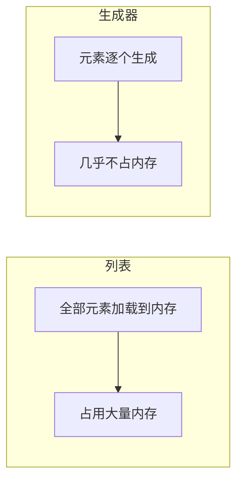

# 深入 Python 语法与编程习惯：写出真正的 Pythonic 代码

Python 以其简洁优雅著称，但“会写 Python”和“写出 Pythonic 的 Python”之间存在着不小的差距。对于中高级开发者而言，理解语言底层的设计哲学、掌握惯用法以及规避常见陷阱，是提升代码质量与性能的关键。

本文将从 **Pythonic 核心原则**出发，深入探讨列表推导式、装饰器、上下文管理器、生成器、类型提示、异步编程等高级特性，并结合代码示例与图示，帮助你在日常开发中写出更地道、更高效的 Python 代码。

---

## 1. 什么是 Pythonic？

Pythonic 并不是一个严格的定义，而是一种社区公认的编码风格和习惯，它遵循 **“简洁、可读、明确”** 的原则。Tim Peters 的《Zen of Python》（PEP 20）给出了精辟的总结：

> - 优美胜于丑陋  
> - 明了胜于隐晦  
> - 简单胜于复杂  
> - 复杂胜于凌乱  
> - 扁平胜于嵌套  
> - 间隔胜于紧凑  
> - 可读性很重要  
> - ...

**核心目标**：用最自然的方式表达意图，让代码读起来像伪代码一样清晰。

---

## 2. 列表推导式与生成器表达式：告别显式循环

Python 提供了强大的序列处理语法，列表推导式（list comprehension）和生成器表达式（generator expression）是其中最具代表性的特性。

### 2.1 列表推导式：简洁且高效

假设我们要筛选出列表中所有的偶数并平方：

```python
# 非Pythonic
numbers = [1, 2, 3, 4, 5]
result = []
for n in numbers:
    if n % 2 == 0:
        result.append(n ** 2)

# Pythonic
result = [n ** 2 for n in numbers if n % 2 == 0]
```

**优势**：
- 代码量减少，意图一目了然
- 底层由 C 语言实现，比手动循环更快

**注意**：不要滥用列表推导式，如果逻辑过于复杂（例如嵌套多个 `if` 或 `for`），应拆分为普通循环以保持可读性。

### 2.2 生成器表达式：节省内存

当数据量很大时，使用列表推导式会一次性生成整个列表，占用大量内存。此时应使用生成器表达式：

```python
# 列表推导式（占用内存）
squares = [x ** 2 for x in range(10_000_000)]

# 生成器表达式（惰性求值）
squares_gen = (x ** 2 for x in range(10_000_000))
```

生成器表达式返回一个迭代器，每次迭代才计算下一个值，非常适合流式处理或只需遍历一次的场景。

---

## 3. 装饰器：函数之上的函数

装饰器是 Python 中实现 **AOP（面向切面编程）** 的利器，它允许在不修改原函数代码的情况下添加额外功能。

### 3.1 理解装饰器执行流程

装饰器本质上是一个可调用对象（通常是函数），接收一个函数作为参数，返回一个新的函数。下面是一个简单的计时装饰器：

```python
import time
from functools import wraps

def timer(func):
    @wraps(func)  # 保留原函数的元信息
    def wrapper(*args, **kwargs):
        start = time.time()
        result = func(*args, **kwargs)
        print(f"{func.__name__} took {time.time() - start:.2f}s")
        return result
    return wrapper

@timer
def slow_function():
    time.sleep(1)

slow_function()  # 输出：slow_function took 1.00s
```

**执行流程**（使用 mermaid 图示）：

```mermaid
graph TD
    A[定义函数 slow_function] --> B[应用装饰器 @timer]
    B --> C[timer(slow_function) 被调用]
    C --> D[返回 wrapper 函数]
    D --> E[将 slow_function 重新绑定为 wrapper]
    E --> F[调用 slow_function() 实际执行 wrapper]
    F --> G[执行计时逻辑，调用原函数]
```

### 3.2 带参数的装饰器

如果需要向装饰器传递参数，需要再嵌套一层：

```python
def repeat(n):
    def decorator(func):
        @wraps(func)
        def wrapper(*args, **kwargs):
            for _ in range(n):
                result = func(*args, **kwargs)
            return result
        return wrapper
    return decorator

@repeat(3)
def greet(name):
    print(f"Hello, {name}")

greet("Alice")  # 打印三次 Hello, Alice
```

### 3.3 常见应用场景

- **日志记录**：自动记录函数调用
- **权限校验**：检查用户是否有权限执行
- **缓存**：`functools.lru_cache`
- **重试机制**：失败后自动重试

---

## 4. 上下文管理器：资源管理的优雅方式

上下文管理器通过 `with` 语句简化了资源的获取和释放，最经典的例子是文件操作：

```python
with open('file.txt', 'r') as f:
    content = f.read()
# 离开 with 块后自动关闭文件
```

### 4.1 实现上下文管理器

有两种方式：**类实现** 和 **`contextlib` 模块**。

**基于类的实现**：
```python
class ManagedFile:
    def __init__(self, filename, mode):
        self.filename = filename
        self.mode = mode
    
    def __enter__(self):
        self.file = open(self.filename, self.mode)
        return self.file
    
    def __exit__(self, exc_type, exc_val, exc_tb):
        if self.file:
            self.file.close()
        # 返回 True 表示异常已被处理，不会向外抛出
        return False
```

**使用 `contextlib.contextmanager` 装饰器**（更简洁）：
```python
from contextlib import contextmanager

@contextmanager
def managed_file(filename, mode):
    f = open(filename, mode)
    try:
        yield f
    finally:
        f.close()
```

### 4.2 高级技巧：同时管理多个上下文

Python 3.3+ 支持在同一个 `with` 语句中管理多个上下文：

```python
with open('in.txt') as f_in, open('out.txt', 'w') as f_out:
    f_out.write(f_in.read())
```

对于动态数量的上下文，可以使用 `contextlib.ExitStack`：

```python
from contextlib import ExitStack

filenames = ['file1.txt', 'file2.txt']
with ExitStack() as stack:
    files = [stack.enter_context(open(fname)) for fname in filenames]
    # 处理多个文件
```

---

## 5. 迭代器与生成器：惰性求值的艺术

### 5.1 迭代器协议

任何实现了 `__iter__()` 和 `__next__()` 方法的对象都是迭代器。`for` 循环本质上是在调用迭代器的 `__next__()` 直到 `StopIteration`。

```python
class CountDown:
    def __init__(self, start):
        self.count = start
    
    def __iter__(self):
        return self
    
    def __next__(self):
        if self.count <= 0:
            raise StopIteration
        self.count -= 1
        return self.count + 1

for num in CountDown(5):
    print(num)  # 5 4 3 2 1
```

### 5.2 生成器：更简单的迭代器

生成器函数使用 `yield` 关键字，每次调用 `next()` 时执行到下一个 `yield` 并暂停。

```python
def countdown(n):
    while n > 0:
        yield n
        n -= 1

for num in countdown(5):
    print(num)
```

**生成器与列表的内存对比**：



### 5.3 生成器进阶：yield from 与协程

`yield from` 用于在生成器中委派给另一个生成器，简化嵌套生成器的编写。

```python
def generator1():
    yield from range(3)
    yield from 'abc'

list(generator1())  # [0, 1, 2, 'a', 'b', 'c']
```

在 Python 3.5+ 中，`yield` 的基础上演化出了 `async/await` 协程，但生成器仍然是协程的基础（可通过 `.send()` 方法实现双向通信）。

---

## 6. 类型提示：让动态语言拥有静态检查

Python 3.5 引入类型提示（Type Hints），虽然不影响运行时，但能显著提高代码可读性，并与工具（如 `mypy`、IDE）配合进行静态类型检查。

### 6.1 基础用法

```python
def greeting(name: str) -> str:
    return f"Hello, {name}"

age: int = 25
```

### 6.2 复杂类型（使用 typing 模块）

```python
from typing import List, Dict, Optional, Union, Tuple

def process_items(items: List[int]) -> Dict[str, int]:
    return {"sum": sum(items)}

def find_user(user_id: Optional[int] = None) -> Union[str, None]:
    if user_id:
        return f"User {user_id}"
    return None

# Python 3.10+ 可以使用 | 代替 Union
def find_user(user_id: int | None = None) -> str | None:
    ...
```

### 6.3 类型别名与自定义类型

```python
from typing import TypeAlias

Vector: TypeAlias = List[float]
```

### 6.4 实际收益

- IDE 自动补全和类型检查
- 提前发现潜在的类型错误
- 作为文档，降低维护成本

---

## 7. 异步编程：asyncio 与 async/await

Python 3.5 正式引入 `async/await`，使得异步 I/O 编程变得简洁。

### 7.1 事件循环模型

```python
import asyncio

async def fetch_data():
    print("开始获取数据...")
    await asyncio.sleep(2)  # 模拟 I/O 操作
    print("数据获取完成")
    return {"data": 123}

async def main():
    result = await fetch_data()
    print(result)

asyncio.run(main())
```

**异步执行流程**（使用 mermaid 图示）：

```mermaid
sequenceDiagram
    participant Main as main()
    participant F as fetch_data()
    participant Loop as 事件循环
    
    Main->>Loop: asyncio.run(main)
    Loop->>Main: 调用 main()
    Main->>F: await fetch_data()
    F->>Loop: 遇到 await asyncio.sleep
    Loop->>F: 暂停，执行其他任务
    Note over Loop: 2秒后...
    Loop->>F: 恢复执行
    F-->>Main: 返回结果
    Main-->>Loop: 结束
```

### 7.2 并发执行多个任务

```python
async def main():
    task1 = asyncio.create_task(fetch_data())
    task2 = asyncio.create_task(fetch_data())
    results = await asyncio.gather(task1, task2)
    print(results)
```

### 7.3 适用场景

- 网络 I/O（HTTP 请求、数据库查询）
- 文件 I/O（配合 `aiofiles`）
- 高并发 Web 服务（FastAPI、aiohttp）

**注意**：CPU 密集型任务不适合用 asyncio，应使用多进程或线程。

---

## 8. 常见陷阱与最佳实践

### 8.1 可变默认参数

**陷阱**：函数定义时默认参数只计算一次，如果默认参数是可变对象（如列表、字典），多次调用会累积修改。

```python
def add_item(item, lst=[]):  # 危险！
    lst.append(item)
    return lst

print(add_item(1))  # [1]
print(add_item(2))  # [1, 2]  ❌ 期望是 [2] 吗？
```

**最佳实践**：使用 `None` 作为默认值，并在函数内部创建新对象。

```python
def add_item(item, lst=None):
    if lst is None:
        lst = []
    lst.append(item)
    return lst
```

### 8.2 浅拷贝与深拷贝

对于嵌套的可变对象，直接赋值或使用 `.copy()` 只是浅拷贝，内层对象仍共享引用。

```python
original = [[1, 2], [3, 4]]
shallow = original.copy()
shallow[0][0] = 99
print(original)  # [[99, 2], [3, 4]]  ❌ 原对象被修改

import copy
deep = copy.deepcopy(original)
deep[0][0] = 0
print(original)  # [[99, 2], [3, 4]]  ✅ 不受影响
```

### 8.3 在循环中修改正在迭代的列表

```python
# 错误示例
items = [1, 2, 3, 4]
for item in items:
    if item % 2 == 0:
        items.remove(item)  # 导致跳过元素
print(items)  # [1, 3]  ❌ 4 没有被移除？
```

**正确做法**：创建新列表或使用列表推导式。

```python
items = [1, 2, 3, 4]
items = [item for item in items if item % 2 != 0]  # 新列表
```

### 8.4 使用 `is` 比较单例

`is` 用于比较对象身份（内存地址），而 `==` 比较值。对于单例如 `None`、`True`、`False`，应使用 `is`。

```python
if result is None:  # ✅
if result == None:  # ❌ 可行但不推荐
```

### 8.5 利用内置函数和标准库

Python 内置函数和标准库经过高度优化，尽量使用它们而非自己造轮子。

```python
# 手动实现
max_val = numbers[0]
for n in numbers[1:]:
    if n > max_val:
        max_val = n

# Pythonic
max_val = max(numbers)
```

- `sum()`、`any()`、`all()`、`zip()`、`enumerate()` 等
- `itertools` 模块提供高效的迭代工具
- `collections` 模块提供 `defaultdict`、`Counter`、`deque` 等

---

## 9. 性能优化小技巧

### 9.1 局部变量加速

在循环中频繁访问全局变量或模块属性时，将其赋值给局部变量可以提升速度。

```python
import math

def compute_sines(angles):
    result = []
    sin = math.sin  # 局部变量
    for angle in angles:
        result.append(sin(angle))
    return result
```

### 9.2 字符串拼接

使用 `+` 拼接大量字符串会产生许多中间字符串，效率低下。应使用 `join()` 方法。

```python
# 慢
s = ""
for chunk in chunks:
    s += chunk

# 快
s = "".join(chunks)
```

### 9.3 选择合适的数据结构

- 频繁查找：使用 `set` 或 `dict` 而非列表
- 频繁在两端插入/删除：使用 `collections.deque`
- 计数：使用 `collections.Counter`

---

## 10. 总结

Python 的简洁背后蕴藏着深厚的语言特性与设计哲学。要写出真正的 Pythonic 代码，需要：

1. **理解并遵循惯用法**：列表推导式、生成器、装饰器等是 Python 的灵魂。
2. **掌握高级特性**：上下文管理器、异步编程、类型提示能显著提升代码的健壮性和可维护性。
3. **规避常见陷阱**：了解可变默认参数、浅拷贝等问题，避免踩坑。
4. **持续优化与学习**：关注性能技巧，阅读优秀开源代码，参与社区讨论。

Pythonic 不仅仅是一种编码风格，更是一种思维模式——以最清晰、最自然的方式表达逻辑。希望本文能帮助你更深入地理解 Python，并在实际项目中写出更具表现力、更高效的代码。

---

*最后，请记住《Zen of Python》中的一句话：“虽然实践大于理论，但理论仍有参考价值。”不断实践，不断反思，你的 Python 代码终将闪耀出 Pythonic 的光芒。*