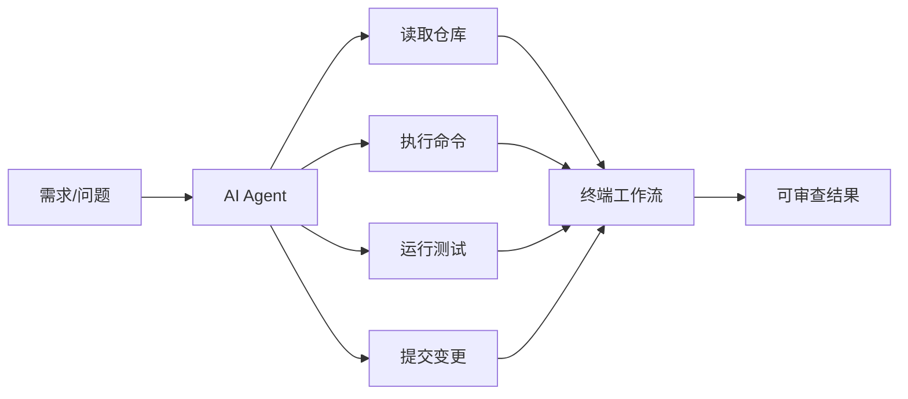
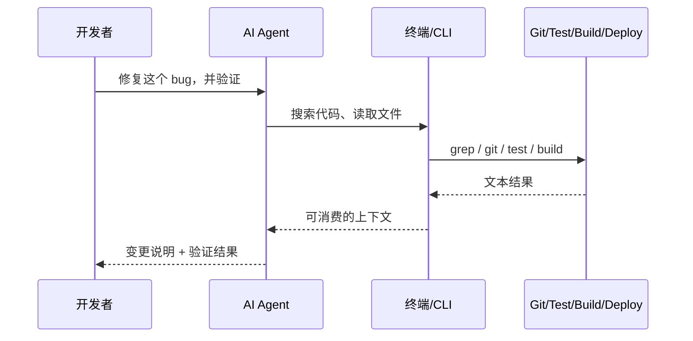

# 终端工作流正在重新赢回主场

过去几年，如果你问一个开发者：AI 编程工具最自然的落点应该在哪里？很多人第一反应会是 IDE。毕竟代码写在 IDE 里，补全、报错、高亮、跳转、调试，全都在那里。把 AI 塞进 IDE，看起来像一条理所当然的路。

但 2025 年之后，事情明显开始变了。

Anthropic 把 Claude Code 做成了终端里的 coding agent，OpenAI 推出了 Codex CLI，GitHub Copilot CLI 开始支持自定义 Agent 和任务委托，Google 也在持续把开发者工作流往 CLI 这一侧推。最近几个月，中文技术社区里类似“AI 编程助手为什么要从 IDE 搬到终端”“为什么越来越多 AI 编程用户开始重视终端体验”这样的讨论也明显变多了。

这不是情怀回潮，也不是黑窗口爱好者的一次集体自嗨。真正发生的事是：当 AI 从“代码补全”升级成“可以自己读仓库、跑命令、改文件、执行测试”的 Agent 之后，终端重新成了最合适的控制平面。

我现在的判断很直接：终端工作流正在重新赢回主场，不是因为终端更酷，而是因为它更适合 AI 真正开始干活的时代。

---

## 先说结论：AI 时代，终端不是输入框，而是控制平面

IDE 适合“写代码”这件事，终端适合“驱动系统”这件事。

当 AI 还只是补全一行代码、生成一个函数、解释一段报错时，IDE 是最舒服的落点。因为它贴着编辑器，离代码最近，反馈也最快。

但当 AI 开始接管的是下面这些任务时，问题就变了：读整个仓库、搜索跨目录依赖、运行测试、调用 lint、执行 git、编排多步工作流、在不同 repo 之间移动、最后再给出一份可以 review 的结果。到了这个阶段，AI 已经不只是一个写作助手，它更像一个能调度工具链的工程代理。

而工程代理最需要的，不是一个漂亮界面，而是一套稳定、可组合、可审计、可复现的操作接口。

这正是终端最擅长的事。



如果你把终端理解成“一个黑窗口”，你会低估它。

在 AI Coding 时代，终端更像是一块总控台。Git、Docker、npm、pnpm、pytest、go test、kubectl、grep、sed、jq、make、gh，这些开发者最核心的生产工具，本来就都生活在这里。AI 一旦进入终端，它不是进入了另一个输入法，它是直接接入了开发者已经存在的生产系统。

---

## 为什么大厂开始集体做 CLI

只看单个产品，你会觉得这只是形态差异；把时间线连起来，就会发现这更像一次方向性迁移。

2025 年 2 月，Anthropic 发布 Claude Code，把“读代码、改代码、跑命令、执行测试”这套能力直接放进终端。2025 年 4 月，OpenAI 推出 Codex CLI，明确把本地终端作为 coding agent 的运行入口。2025 年 10 月，GitHub Copilot CLI 支持自定义 Agent 和 `/delegate` 任务委托，终端里可以直接把一个需求交给后台 Agent 执行，并生成草稿 PR。到 2025 年 12 月，又出现了 Toad 这种把多个 AI coding agent 统一编排在终端里的新工具，说明终端不只是“运行单个 AI”，而是在演化成 Agent 的调度层。

这几件事放在一起看，信号已经很强了：AI 编程工具不再只争 IDE 入口，而是在争“谁能接管真正的开发工作流”。



IDE 插件当然还会继续存在，而且会越来越强。但如果目标是让 AI 真正参与一个完整的工程闭环，终端的地位只会更高，不会更低。

---

## 终端工作流重新变强，不靠情怀，靠的是四个工程优势

### 1. 它天然可组合

终端最大的价值，从来不是“快”，而是“能接”。

一个命令干一件事，多个命令通过 stdin/stdout 串起来，这就是 Unix 哲学最朴素也最强的地方。对人来说，这意味着可以写脚本；对 AI 来说，这意味着每一步都是结构化文本，每一步都能被继续消费。

比如一个很真实的工作流：先 grep 出相关文件，再让 AI 读这些文件，再运行测试，再根据失败结果继续修。这个过程在终端里几乎是天然成立的。

```bash
rg "UserQuota|QuotaExceeded" ./service ./api ./web
claude "先阅读这些命中的文件，判断限额逻辑分布在哪几层"
pytest tests/quota -q
claude "根据失败的测试，最小化修改并解释原因"
```

GUI 不是不能做这些事，但它做这件事的方式更像“你点一个按钮，再点另一个按钮，再在另一个面板里确认状态”。这种流程对人还行，对 Agent 不够自然。Agent 需要的是原子动作和清晰回执，而不是隐式状态和界面跳转。

### 2. 它天然可脚本化

AI 真正有价值的地方，不是帮你多写十行代码，而是把那些重复、繁琐、容易断节奏的动作接过去。

比如拉分支、读 issue、改代码、跑测试、生成 commit message、整理 PR 说明。这些步骤在 GUI 里都能做，但只有在终端里，它们能真正连成一条自动化链路。

```bash
git checkout -b fix/payment-timeout
claude "读取最近的报错日志，定位 payment timeout 的根因，并给出最小修复"
go test ./... 
claude "根据当前 diff 生成一条清晰的 commit message"
git commit -am "fix: reduce payment timeout caused by stale connection reuse"
```

一旦 AI 能嵌进 Shell、Makefile、CI 或 Git hooks，它就不再只是一个聊天窗口，而是进入了正式生产流程。

这也是为什么终端形态越来越重要。因为能接进流程，才是真正的生产力。

### 3. 它天然可观测、可审计

AI Coding 最怕什么？不是模型不够强，而是你不知道它刚刚到底干了什么。

终端的好处是，输入是文本，输出也是文本。跑了什么命令、读了哪些文件、测试为什么挂、哪一步修改失败，全都有迹可循。你可以 review，可以复制，可以追溯，可以重放。

相比之下，很多 GUI 交互其实是隐式状态：你点了什么、哪个面板切走了、哪个按钮变灰了、什么上下文被保留、什么上下文被清空了，事后并不容易重建。

AI 一旦开始真正执行动作，审计能力就变得非常重要。终端不是更“古老”，而是更“透明”。

### 4. 它天然更适合大上下文和多工具协作

2026 年 3 月 OpenDev 那篇关于 terminal-native coding agent 的论文里，重点讲了上下文压缩、双内存架构、工具结果裁剪这些工程实践。它本质上在解决一个问题：当 Agent 面对的不是单文件，而是整个仓库、多个步骤、很多工具返回结果时，怎么不被上下文撑爆。

终端工作流对这个问题更友好，因为它天生就是“按需取结果”。需要目录结构就 `ls`，需要搜索就 `rg`，需要 JSON 就 `jq`，需要测试结果就直接读测试输出。你不需要把整个 IDE 状态打包给模型，你只需要把当前这一步真正有用的文本交给它。

这会极大降低上下文噪音。

说白了，GUI 更像一个把所有东西同时摊开的大桌面，而终端更像一个高压缩率的操作台。对于 Agent 来说，后者更利于推理。

---

## 终端为什么特别适合多 Agent 协作

我最近越来越强烈的一个感受是：AI Coding 的下一个瓶颈，不只是模型质量，而是工作流编排。

一个 Agent 负责读需求，一个 Agent 负责改后端，一个 Agent 负责补测试，一个 Agent 负责做 review，这种事情已经不是想象，而是很多开发者正在尝试的日常。

这时候，终端的价值会继续放大。因为终端最擅长的，恰恰就是把不同工具、不同命令、不同上下文拼成一个可以落地的流程。

```bash
# 需求分析
claude "阅读 docs/payment.md 和 issue #42，总结需求边界"

# 后端实现
codex "在 ./server 中实现 payment retry，并保持接口兼容"

# 测试补齐
claude "给 ./server/payment 增加失败重试与超时回归测试"

# 最终验证
make test && make lint
```

如果这些动作发生在终端里，你几乎不需要额外解释“下一步该切到哪个界面”。每个 Agent 都在同一个控制平面里干活，切换成本很低，产物也天然能汇总。

这也是为什么我现在会把终端看成 AI Agent 的宿主层，而不是附属工具。

---

## 这不意味着 GUI 没价值，恰恰相反

我不觉得这是“终端打败 GUI”的故事。真正成熟的结论应该是：GUI 负责可视化和精修，终端负责编排和执行。

看 diff、做复杂断点调试、盯前端界面细节、拖数据库关系图，这些事情 GUI 仍然很强，而且很多场景下不可替代。

但如果任务是：跨仓库搜索、批量改动、自动验证、标准化执行、接 CI/CD、可复现回放，那么终端的优势会越来越明显。

最合理的未来，不是谁替代谁，而是分工变得更清楚：IDE 继续做最强的人类编辑器，终端成为 AI Agent 的主战场。

---

## 一个更现实的判断：终端正在从“高手工具”变成“默认接口”

以前很多人对终端的想象，还是门槛高、记命令、容易出错、适合老程序员炫技。

但 AI CLI 工具把这件事彻底改写了。

你现在不一定要先会一百条命令，才能用终端。很多时候你只要会描述目标：帮我分析这个仓库、帮我定位 bug、帮我补测试、帮我最小化修改、帮我生成 review 说明。底层那套 git、grep、test、build 的调用，AI 会替你走。

终端的学习曲线，正在被自然语言不断压平。

这件事一旦成立，终端就不再只是高手工具，而会慢慢变成 AI 与开发环境交互的默认接口。因为它足够简单，足够稳定，足够贴近真实生产系统。

---

## 最后

如果你今天还把终端理解为“黑窗口里敲命令的 old school 技能”，那你看到的只是它的表层。

真正值得注意的是，终端正在重新变成工程系统的中枢，而且这次不是因为人类开发者怀旧，而是因为 AI Agent 终于把终端真正需要的那些特性重新激活了：可组合、可脚本、可审计、可复现、可接入整个工具链。

过去十几年，大家一直在想办法把开发工作流图形化；接下来几年，我们可能会看到另一种更有意思的趋势：图形界面继续负责展示和交互，而真正推动系统向前跑的那只手，越来越多地回到终端里。

终端工作流不是回潮，它是在 AI 时代重新对齐了自己的位置。

而这一次，它赢回主场，不靠怀旧，靠工程现实。

---

## 参考资料

1. [Claude Code 官方产品页](https://claude.com/product/claude-code)
2. [OpenAI Codex CLI GitHub 仓库](https://github.com/openai/codex)
3. [GitHub Copilot CLI: Use custom agents and delegate to Copilot coding agent](https://github.blog/changelog/2025-10-28-github-copilot-cli-use-custom-agents-and-delegate-to-copilot-coding-agent/)
4. [Toad is a unified experience for AI in the terminal](https://willmcgugan.github.io/toad-released/)
5. [Terminal AI Agents: The 2025 Landscape](https://wal.sh/research/2025-terminal-ai-agents.html)
6. [为什么命令行可能是 AI Agent 最友好的交互界面？](https://sspai.com/post/107173)
7. [AI Coding向CLI方向发展的深层次原因](https://hobbytp.github.io/zh/my_insights/ai_coding_cli_trend/)
8. [Building AI Coding Agents for the Terminal: Scaffolding, Harness, Context Engineering, and Lessons Learned](https://arxiv.org/html/2603.05344v1)
