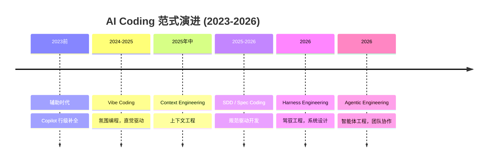
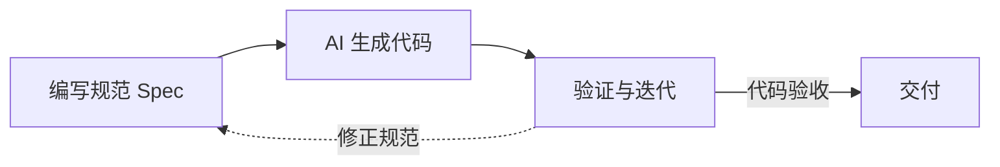
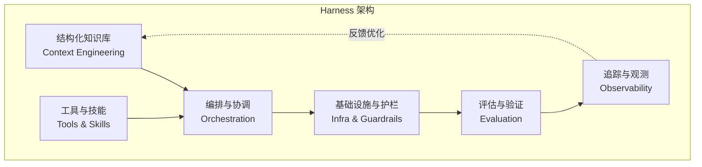
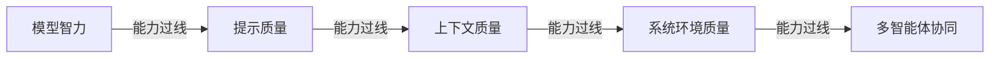

# 从 Vibe Coding 到 Harness Engineering：AI Coding 的范式演进之路

> 从 Karpathy 在浴缸里灵光一现的“氛围编程”，到 OpenAI 用 AI 智能体在 5 个月内交付百万行代码的“驾驭工程”——AI Coding 在短短两年内完成了四次范式跃迁。本文将系统梳理这条演进路径，并深入探讨 Harness Engineering 如何成为 AI 时代软件工程的最终答案。


## 1. 引言：AI Coding 的“文艺复兴”

2025 年 2 月，前 OpenAI 联合创始人 Andrej Karpathy 在社交媒体上随手发了一条推文：

> *“There‘s a new kind of coding I call ’vibe coding‘, where you fully give in to the vibes, embrace exponentials, and forget that the code even exists.”*

他没多想，把它当作一个“浴中哲思”随手发出。但这条推文意外地引爆了一场全球性的编程运动。一年后，“Vibe Coding”被写进了维基百科，词条内容比他的个人词条还要长[reference:0]。

然而，仅仅一年后，Karpathy 亲自按下了升级键。2026 年初，他提出了“Agentic Engineering”——智能体工程，标志着 AI 编程从“玩票”走向“专业”[reference:1]。同年 2 月，OpenAI 公开了 Harness Engineering 方法论，用一个内部实验把范式演进推向了新高度：3 名工程师，5 个月，零行手写代码，交付了百万行生产级产品[reference:2]。

本文将沿着这条时间线，系统梳理 AI Coding 从 Vibe Coding 到 Harness Engineering 的完整演进路径，剖析每一次范式跃迁的核心驱动力、技术特征和里程碑案例，并探讨工程师角色如何在这一过程中被重新定义。


## 2. AI Coding 的范式演进时间线



### 2.1 整体演进概览

| 阶段 | 时间 | 核心逻辑 | 人类角色 | AI 角色 | 代码质量 |
| :--- | :--- | :--- | :--- | :--- | :--- |
| **辅助时代** | 2023 前 | AI 辅助行级补全 | 代码编写者 | 打字助手 | 稳定可控 |
| **Vibe Coding** | 2024-2025 | 直觉驱动，全盘接受 | 体验者/协作者 | 高级自动补全 | 参差不齐 |
| **Context Engineering** | 2025 年中 | 信息环境设计 | 上下文编排者 | 上下文感知执行者 | 有约束 |
| **SDD / Spec Coding** | 2025-2026 | 规范先行，共识驱动 | 架构设计师 | 规约执行者 | 高可预测 |
| **Harness Engineering** | 2026 | 系统环境设计 | 系统架构师 | 自主执行者 | 稳定可控 |
| **Agentic Engineering** | 2026 | 多智能体协同 | 项目经理/架构师 | 协同作战团队 | 高可靠性 |

**演进的核心逻辑**：每一次范式跃迁，都在扩大工程设计的覆盖范围——从单次交互，到模型输入环境，到完整的生产运行体系[reference:3]。每一次迭代都指向同一个结论：AI 的效果瓶颈不在模型，而在围绕模型构建的系统环境。


## 3. 阶段一：辅助时代（2023 前）—— 行级补全的“得力助手”

这是 AI 编程的萌芽期。以 GitHub Copilot 为代表的工具主要解决语法错误和重复代码编写问题，在 IDE 中提供行级代码补全。此时的 AI 更像是程序员身边的“打字助手”，核心逻辑是“AI 辅助，人类主导”，开发者仍需逐行编写绝大部分代码，AI 仅在局部环节参与[reference:4][reference:5]。

**局限性**：AI 无法理解全局上下文，更无法自主完成完整功能。代码的核心逻辑、架构设计、测试编写，全由人类完成。


## 4. 阶段二：Vibe Coding（2024-2025）—— 氛围编程的“野马”

### 4.1 什么是 Vibe Coding？

Vibe Coding 的本质是“放弃控制”——开发者用自然语言描述需求，全盘接受 AI 生成的代码，不审查 diff，不纠结实现细节，通过不断粘贴错误信息迭代，直到程序跑起来[reference:6]。其核心本质可以用三句话概括[reference:7]：

1. **代码从核心资产变为实现细节**：开发者只需聚焦业务意图，代码成为 AI 生成的瞬时消耗品
2. **开发核心从“实现”变为“意图对齐”** ：通过持续的自然语言对话，让 AI 生成的结果不断对齐开发者预期
3. **开发者角色从“执行者”变为“决策者”** ：从亲手拧螺丝的“工人”，转变为指挥乐团的“指挥家”

### 4.2 适用场景与失效模式

Vibe Coding 确实有其价值：绿地的 MVP 和原型开发、个人脚本和一次性工具、学习和探索性编程[reference:8]。

但它的失效模式同样显著。就像 Karpathy 所说的，“一年前的 Vibe Coding，是大家用当时能力还比较弱的 LLM，做些好玩的一次性项目、演示和小探索”[reference:9]。一旦进入真实世界，问题就暴露了：

> *“你试图修改它、扩展它、或者加固它，然后你会发现——没人知道代码到底在做什么。有人把这叫做‘工程’？不，这叫‘许愿’。”*[reference:10]

**比喻**：Vibe Coding 就像开碰碰车——追求乐趣和快速移动，规则宽松，撞了墙也没关系[reference:11]。问题是，当你要开车上高速公路时，碰碰车的玩法就行不通了。


## 5. 阶段三：Context Engineering（2025 年中）—— 模型的信息环境设计

### 5.1 从“怎么写提示词”到“该喂什么信息”

2025 年中，Karpathy 发帖：“+1 for ‘context engineering’ over ‘prompt engineering’”[reference:12]。同年，Gartner 正式宣布 Context Engineering 正在取代 Prompt Engineering，标志着行业关注点从“怎么写提示词”转向“怎么设计模型运行时的信息环境”[reference:13]。

Context Engineering 被定义为“为 AI 智能体设计整个信息生态系统的学科”——不仅包括提示词，还包括代码库上下文、Git 历史、依赖关系、工具定义、团队标准以及检索到的文档[reference:14]。

### 5.2 五大核心策略

根据 Faros 的完整指南，Context Engineering 包含五项核心策略[reference:15]：

| 策略 | 描述 |
| :--- | :--- |
| **选择 (Selection)** | 从海量信息中筛选出最相关的部分，而非全量喂入 |
| **压缩 (Compression)** | 对冗余信息进行摘要，减少 Token 消耗 |
| **排序 (Ordering)** | 信息呈现的顺序影响模型注意力分配 |
| **隔离 (Isolation)** | 不同任务使用独立上下文，避免相互污染 |
| **格式优化 (Format Optimization)** | 结构化信息（JSON/YAML）比纯文本更容易被模型解析 |

### 5.3 为什么 Context Engineering 取代了 Prompt Engineering？

Prompt Engineering 的精妙之处在于“怎么写”，但它的视野局限在单条指令上。而 Context Engineering 将视野扩展到了“模型看到的所有信息”。一个精心设计的 Prompt 可以写出 10 分的效果，但如果模型缺少关键的代码库上下文，结果可能是 0 分。因此，**Context Engineering 比 Prompt Engineering 更本质**：它是模型能力的“前置条件”。


## 6. 阶段四：SDD / Spec Coding（2025-2026）—— 规范驱动的“共识”

在 Vibe Coding 和 Harness Engineering 之间，有一个关键的过渡方法论：SDD（Specification-Driven Development，规范驱动开发）[reference:16]。

SDD 的核心逻辑是“先写规范，再生成代码”：在动手之前，人类与 AI 必须先达成一套关于架构、边界与逻辑的共识文档（Spec），让 AI 基于规约逐点执行[reference:17]。规范成为唯一的“事实来源”，代码是规范的自动化表达[reference:18]。



SDD 解决了 Vibe Coding 的几个核心痛点：代码不可控 → 规范作为约束；结果不可预测 → 验收标准明确；难以协作 → 规范即文档；质量不稳定 → 规范驱动测试[reference:19]。

**示例规范**：

```yaml
specification:
  name: 用户登录
  functional_requirements:
    - 支持邮箱/手机号登录
    - 登录失败 5 次锁定 30 分钟
  constraints:
    - 响应时间 < 500ms (P95)
    - 密码加密：bcrypt
  acceptance_criteria:
    - 正确凭证 100% 登录成功
    - 错误凭证返回明确错误码
```

SDD 可以理解为“用规范替换感觉”——它把 Vibe Coding 中依赖“感觉”的部分，用可验证的规范文档取代，为后续的 Harness Engineering 奠定了基础[reference:20]。


## 7. 阶段五：Harness Engineering（2026）—— 系统环境的“马具”

### 7.1 概念定义与核心要素

2026 年初，HashiCorp 联合创始人 Mitchell Hashimoto 将 Harness Engineering 作为一个正式概念提出[reference:21]。紧接着，OpenAI 用百万行代码实验引爆了这一范式[reference:22]。LangChain 则提供了量化的证据——仅优化 Harness，不更换模型，编码 Agent 在 Terminal Bench 2.0 上的得分从 52.8% 飙升至 66.5%，排名从全球前 30 之外跃升至前 5[reference:23]。

Harness Engineering 的核心是为 AI 智能体构建一套完整的运行环境、约束规则与反馈闭环，让 AI 可靠、自主地完成复杂工作[reference:24]。Hashimoto 给过一个朴素而深刻的定义：“每当 AI 犯错，就工程化一个方案，让它永远不再犯同样的错”[reference:25]。

**“马具”的比喻**：百度云相关业务负责人云周将这个比喻精准地表达了出来——大模型是一匹拥有惊人体能、在荒野中横冲直撞的野马；缰绳是 Prompt Engineering，马鞍是 RAG 插件，马镫是闭环的沙盒执行环境。只有套上这套“马具”，才能将野马转化为能上赛场、稳定输出的赛马[reference:26]。



### 7.2 Harness 的核心组件

| 层次 | 组件 | 功能 |
| :--- | :--- | :--- |
| **信息层** | 结构化知识库 | 渐进式披露的文档体系，如“索引地图”式的 AGENTS.md |
| | 工具与技能 | 精选最小工具集，每个工具有清晰的输入输出 schema |
| **执行层** | 编排与协调 | 任务拆解、Agent 交接、状态管理（如双智能体接力架构） |
| | 基础设施与护栏 | 沙箱隔离、权限控制、失败恢复 |
| **反馈层** | 评估与验证 | 自动化测试、自我评分、人机协同评审 |
| | 追踪与观测 | 执行轨迹、成本分析、日志与指标查询（LogQL/PromQL） |

### 7.3 Harness Engineering 的核心思维转变

从 Vibe Coding 到 Harness Engineering，最核心的转变是**“修复环境，而非修复代码”**。当 AI 写出 Bug 时，低级做法是直接告诉它“这行写错了”；高级做法是思考“为什么我们的测试没抓到？是不是目录结构误导了它？”然后通过修改 AGENTS.md 规范或增加 Linter 来“修复环境”[reference:27]。

### 7.4 里程碑案例

#### OpenAI 百万行代码实验

2025 年 8 月下旬，OpenAI 的一个工程团队开始了一项激进的实验：从一个空的 Git 仓库开始，构建并交付一款软件产品的内部 Beta 版，其中**没有一行代码是人工编写的**。最初仅 3 人的团队（后扩展到 7 人），5 个月，交付了约 100 万行代码，每人每天平均能推进 3.5 个 PR，效率比传统手写代码快了近 10 倍[reference:28]。

早期进展远低于预期。不是 Codex 不行，而是因为环境的规范不够明确[reference:29]。工程师团队的主要工作变成了设计约束规则、质检流程、文档规范和反馈闭环——让 AI 在一个被精心定义的环境中可靠工作[reference:30]。

关键实践[reference:31]：
- **AGENTS.md 从“百科全书”变为“索引地图”**：最初是一本成百上千页的巨型说明书，反而挤占了任务所需的上下文窗口。后来压缩到仅 100 行左右，只做目录和索引，实现渐进式披露
- **可观测性接入**：将 Chrome DevTools 协议接入智能体运行时，创建处理 DOM 快照、截图和导航的技能，同时提供本地可观测性堆栈，使 Agent 能够使用 LogQL 和 PromQL 查询日志、指标和追踪记录

#### LangChain Terminal Bench 2.0 飞跃

LangChain 在 Terminal Bench 2.0 上的实验是 Harness 价值的极致体现：**不更换模型，仅改变 Harness，得分从 52.8% 飙升至 66.5%，排名从全球前 30 之外跃升至前 5**[reference:32][reference:33]。

他们采用了一个简洁有效的“配方”[reference:34]：
- 聚焦三个优化维度：系统提示词、工具选择和中间件（模型和工具调用周围的钩子）
- 创建 Trace Analyzer Agent Skill：从 LangSmith 获取实验追踪数据，生成并行错误分析 Agent，由主 Agent 汇总发现并提出改进建议
- 形成可重复的错误分析和 Harness 优化循环

这些实验揭示的核心规律是：**模型能力已经不是主要瓶颈，围绕模型的工程设计才是决定 AI 实际表现的关键变量**[reference:35]。


## 8. 阶段六：Agentic Engineering（2026）—— 多智能体“军团作战”

就在 Harness Engineering 成为热词的同时，Karpathy 提出了“Agentic Engineering”——智能体工程[reference:36]。它的核心特征包括：

- **99% 的代码不再直接编写**，而是在指挥智能体干活，充当“监工”[reference:37]
- **多智能体协同**：采用“中央编排 Agent + 专项子 Agent”的模式，子 Agent 涵盖架构设计、前端开发、测试验证、安全防护、运维部署等各个环节，多智能体并行推理、分工协作，能将复杂项目的开发周期压缩 70% 以上[reference:38]
- **任务时间从几分钟扩展到数天甚至数周**。Anthropic 发布的 2026 年趋势报告指出，乐天工程师借助 Claude Code，在拥有 1250 万行代码的 vLLM 开源库中，仅用 7 小时就完成特定激活向量提取任务，数值精度达 99.9%[reference:39]

智能体工程的核心是 **“人类从写代码的人，变成带团队的人”** [reference:40]。

**比喻**：Agentic Engineering 就像当赛车手——坐在驾驶舱里，手握方向盘，指挥整个团队（AI 代理）协同作战，冲向终点[reference:41]。


## 9. 演进背后的核心驱动力

### 9.1 能力提升驱动的范式跃迁

每一次范式跃迁，底层都是 AI 模型能力的跃升。早期模型能力有限，只能做行级补全；当模型可以理解完整功能时，Vibe Coding 成为可能；当模型能够处理长时间复杂任务时，Harness Engineering 成为必要；当多模型可以协同工作时，Agentic Engineering 成为趋势。

### 9.2 瓶颈的逐层外移



每一次能力过线，瓶颈就向外层转移一层。这解释了为什么 Harness Engineering 会成为 2026 年的焦点：当模型智力已经足够强大，决定最终效果的不是模型本身，而是围绕模型的系统环境。

### 9.3 工程化的必然要求

Vibe Coding 在娱乐化和探索性场景中确实有其价值，但一旦进入需要长期维护和扩展的生产环境，它的局限性就暴露无遗。工程化要求可复现、可审计、可测试、可维护——这些都需要 Harness Engineering 来保障。


## 10. 范式对比总览

| 维度 | Vibe Coding | Context Engineering | SDD | Harness Engineering | Agentic Engineering |
| :--- | :--- | :--- | :--- | :--- | :--- |
| **核心关注** | 怎么跟 AI 说话 | 该给 AI 喂什么信息 | 如何定义规范共识 | 如何构建运行环境 | 如何协调多智能体 |
| **工程师角色** | 体验者/协作者 | 上下文编排者 | 架构设计师 | 系统架构师 | 项目经理/架构师 |
| **AI 角色** | 高级自动补全 | 上下文感知执行者 | 规约执行者 | 自主执行者 | 协同作战团队 |
| **代码质量** | 参差不齐 | 有约束 | 高可预测 | 稳定可控 | 高可靠性 |
| **适用场景** | 原型、个人项目 | 多轮复杂问答 | 中大型项目 | 生产级应用 | 超大规模系统 |


## 11. 工程师角色的重塑：从“码农”到“驾驭者”

贯穿整个演进路径的，是工程师角色的持续重塑。

- **辅助时代**：工程师是“代码编写者”
- **Vibe Coding**：工程师是“体验者/协作者”，与 AI 共同编写代码
- **Context Engineering**：工程师是“上下文编排者”，设计信息环境
- **SDD**：工程师是“架构设计师”，定义规范和约束
- **Harness Engineering**：工程师是“系统架构师”，设计约束规则、质检流程和反馈闭环
- **Agentic Engineering**：工程师是“项目经理/架构师”，负责系统设计、任务拆解、质量监督和多智能体协同[reference:42]

人类工程师的不可替代性始终在于：**知道一个好的系统长什么样**。正如一位从业者所指出的，“在大厂设计大规模系统的经验，反而让我能更好地驾驭 AI。核心原因在于：我知道一个好的系统长什么样。正因为我有能力设计，才能引导 AI 走向稳固的架构。这就是‘氛围编程’和‘智能体工程’的本质区别”[reference:43]。


## 12. 总结：演进没有终点，驾驭才是答案

从 Vibe Coding 到 Harness Engineering，AI Coding 的范式演进可以总结为三个核心洞察：

1. **瓶颈的外移是必然趋势**：随着模型能力持续提升，瓶颈从“模型智力”逐层外移到“系统驾驭力”。Harness Engineering 正是这一趋势下的产物。

2. **工程化是 AI 落地的唯一路径**：无论模型多强，概率性与确定性之间的鸿沟都需要工程手段来填补。Harness Engineering 的本质，就是通过环境设计、约束规则和反馈闭环，将 AI 的概率性输出转化为确定性结果。

3. **工程师的价值正在迁移，但从未贬值**：从“写代码”到“写规则”，从“执行者”到“设计者”，工程师的角色在演进中不断升级。那些懂得驾驭 AI 的工程师，正在成为 AI 时代的赢家。

Harness Engineering 和 Agentic Engineering 仍在快速演进中。正如从业者所观察到的，“从 Prompt Engineering 到 Context Engineering 到 Harness Engineering，每一步迭代都在扩大工程设计的覆盖范围——从单次交互、到模型输入环境、到完整的生产运行体系。这条演进路径还远没有走完”[reference:44]。当模型能力继续提升，Harness 可能会被“做薄”，多智能体协同会更加深入，但有一点可以确定：未来的软件工程，将越来越考验我们驾驭 AI 的能力，而不仅仅是编写代码的能力。


**延伸阅读**：
- [OpenAI: Harness Engineering](https://openai.com/index/harness-engineering/)
- [Anthropic: 2026 年智能体编码趋势报告](https://www.anthropic.com/news/agentic-coding-trends-2026)
- [LangChain: Improving Deep Agents with Harness Engineering](https://blog.langchain.com/improving-deep-agents-with-harness-engineering/)
- [Andrej Karpathy: Agentic Engineering](https://x.com/karpathy)

*（本文基于 2026 年 Q1 的行业公开资料整理，AI Coding 范式仍在快速迭代中，建议关注一线团队的最新实践。）*