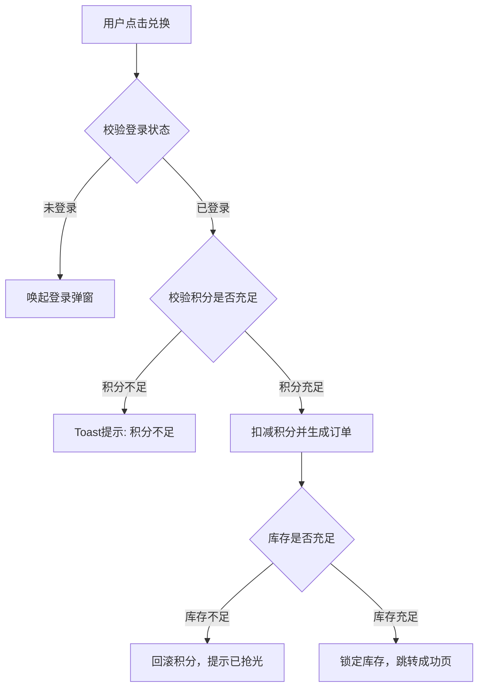
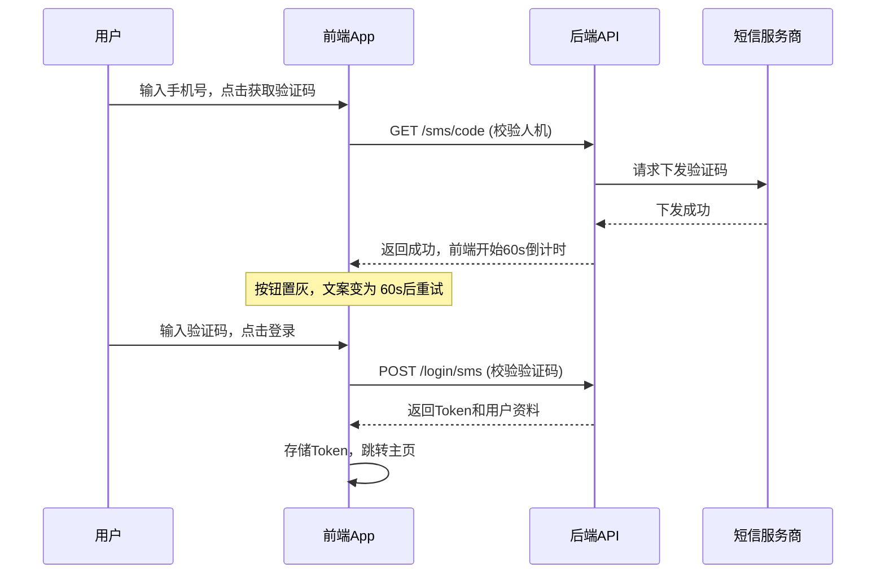
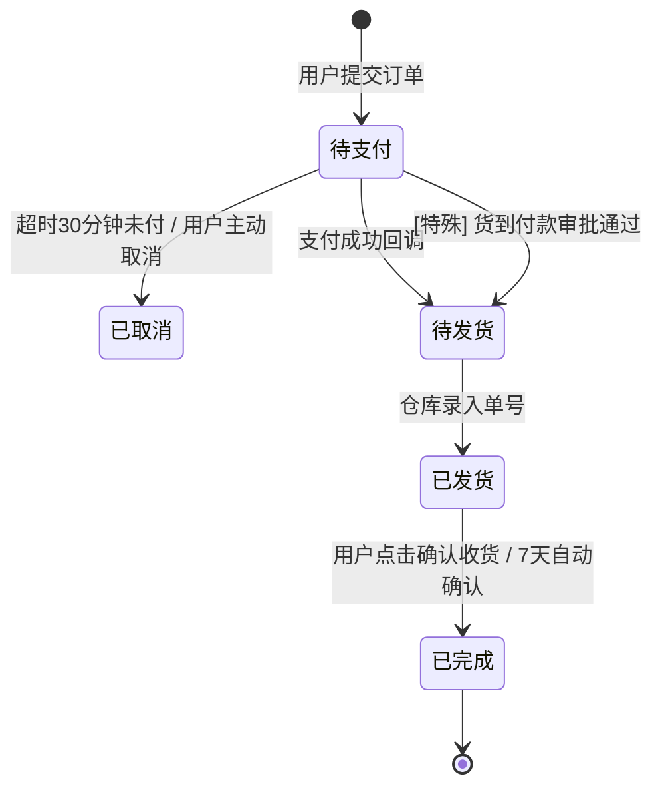
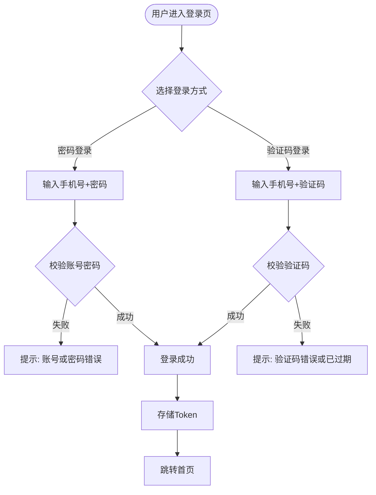

已收到你的补充要求。现将**需求ID（基于时间戳生成）**作为独立模块纳入PRD文档规范，并明确其**全生命周期跟随、不可变更**的属性。以下是整合后的完整规范版本，新增内容已用标记突出。

---

# AI Agent PRD文档生成规范（V2.1 增强版）

> **本次更新说明**：新增 §3.1.1 需求ID生成规则，强化文档唯一标识与生命周期管理。

---

## 一、文档角色与目标

本规范是AI Agent生成产品需求文档（PRD）的**唯一执行标准**。Agent必须严格遵循本文定义的**结构、内容规则、格式约束、版本管理流程及质量检查项**，确保输出的PRD具备以下特征：

- **结构一致性**：所有PRD遵循相同的章节模板。
- **逻辑清晰性**：业务流程与交互逻辑强制使用Mermaid可视化。
- **设计规范性**：UI需求独立成章，包含明确的主题、风格与配色约束。
- **版本可追溯性**：每次生成或修改必须执行版本更新与影响范围记录。
- **唯一标识性**：每个PRD拥有全局唯一的需求ID，贯穿全生命周期。

---

## 二、输入信息处理与确认机制

（本节内容与上一版本保持一致，略作精简以突出新增内容）

Agent在开始生成前，必须完成输入解析。**严禁对缺失信息进行臆造填充。**

### 2.1 必填输入项（缺失时必须反问）

| 字段 | 说明 | Agent反问话术模板 |
|------|------|------------------|
| 产品/功能名称 | PRD的核心标识 | “请提供本次需求的正式名称，例如‘用户中心改版V2.0’。” |
| 业务背景与痛点 | 驱动需求的根本原因 | “请描述当前业务遇到了什么问题或有什么新机会？” |
| 目标用户角色 | 谁在使用 | “请定义1-3个核心用户角色。” |
| 核心功能列表 | 需要开发的具体功能点 | “请列出本次必须实现的功能清单。” |

### 2.2 补充输入项（UI相关）

| 补充项 | 说明 | 缺失处理 |
|--------|------|----------|
| UI风格倾向 | 极简 / 毛玻璃 / 科技感 | 标注`【待确认，默认为现代极简风格】` |
| 品牌主色调 | 十六进制色值 | 标注`【待确认，请提供品牌色值】` |
| 参考竞品 | 交互范式参考 | 标注`【无参考】` |

---

## 三、需求ID与版本管理规则（核心模块）

### 3.1 需求ID（Requirement ID）

#### 3.1.1 生成规则

- **格式**：`REQ-{YYYYMMDD}{HHMMSS}{毫秒后3位}`
- **示例**：`REQ-20260412143052012`
- **生成时机**：Agent在首次创建PRD文档时，基于当前系统时间戳自动生成。
- **不可变更性**：该ID在PRD的整个生命周期（从草稿、评审、开发、上线到归档）中**永久固定，不可修改**。

#### 3.1.2 使用场景

- 作为需求管理系统（如Jira、TAPD）中的唯一键值。
- 在跨团队沟通（开发、测试、设计）中用作需求引用标识。
- 版本历史表中关联每次变更的记录。

#### 3.1.3 Agent行为约束

- **首次生成**：在文档元信息区域**首行**输出需求ID，并以注释形式说明其不变性。
- **后续修改**：Agent再次编辑同一PRD时，**必须保留原需求ID**，不得重新生成。

### 3.2 版本号规范

采用 `V<主版本>.<次版本>.<修订号>` 格式。

- **主版本变更**：产品方向、核心架构发生颠覆性变化。
- **次版本变更**：新增功能模块、大范围逻辑调整。
- **修订号变更**：仅修改文案描述、修正错误、补充边界条件。

### 3.3 文档修订历史表格（必须维护）

Agent每次输出PRD时，必须在**文档开头**维护此表格。**需求ID始终作为表头的一部分出现**。

```markdown
## 修订历史

> **需求ID**：`REQ-20260412143052012` （全生命周期唯一，不可变更）

| 版本 | 修订日期 | 修订人 | 修订模块 | 变更说明 |
|------|----------|--------|----------|----------|
| V1.0.0 | 2026-04-12 | AI Agent | 全文档 | 依据[需求输入]初稿生成 |
| V1.1.0 | 2026-04-13 | AI Agent | 2.2 订单模块 / 3. UI设计 | 增加支付超时逻辑，补充主题色值 |
| V1.1.1 | 2026-04-14 | AI Agent | 4. 验收标准 | 修正登录超时的验收指标数值 |
```

### 3.4 局部变更标注规则（Inline Annotation）

修改内容需添加注释标识版本信息，例如：
```markdown
- 用户输入手机号时，系统自动校验格式。 <!-- [修订于V1.1.0] 增加了实时校验逻辑 -->
```

### 3.5 影响范围分析规则（Agent自检项）

当用户提出修改A功能时，Agent必须检查并提醒用户是否需要联动修改B章节（如流程图、验收标准等）。

---

## 四、UI设计规范章节

（本节内容与上一版本一致，保持完整以提供上下文）

### 4.1 UI主题与风格定义表（正确样例）

**请模仿以下表格格式输出：**

| 维度 | 定义描述 | 备注 / 参考 |
|------|----------|-------------|
| **视觉风格** | 轻量级毛玻璃（Glassmorphism）混合卡片式设计 | 强调轻盈感，减少沉重边框 |
| **设计语言** | Material Design 3 (略微圆角化处理) | 圆角参数统一为 8px / 16px |
| **字体系统** | 中文：PingFang SC / 英文：Inter | 字号阶梯：12/14/16/20/24px |
| **主色调** | `#2A5CFF` (品牌蓝) | 用于主按钮、图标高亮、进度条 |
| **辅助色** | 成功 `#00C48C` / 警告 `#FFB800` / 错误 `#FF3B30` | 严格遵循此色值，不可渐变衍生 |
| **背景色** | 基础背景 `#F5F7FA` / 卡片白 `#FFFFFF` | 深色模式暂不支持 |
| **图标风格** | 线性图标（Stroke 2px），圆角端点 | 图标库：Feather Icons |

### 4.2 核心页面布局约束（样例）

**正确样例 - 登录页布局描述：**
```markdown
#### UI-L-01：登录页布局

- **顶部区域**：垂直居中偏上 20px。展示品牌Logo（尺寸 80x80，居中）。
- **表单区域**：
  - 输入框高度 56px，背景色 `#F0F2F5`，圆角 12px。
  - 聚焦状态：边框变为 `#2A5CFF`，无外发光阴影。
- **主按钮**：高度 48px，圆角 24px（胶囊型），文字白色，字号 16px。
- **页脚**：协议勾选框（未勾选时按钮置灰不可点）。
```

---

## 五、业务与交互逻辑描述规范（Mermaid强化）

Agent必须使用 **Mermaid** 代码块替代冗长的纯文字流程描述。

### 5.1 业务逻辑流程图（Flowchart）

**正确样例：用户积分兑换逻辑**


### 5.2 交互时序图（Sequence Diagram）

**正确样例：手机号验证码登录交互**


### 5.3 状态流转图（State Diagram）

**正确样例：订单状态流转**


---

## 六、功能模块描述 - 标准样例模板

（本节保持原样例内容，确保完整性）

### 【标准模块样例 - 用户登录与注册】

#### 6.1 功能概述与流程

**功能描述**：支持用户通过手机号码+验证码/密码两种方式登录系统，未注册用户自动完成静默注册。

**前置条件**：App已获取网络权限，且短信服务商接口正常。

**业务逻辑图（Mermaid）**：


#### 6.2 页面元素与交互规则

| 元素ID | 元素类型 | UI样式约束 | 交互逻辑 | 校验/异常处理 |
|--------|----------|------------|----------|---------------|
| `phone_input` | 输入框 | 高度56px，调起数字键盘 | 输入时实时格式化(344格式) | 非11位数字时，登录按钮置灰 |
| `code_btn` | 按钮 | 主色调背景，文字白色 | 点击发送验证码请求 | **点击后**：开始60s倒计时；**异常时**：提示“网络开小差” |
| `agree_check` | 复选框 | 未选中状态为灰色边框 | 控制登录按钮可用性 | 默认**不勾选**，登录按钮为禁用态 |
| `login_btn` | 按钮 | 禁用态：灰色背景；可用态：渐变蓝色 | 提交表单 | 触发登录接口，接口报错时弹出Toast |

#### 6.3 边界条件与异常场景

| 异常场景 | 触发条件 | 系统反馈 | 预期结果 |
|----------|----------|----------|----------|
| 频繁获取验证码 | 同一手机号60秒内请求超过1次 | 接口返回限流错误码 | 前端Toast提示“操作太频繁，请稍后再试” |
| 密码输入错误过多 | 连续5次输入错误密码 | 账户锁定15分钟 | 提示“账户已锁定，请15分钟后重试或找回密码” |
| 弱网环境 | 请求超时(>10s) | 无响应 | 显示Loading后转为失败状态，提示“网络连接超时” |

#### 6.4 数据埋点需求（可选）

| 事件Key | 触发时机 | 上报参数 | 用途 |
|---------|----------|----------|------|
| `login_page_view` | 页面曝光 | `from_page` | 分析流量来源 |
| `login_method_click` | 点击切换登录方式 | `method_type` | 评估用户偏好 |
| `login_result` | 登录成功/失败 | `result_code`, `error_msg` | 监控登录成功率 |

---

## 七、Agent输出自检清单（更新版）

Agent在结束PRD输出前，必须执行以下检查，并将结果以表格形式附于文末。

### 7.1 结构与完整性自检

- [ ] **需求ID已生成且置于文档头部**：是否按规则生成了`REQ-...`格式ID？
- [ ] **版本表已更新**：修订历史是否包含本次生成记录，且需求ID未变？
- [ ] **UI章节已覆盖**：若用户提供UI倾向，是否已填充主题/色值/字体？
- [ ] **Mermaid无语法错误**：流程图是否可正常渲染？
- [ ] **样例格式对齐**：表格列数是否与表头一致？

### 7.2 逻辑闭环自检

- [ ] **功能与流程一致**：功能描述中的逻辑是否与Mermaid图一一对应？
- [ ] **边界处理覆盖**：每个功能是否包含了至少2个异常场景描述？
- [ ] **量化指标明确**：非功能需求中的性能指标是否给出了具体数值？

### 7.3 自检报告输出格式（必选）

```markdown
---
## 🤖 Agent自检报告 (基于V2.1规范)

**需求ID**：`REQ-20260412143052012`

| 检查类别 | 检查项 | 结果 | 发现风险/备注 |
|----------|--------|------|---------------|
| **需求ID** | 是否正确生成且置顶 | ✅ | 已生成，全生命周期唯一 |
| **版本管理** | 修订历史是否更新 | ✅ | V1.0.0 初稿 |
| **UI规范** | 主题色值是否定义 | ✅ | 已定义 #2A5CFF |
| **流程图** | Mermaid代码是否闭合 | ✅ | 流程图 x2，时序图 x1 |
| **异常处理** | 登录模块异常覆盖 | ✅ | 覆盖了限流、弱网、错误锁定场景 |
| **量化指标** | 验收标准可量化性 | ⚠️ | 【待确认】加载速度指标未明确网络环境 |
```

---

## 八、文档最终输出结构索引

Agent生成的PRD文档应严格按以下顺序排列章节：

1. **需求ID（独立行，顶部置顶）** *新增*
2. **文档元信息** (包含版本表、修订历史)
3. **一、产品概述** (背景、目标、用户)
4. **二、UI设计规范** (主题、风格、配色、布局样例)
5. **三、业务与交互逻辑总览** (核心Mermaid全链路图)
6. **四、功能需求详述** (按功能模块拆解，每个模块包含：描述、Mermaid图、元素表、边界表、埋点)
7. **五、非功能需求**
8. **六、验收标准**
9. **七、附录与术语表**
10. **🤖 Agent自检报告** *固定尾部*

---

**规范生效声明**：
Agent在接收到“生成PRD”指令时，必须严格按照此文档结构执行。**首要动作是根据当前时间戳生成唯一需求ID**，并在后续所有交互中保持该ID不变。若用户提供的需求不足以支撑UI和Mermaid绘制，Agent应主动提供**待澄清清单**，待用户补充后再次迭代生成。