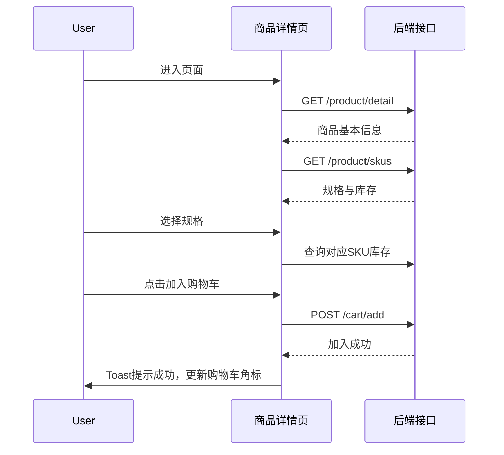

# AI Agent UI文档生成规范 v1.0

> **核心定位**：本文档是一份 **「规范中的规范」** ——为 AI Agent 制定的 UI 文档编写准则。Agent 在接收到用户需求与需求 PRD 文档后，**必须严格遵循本规范**产出标准化的 UI 文档（Markdown 格式）。生成的 UI 文档需以 PRD 为唯一事实来源，完整覆盖产品运行逻辑、模块交互关系、数据信息流、UI 主题风格与视觉元素，并实现版本化、可追溯的维护机制。


## 一、规范适用范围

本规范面向以下角色：
- **AI Agent**：UI 文档的生成主体，需严格按照本规范输出结构化 Markdown 文档
- **产品经理 / 需求分析师**：负责提供符合规范的 PRD 文档作为 Agent 的输入
- **UI/UX 设计师、前端开发工程师、测试工程师**：UI 文档的消费方，依赖该文档进行设计实现、开发还原和质量验证

## 二、前置输入要求（强制）

Agent 在生成 UI 文档之前，**必须**获得以下两份输入：

1. **用户要求（User Requirements）** ：明确本次 UI 文档生成的目标产品、目标页面范围、重点关注的交互需求、特殊约束条件等。
2. **需求 PRD 文档（Product Requirement Document）** ：必须包含以下可解析的结构化信息：
   - 产品名称与项目背景
   - 目标用户画像与使用场景
   - 功能需求列表与优先级
   - 业务流程说明（建议附流程图）
   - 页面/模块划分
   - 非功能性需求（性能、安全、数据埋点等）

> ⚠️ **注意**：若输入的 PRD 不完整，Agent 应在 UI 文档中明确标注“信息缺失”或“待补充”模块，不得凭空编造。

## 三、UI 文档输出规范

### 3.1 文档结构（必含模块）

Agent 生成的 UI 文档**必须**按以下顺序组织：

```markdown
# [产品名称] UI 设计规范文档

---

## 📋 版本信息
（见第四章）

---

## 1. 产品概述
- 产品定位与目标
- 核心用户画像
- 产品运行逻辑总览（全局业务流程图）

## 2. 信息架构
- 站点地图 / 页面层级结构（Mermaid 图）
- 导航体系说明（主导航、二级导航、面包屑）

## 3. 全局设计规范
- 3.1 主题风格定义
- 3.2 色彩系统
- 3.3 字体系统
- 3.4 间距与布局规范
- 3.5 图标规范
- 3.6 动效与转场规范

## 4. 通用组件库规范
（每个组件包含：用途、样式、交互状态、数据绑定、边界情况）

## 5. 页面详细设计
（按页面逐个展开，每个页面包含：）
- 5.x.1 页面定位与入口
- 5.x.2 页面布局结构图
- 5.x.3 模块拆解说明
- 5.x.4 交互逻辑与状态变化
- 5.x.5 数据信息流（含接口/数据来源）
- 5.x.6 UI 示意图（可配文字描述或图片占位）

## 6. 数据信息流总览
- 全局数据流向图（Mermaid）
- 核心数据实体与关系
- 数据埋点需求汇总

## 7. 边界情况与异常处理

## 8. 附录
- 8.1 术语表
- 8.2 设计资源索引
```

### 3.2 各模块内容要求

#### 📋 版本信息（必填）

```markdown
| 字段 | 内容 |
|------|------|
| **产品名称** | [填写产品正式名称] |
| **UI 文档版本** | vX.Y（与 PRD 版本号对齐）|
| **关联 PRD 版本** | [PRD 文档版本号及链接] |
| **编制人员** | AI Agent / [审核人姓名] |
| **编制日期** | YYYY-MM-DD |
| **最后更新日期** | YYYY-MM-DD |
| **文档状态** | 草稿 / 评审中 / 已确认 / 已发布 |

### 🔄 变更记录

| 版本号 | 变更日期 | 变更内容 | 影响模块 | 变更人 | 关联PRD变更 |
|--------|----------|----------|----------|--------|-------------|
| v1.0 | 2025-04-01 | 初始版本 | 全部 | AI Agent | PRD v1.0 |
```

#### 1. 产品概述

- **产品定位与目标**：一句话概括产品核心价值与目标用户（引用 PRD 中的产品目标）
- **核心用户画像**：列出 2-3 个主要用户角色，描述其使用场景与核心诉求
- **产品运行逻辑总览**：以 **Mermaid 流程图** 呈现产品的核心业务流程与数据流向，帮助阅读者快速建立整体认知

> Agent 需从 PRD 中提取或推断产品核心流程，若 PRD 中已提供流程图，应复用并标注来源。

#### 2. 信息架构

- **站点地图**：以 Mermaid 图展示全部页面及其层级关系，标注页面之间的跳转入口
- **导航体系说明**：分别描述主导航（一级导航）、二级导航、面包屑导航的设计规则与使用场景

> 若 PRD 中未明确信息架构，Agent 应根据功能列表推导并标注“由 AI 推导，需人工确认”。

#### 3. 全局设计规范

**3.1 主题风格定义**
- 设计语言定位（如：简洁商务、活泼社交、专业工具型）
- 整体视觉感受描述（轻量/厚重、温暖/冷静、科技/人文）

**3.2 色彩系统**（需明确色值、使用场景）

| 色彩类型 | 色值 | CSS变量名 | 使用场景 | 示例 |
|----------|------|-----------|----------|------|
| 品牌主色 | #XXXXXX | `--color-primary` | 主要按钮、导航栏、关键图标 | ![色块] |
| 辅助色 | #XXXXXX | `--color-secondary` | 次级按钮、辅助信息、装饰元素 | |
| 强调色 | #XXXXXX | `--color-accent` | 促销标签、提醒、CTA按钮 | |
| 成功色 | #XXXXXX | `--color-success` | 成功提示、已完成状态 | |
| 警告色 | #XXXXXX | `--color-warning` | 警告提示、待处理状态 | |
| 错误色 | #XXXXXX | `--color-danger` | 错误提示、删除操作 | |
| 中性色 | 多级灰阶 | `--color-gray-*` | 文字、背景、边框、分割线 | |
| 背景色 | #XXXXXX | `--color-bg` | 页面全局背景 | |

**3.3 字体系统**

| 字体类型 | 字体族 | 字号 | 字重 | 行高 | 颜色 | 使用场景 |
|----------|--------|------|------|------|------|----------|
| H1 大标题 | [字体名] | 32px | Bold | 1.5 | `--color-text-primary` | 页面主标题 |
| H2 次标题 | [字体名] | 24px | Semibold | 1.5 | `--color-text-primary` | 模块标题 |
| H3 小标题 | [字体名] | 18px | Medium | 1.5 | `--color-text-primary` | 子模块标题 |
| 正文 | [字体名] | 14px | Regular | 1.6 | `--color-text-secondary` | 段落文字、表单标签 |
| 辅助文字 | [字体名] | 12px | Regular | 1.5 | `--color-text-tertiary` | 说明文字、时间戳、计数 |
| 可点击文字 | [字体名] | 14px | Medium | 1.5 | `--color-primary` | 链接、导航项 |

**3.4 间距与布局规范**
- 基准单位：4px / 8px（二选一）
- 全局内边距/外边距的常用倍数：4px、8px、16px、24px、32px
- 网格系统（如采用 12 列网格）
- 断点定义（响应式设计时必填）

**3.5 图标规范**
- 图标库来源（如 Feather Icons、Material Icons、自研图标库）
- 尺寸规范（小：16px、中：20px、大：24px）
- 点击热区规范（图标最小点击区域建议 44px × 44px）

**3.6 动效与转场规范**
- 动效原则（如：克制动效，仅用于反馈与引导）
- 常用时长（微动效 150ms、标准转场 250ms、页面切换 300ms）
- 缓动曲线（ease-in-out / cubic-bezier）

#### 4. 通用组件库规范

将 PRD 中涉及的可复用 UI 组件逐个规范描述，每个组件包含：

- **组件名称与用途**
- **组件结构**：包含哪些子元素（可配示意图/ASCII图）
- **变体（Variants）** ：尺寸变体、类型变体
- **交互状态**：默认、悬停、点击/激活、禁用、加载中
- **数据绑定**：组件接收的 props / 数据字段
- **边界情况**：空状态、超长文本处理、错误状态
- **可访问性**：ARIA 标签、键盘交互

> 示例组件：按钮（Button）、输入框（Input）、下拉选择（Select）、模态框（Modal）、标签页（Tabs）、卡片（Card）、数据表格（Table）、分页（Pagination）等。

#### 5. 页面详细设计

**每个页面**必须包含以下子模块（以“首页”为例）：

```markdown
### 5.1 首页（Dashboard）

#### 5.1.1 页面定位与入口
- 页面定位：用户登录后的默认着陆页，提供核心数据概览与快捷入口
- 页面入口：顶部导航栏“首页”标签、登录后自动跳转

#### 5.1.2 页面布局结构图
（以 Mermaid 或 ASCII 图描述页面区块划分）
┌────────────────────────────────────┐
│  顶部导航栏（Logo + 导航 + 用户头像）    │
├──────────────┬─────────────────────┤
│              │  数据卡片区（4卡片）     │
│  左侧菜单栏   │  ────────────────────  │
│              │  图表展示区（趋势图）     │
│              │  ────────────────────  │
│              │  列表区（最新动态）       │
└──────────────┴─────────────────────┘

#### 5.1.3 模块拆解说明
按区块逐一说明：
| 模块名称 | UI 组件 | 展示内容 | 数据来源 |
|----------|---------|----------|----------|
| 数据卡片区 | Card 组件 ×4 | 关键指标（PV/UV/转化率/收入） | /api/stats/overview |
| 图表展示区 | Chart 组件 | 近7日趋势 | /api/stats/trend |
| 最新动态 | Table / List 组件 | 最近10条操作记录 | /api/activities |

#### 5.1.4 交互逻辑与状态变化
- 加载状态：骨架屏 → 数据加载完成后的真实内容
- 卡片交互：点击卡片 → 跳转至对应详情页
- 图表交互：悬停显示数据点详情、支持时间范围切换
- 列表交互：支持分页、点击行跳转详情、支持筛选/搜索
- 空状态：各模块无数据时的占位图与引导文案
- 错误状态：接口失败时的重试机制与提示文案

#### 5.1.5 数据信息流
- 数据来源接口：列举本页面依赖的所有 API
- 数据更新频率：实时 / 定时轮询 / 用户操作触发刷新
- 数据流向图（Mermaid）：展示前端组件 → 状态管理 → API → 后端的流向

#### 5.1.6 UI 示意图
（以文字描述 + 图片占位的方式呈现，鼓励 Agent 给出结构化的视觉描述）
> 📸 UI示意图：[此处可插入设计稿图片，或以文字详细描述视觉元素]
> 文字描述示例：页面采用左右布局，左侧深色导航栏宽240px，右侧主内容区浅色背景，顶部固定导航栏高64px。数据卡片采用白色圆角卡片，带轻微阴影。图表区域使用品牌主色的折线图，底部列表为无边线表格风格...
```

#### 6. 数据信息流总览

- **全局数据流向图**：以 Mermaid 绘制前端页面 → 状态管理 → API 网关 → 后端服务的整体数据流向
- **核心数据实体与关系**：User、Order、Product 等核心实体的字段与关联
- **数据埋点需求汇总**：根据 PRD 要求，汇总各页面的埋点事件清单（事件名、触发时机、上报参数）

#### 7. 边界情况与异常处理

- 网络异常（无网络、请求超时）的处理方式与 UI 呈现
- 权限不足时的页面表现（如隐藏入口、跳转 403 页）
- 数据为空时的占位设计
- 表单输入错误的校验与提示
- 操作冲突的处理（如同一账号多端登录）

#### 8. 附录

- **术语表**：产品中出现的专业术语、缩写解释
- **设计资源索引**：Figma 链接、图标库地址、组件库文档地址


## 四、版本管理规范（强制）

### 4.1 版本号规则

采用语义化版本号 **`vX.Y`**：
- **X（主版本号）** ：产品大版本上线、重大功能重构、UI 框架整体升级时 +1
- **Y（次版本号）** ：单个页面迭代、组件新增/优化、样式微调时 +1

> 建议 UI 文档版本号与 PRD 文档版本号保持同步或建立映射关系。

### 4.2 PRD 联动变更流程（强制）

1. **PRD 先行原则**：任何需求变更必须首先在 PRD 文档中登记，形成 PRD 新版本
2. **UI 文档同步**：Agent 接收到变更后的 PRD 后，必须在 UI 文档中：
   - 更新“关联 PRD 版本”字段
   - 在“变更记录”表格中新增一行，详细描述变更内容、影响的模块
   - 修改受影响的页面/组件内容
   - 版本号按规则递增
3. **变更追溯**：变更记录须保留完整历史，确保任何时间点的文档都可追溯到对应 PRD 版本

### 4.3 变更记录表格模板

| 版本号 | 变更日期 | 变更内容 | 影响模块 | 变更人 | 关联PRD变更 |
|--------|----------|----------|----------|--------|-------------|
| v1.0 | 2025-04-01 | 初始版本创建 | 全部 | AI Agent | PRD v1.0 初始发布 |
| v1.1 | 2025-04-05 | 新增用户反馈入口模块 | 页面5.3、组件4.8 | AI Agent | PRD v1.1 新增用户反馈需求 |

> 变更记录建议放在文档顶部（紧随版本信息之后），方便快速查阅追溯。


## 五、Agent 生成 UI 文档的执行要求

### 5.1 输入处理

- 读取用户要求，确认目标范围与特殊约束
- 解析 PRD 文档，提取与 UI 相关的结构化信息
- 若 PRD 中某些章节缺失（如用户画像、流程图、非功能性需求），在对应 UI 文档模块中标注 `[待补充]`，**不得臆造**

### 5.2 产出约束

- **格式**：纯 Markdown 格式，允许使用 Mermaid 图表和 HTML 表格
- **命名规范**：文件名格式 `[产品名称]_UI_Spec_vX.Y.md`（如 `电商后台_UI_Spec_v1.0.md`）
- **图片处理**：UI 示意图可采用以下任一方式呈现：
  - 插入设计稿图片（以 Markdown 图片语法引用）
  - 提供详细的结构化文字描述（标注“图片待补充”）
  - 使用 ASCII 艺术表示布局框架
- **图表要求**：所有流程图、架构图、数据流向图必须使用 **Mermaid** 语法编写，确保可渲染
- **完整性检查**：在文档末尾添加“完成检查清单”，Agent 自行核对各模块是否已覆盖

### 5.3 质量检查清单（Agent 自检）

| 检查项 | 状态 |
|--------|------|
| 是否已正确引用 PRD 版本号？ | ✅ / ❌ |
| 版本信息与变更记录是否填写完整？ | ✅ / ❌ |
| 产品运行逻辑是否以流程图形式呈现？ | ✅ / ❌ |
| 信息架构是否包含完整的站点地图？ | ✅ / ❌ |
| 全局设计规范是否覆盖色彩、字体、间距、图标、动效？ | ✅ / ❌ |
| 通用组件库是否覆盖 PRD 中涉及的所有可复用组件？ | ✅ / ❌ |
| 每个页面是否包含布局结构图、模块拆解、交互逻辑、数据流、UI 示意图？ | ✅ / ❌ |
| 是否提供了数据信息流总览（流程图）？ | ✅ / ❌ |
| 边界情况与异常处理是否覆盖？ | ✅ / ❌ |
| 所有 Mermaid 图表语法是否正确（可渲染）？ | ✅ / ❌ |

### 5.4 与其他工具的衔接建议

- **与 Figma 对接**：文档中的“设计资源索引”应提供 Figma 设计稿链接。Agent 在读取 Figma 设计文件时，可通过 MCP 协议提取组件树、Token 和变体数据，自动填充到 UI 文档的“全局设计规范”和“通用组件库规范”模块中
- **与前端框架对接**：CSS 变量命名、组件 props 定义应尽可能与项目实际使用的框架（React / Vue / 小程序）保持一致
- **与数据埋点系统对接**：“数据埋点需求汇总”模块应使用项目约定的埋点字段命名规范，便于开发直接引用


## 六、示例片段

> 以下为一个 UI 文档中“页面详细设计”模块的简洁示例，供 Agent 参考格式：

```markdown
### 5.2 商品详情页

#### 5.2.1 页面定位与入口
- 页面定位：展示商品完整信息，支持用户加入购物车或立即购买
- 页面入口：商品列表页点击商品卡片、搜索结果页点击商品条目、推荐模块点击商品推荐位

#### 5.2.2 页面布局结构图
┌──────────────────────────────────────────────┐
│  ← 返回  商品详情页标题          ⋯ 更多操作   │
├──────────────────────────────────────────────┤
│                                              │
│              商品主图轮播区（750×750）          │
│                                              │
├──────────────────────────────────────────────┤
│  价格区域：¥XX.XX（原价）、促销标签、销量        │
├──────────────────────────────────────────────┤
│  商品名称与描述区域（支持展开/收起）              │
├──────────────────────────────────────────────┤
│  规格选择区域（颜色、尺寸等，点击弹出选择面板）    │
├──────────────────────────────────────────────┤
│  数量选择区域（加减按钮 + 数量显示）              │
├──────────────────────────────────────────────┤
│  配送地址区域（显示默认地址，可点击切换）          │
├──────────────────────────────────────────────┤
│  评价摘要区域（好评率 + 精选评价，可点击查看更多）  │
├──────────────────────────────────────────────┤
│  ┌──────────────┐ ┌──────────────┐           │
│  │   加入购物车   │ │   立即购买    │           │
│  └──────────────┘ └──────────────┘           │
└──────────────────────────────────────────────┘

#### 5.2.3 模块拆解说明
| 模块名称 | UI 组件 | 展示内容 | 数据来源 | 交互行为 |
|----------|---------|----------|----------|----------|
| 商品主图轮播 | Swiper 组件 | 商品图片集，支持缩放 | /api/product/images | 滑动切换、点击全屏预览 |
| 价格区域 | Text + Tag | 现价、原价、促销标签 | /api/product/detail | 无 |
| 规格选择 | Selector 弹窗 | 规格项（颜色/尺寸） | /api/product/skus | 点击打开弹窗，选择后更新价格/库存 |
| 数量选择 | Stepper 组件 | 购买数量（1-库存上限） | 本地状态 | 点击 +/- 调整，超出上限提示 |
| 底部操作栏 | Button Group | 加入购物车 / 立即购买 | /api/cart/add | 点击触发对应接口，成功后 Toast 提示 |

#### 5.2.4 交互逻辑与状态变化
- 页面加载：顶部显示加载进度条，内容区域以骨架屏占位
- 轮播图交互：支持左右滑动切换、双击/捏合手势缩放（移动端）、点击图片进入全屏查看模式
- 规格选择交互：点击规格区域 → 底部弹出选择面板 → 选择具体规格 → 更新页面上的价格和库存信息 → 若所选规格无库存则禁用“加入购物车”和“立即购买”按钮
- 数量选择交互：点击“+”数量+1，点击“-”数量-1，最小为1，最大为当前规格库存。超出上限时 Toast 提示“最多可购买 X 件”
- 加入购物车：点击后调用接口，成功则弹出提示并更新购物车角标数量，失败则提示失败原因
- 立即购买：点击后校验规格是否已选（未选则自动拉起规格选择面板），校验通过后跳转至订单确认页
- 收藏/分享：顶部“更多操作”菜单支持收藏商品、分享链接

#### 5.2.5 数据信息流
- 数据来源接口：
  - `/api/product/detail`：获取商品基本信息
  - `/api/product/images`：获取商品图片集
  - `/api/product/skus`：获取规格与库存
  - `/api/cart/add`：加入购物车
  - `/api/product/favorite`：收藏商品
- 数据更新频率：页面初始化加载一次，规格切换时实时查询最新库存
- 数据流向图：


#### 5.2.6 UI 示意图
> 📸 UI示意图：[此处建议插入商品详情页设计稿]
> 
> 文字描述：页面背景为浅灰色（#F5F5F5），内容卡片为白色圆角（12px）。主图区域宽750px（移动端）或600px（PC端），支持手势缩放。价格区域现价使用品牌主色（#FF6B6B）、32px、Bold；原价使用灰色（#999999）、16px、带删除线。规格选择区域使用圆角卡片，选项标签采用浅灰色背景圆角标签，选中状态为主色描边。底部操作栏固定于页面底部，两个按钮各占50%宽度，加入购物车为白底主色描边、立即购买为主色纯色背景。页面整体符合移动端手势交互习惯，所有可点击区域最小热区为44×44px。
```

## 七、结语

本规范为 AI Agent 生成 UI 文档提供了结构化的执行框架。Agent 应严格遵循“PRD 先行、UI 同步、版本联动”的原则，确保生成的 UI 文档完整、准确、可追溯，同时兼顾人类阅读体验与 AI 解析效率。随着产品迭代与 AI 能力的演进，本规范也将持续更新。

---

**规范维护信息**

| 字段 | 内容 |
|------|------|
| 规范版本 | v1.0 |
| 编制日期 | 2025-04-12 |
| 适用对象 | AI Agent（UI 文档生成） |
| 下次审查日期 | 2025-07-12 |