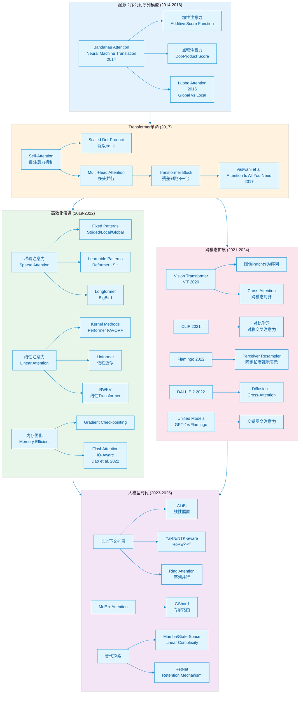
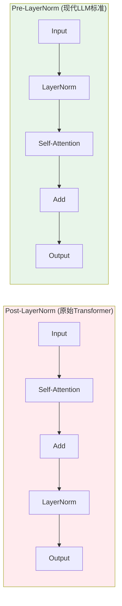
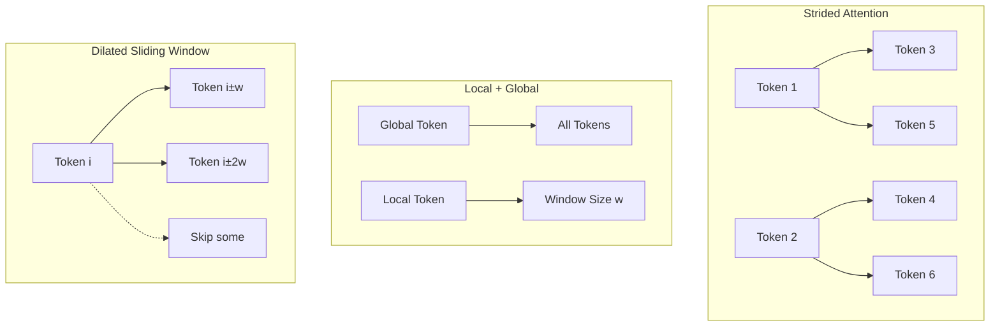
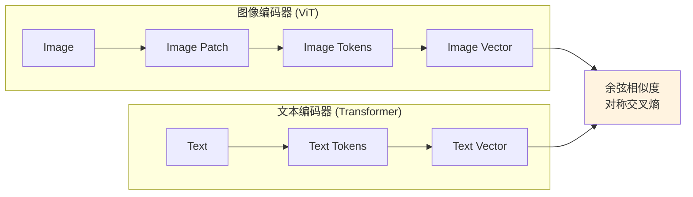
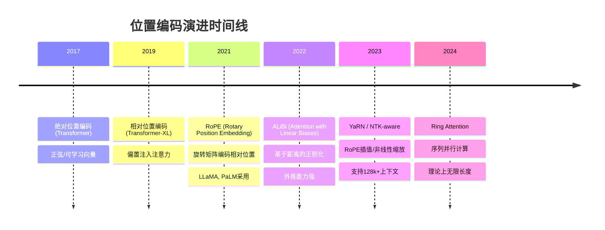

 我来为你生成这份关于AI大模型注意力机制的深度技术文档。这是一个纯技术写作任务，无需调用外部工具，我将直接基于专业知识构建完整的Markdown文档。

---

# AI大模型注意力机制深度技术剖析

> **目标读者**：具备深度学习背景的资深AI开发者  
> **文档定位**：从理论原理到工程实践的全面技术参考  
> **覆盖范围**：2014-2025年注意力机制演进全谱系

---

## 一、总结性概览

### 1.1 开篇综述

注意力机制（Attention Mechanism）已成为现代人工智能的**核心抽象接口**，其地位堪比卷积之于计算机视觉、反向传播之于深度学习。从2014年Bahdanau等人在机器翻译中的开创性应用，到2017年Transformer的"Attention Is All You Need"，再到如今GPT-4、Claude、Gemini等超大规模模型的统治地位，注意力机制完成了从序列建模工具到通用计算范式的跃迁。

**核心思想**：注意力机制本质上是一种**可微分的键值检索系统**。给定查询（Query），模型在键（Key）空间中进行相似度匹配，获得注意力权重，进而对值（Value）进行加权聚合。这一机制突破了RNN的顺序计算限制，实现了：
- **长距离依赖建模**：任意位置间的直接交互，路径长度O(1)
- **并行计算**：矩阵乘法高度优化，适配GPU/TPU架构
- **可解释性**：注意力权重提供模型决策的透明窗口

**跨模态统一性**：注意力机制展现出惊人的模态迁移能力：
- **文本**：自注意力捕获词间句法/语义关系
- **视觉**：ViT将图像切分为patch序列，应用自注意力
- **多模态**：交叉注意力实现异构数据（图文、音视频）的对齐与融合
- **科学计算**：AlphaFold2、Graphormer等将注意力扩展至蛋白质、图结构

### 1.2 注意力机制演化图谱



---

## 二、分模块详细讲解

### 2.1 注意力机制的起源与基础

#### 2.1.1 从RNN到注意力：动机与突破

**历史背景**：2014年前，神经机器翻译（NMT）基于RNN的Encoder-Decoder架构。核心瓶颈在于**信息瓶颈**：源序列被压缩为固定长度的上下文向量（context vector），长句翻译质量急剧下降。

**Bahdanau et al. (2014)** 提出**加性注意力（Additive Attention）**：

$$\text{score}(s_t, h_i) = v_a^\top \tanh(W_s s_t + W_h h_i)$$

其中 $s_t$ 是Decoder第 $t$ 步的隐藏状态（Query），$h_i$ 是Encoder第 $i$ 步的隐藏状态（Key/Value）。$W_s, W_h, v_a$ 为可学习参数。

**技术特点**：
- **对齐模型**：引入可学习的对齐机制，动态关注源序列相关部分
- **软注意力**：权重为连续值（soft），可微分训练
- **双向交互**：Decoder状态影响源序列关注位置

**Luong et al. (2015)** 提出**点积注意力（Dot-Product Attention）**：

$$\text{score}(s_t, h_i) = s_t^\top h_i$$

**设计权衡**：

| 机制 | 计算复杂度 | 表达能力 | 适用场景 |
|------|-----------|---------|---------|
| **加性注意力** | $O(d^2)$ | 强（非线性变换） | 查询-键维度不同或语义异构 |
| **点积注意力** | $O(d)$ | 中等（线性） | 查询-键维度相同，追求速度 |

**现代选择**：大模型普遍采用**缩放点积注意力**，因其：
1. 矩阵乘法高度优化（cuBLAS）
2. 可扩展至多头并行
3. 与Transformer架构无缝集成

#### 2.1.2 注意力的一般化定义

**抽象形式**：

$$\text{Attention}(Q, K, V) = \text{softmax}\left(\frac{QK^\top}{\sqrt{d_k}}\right)V$$

其中：
- $Q \in \mathbb{R}^{n \times d_k}$：查询矩阵（$n$ 个查询，维度 $d_k$）
- $K \in \mathbb{R}^{m \times d_k}$：键矩阵（$m$ 个键值对）
- $V \in \mathbb{R}^{m \times d_v}$：值矩阵
- 输出维度：$\mathbb{R}^{n \times d_v}$

**信息论视角**：注意力实现了**内容寻址存储（Content-Addressable Memory）**，其中Key是地址标签，Value是存储内容，Query是检索请求。Softmax提供**稀疏检索**的连续松弛。

---

### 2.2 自注意力与Transformer

#### 2.2.1 自注意力的动机与定义

**核心问题**：RNN的长距离依赖路径长度为 $O(n)$，且顺序计算无法并行。

**自注意力（Self-Attention）**：Query、Key、Value均来自同一序列，实现序列内部的**全局依赖建模**：

$$\text{Self-Attention}(X) = \text{softmax}\left(\frac{XW_Q (XW_K)^\top}{\sqrt{d_k}}\right) XW_V$$

其中 $X \in \mathbb{R}^{n \times d_{model}}$ 为输入序列，$W_Q, W_K \in \mathbb{R}^{d_{model} \times d_k}$，$W_V \in \mathbb{R}^{d_{model} \times d_v}$。

**关键优势**：
- **路径长度**：任意两位置间路径长度 $O(1)$（直接连接）
- **并行度**：矩阵乘法可完全并行，时间复杂度 $O(1)$（序列长度维度）
- **可解释性**：注意力权重矩阵 $A \in \mathbb{R}^{n \times n}$ 可视化显示词间关联

#### 2.2.2 Scaled Dot-Product Attention：为何除以 $\sqrt{d_k}$

**数学推导**：

假设 $q, k \in \mathbb{R}^{d_k}$ 的分量为独立随机变量，均值为0，方差为1。则：

$$\text{Var}(q^\top k) = \sum_{i=1}^{d_k} \text{Var}(q_i k_i) = \sum_{i=1}^{d_k} 1 \cdot 1 = d_k$$

因此 $q^\top k$ 的方差为 $d_k$，标准差为 $\sqrt{d_k}$。当 $d_k$ 较大时（如64、128），点积的数值范围很大，导致softmax进入**饱和区**（梯度消失）。

**缩放因子** $\frac{1}{\sqrt{d_k}}$ 将方差归一化为1：

$$\text{Var}\left(\frac{q^\top k}{\sqrt{d_k}}\right) = \frac{d_k}{d_k} = 1$$

**实验验证**：Vaswani et al. (2017) 显示，当 $d_k$ 较大时，不加缩放的注意力性能显著下降。

#### 2.2.3 多头注意力：并行子空间学习

**动机**：单头注意力可能专注于特定类型的关系，多头允许模型**在不同表示子空间**捕获多样化依赖。

**数学形式**：

$$\text{MultiHead}(Q, K, V) = \text{Concat}(\text{head}_1, ..., \text{head}_h)W^O$$

其中 $\text{head}_i = \text{Attention}(QW_i^Q, KW_i^K, VW_i^V)$

**维度设计**：
- 原始维度：$d_{model} = 512$（base）或 $1024$（large）
- 头数：$h = 8$（base）或 $16$（large）
- 每头维度：$d_k = d_v = d_{model} / h = 64$

**计算特性**：
- 总参数量不变：$h \times (d_{model} \times d_k) = d_{model} \times d_{model}$
- 计算可并行：$h$ 个头可在不同GPU上并行（张量并行）

#### 2.2.4 Transformer Block完整结构

**残差连接与层归一化**：

$$\text{Output} = \text{LayerNorm}(x + \text{Sublayer}(x))$$

其中 $\text{Sublayer}$ 为自注意力或前馈网络。

**Pre-Norm vs Post-Norm**：



**演进选择**：现代大模型（GPT-3、LLaMA等）采用**Pre-Norm**，因为：
- 训练更稳定，梯度传播更顺畅
- 支持更深网络（100+层）
- 避免Attention层的梯度消失

**完整Transformer Block**：

```python
# PyTorch风格伪代码
class TransformerBlock(nn.Module):
    def __init__(self, d_model, n_heads, d_ff):
        self.attn = MultiHeadAttention(d_model, n_heads)
        self.ffn = FeedForward(d_model, d_ff)  # d_ff = 4*d_model
        self.norm1 = LayerNorm(d_model)
        self.norm2 = LayerNorm(d_model)
        
    def forward(self, x, mask=None):
        # Pre-Norm结构
        x = x + self.attn(self.norm1(x), mask=mask)  # 残差连接
        x = x + self.ffn(self.norm2(x))
        return x
```

---

### 2.3 高效注意力机制

#### 2.3.1 计算瓶颈分析

标准自注意力的复杂度：
- **时间复杂度**：$O(n^2 \cdot d)$，序列长度的平方
- **空间复杂度**：$O(n^2)$，存储注意力矩阵
- **内存带宽**：自回归生成时，每次加载全部KV缓存

当 $n = 100k$ 时，$n^2 = 10^{10}$，计算和内存均不可接受。

#### 2.3.2 稀疏注意力：选择性关注

**Child et al. (2019)** 提出**Sparse Transformer**，识别出注意力矩阵的稀疏性。

**固定模式（Fixed Patterns）**：



**Longformer**（Beltagy et al., 2020）组合：
- **局部窗口注意力**：每个token关注左右 $w$ 个token（线性复杂度）
- **全局注意力**：特定token（如[CLS]）关注全部序列
- **膨胀注意力**：在窗口内跳过部分token，增加感受野

**BigBird**（Zaheer et al., 2021）证明：全局+局部+随机注意力可逼近全注意力，且是**图灵完备**的。

**可学习模式（Learnable Patterns）**：

**Reformer**（Kitaev et al., 2020）引入**LSH（Locality Sensitive Hashing）注意力**：
- 将Query和Key哈希到桶中，只计算同桶内的注意力
- 复杂度从 $O(n^2)$ 降至 $O(n \log n)$
- 牺牲：哈希冲突导致精度损失，实现复杂

#### 2.3.3 线性注意力：核方法近似

**核心思想**：将softmax注意力重写为核特征映射，利用矩阵乘法的结合律改变计算顺序。

**标准注意力**：

$$\text{Attention}(Q, K, V)_i = \frac{\sum_{j=1}^n \exp(q_i^\top k_j) v_j}{\sum_{j=1}^n \exp(q_i^\top k_j)}$$

**线性注意力**（Katharopoulos et al., 2020）：

定义特征映射 $\phi(x) = \text{elu}(x) + 1$，则：

$$\exp(q_i^\top k_j) \approx \phi(q_i)^\top \phi(k_j)$$

注意力计算变为：

$$\text{Attention}(Q, K, V)_i = \frac{\phi(q_i)^\top \sum_{j=1}^n \phi(k_j) v_j^\top}{\phi(q_i)^\top \sum_{j=1}^n \phi(k_j)}$$

**复杂度分析**：
- 标准：$O(n^2 d)$（先算 $QK^\top$）
- 线性：$O(n d^2)$（先算 $\sum \phi(k_j) v_j^\top$）

当 $n \gg d$ 时（长序列），线性注意力显著更快。

**Performer**（Choromanski et al., 2021）提出**FAVOR+（Fast Attention Via Orthogonal Random Features）**：
- 使用随机正交特征近似softmax核
- 无训练过程修改，可即插即用
- 理论保证：近似误差有界

#### 2.3.4 硬件感知优化：FlashAttention

**Dao et al. (2022)** 的**FlashAttention**是工程优化的里程碑。

**核心问题**：标准注意力实现受限于**GPU内存层次结构**：
- HBM（High Bandwidth Memory）：容量大（40GB+），带宽低（1.5TB/s）
- SRAM（Shared Memory）：容量小（~100KB），带宽高（19TB/s）

标准实现将 $O(n^2)$ 的注意力矩阵写入HBM，成为瓶颈。

**FlashAttention算法**：

```python
# 核心思想：分块计算，避免HBM读写
def flash_attention(Q, K, V, block_size):
    # Q,K,V: [n, d]，驻留HBM
    # 输出O: [n, d]
    
    # 初始化
    O = zeros_like(Q)  # 输出
    L = zeros(n)       # 累加和（softmax分母）
    M = full(n, -inf)  # 最大值（数值稳定）
    
    # 分块加载到SRAM
    for block_idx in range(0, n, block_size):
        Q_i = load_block(Q, block_idx)  # 加载到SRAM
        
        # 遍历K,V块
        for kv_idx in range(0, n, block_size):
            K_j = load_block(K, kv_idx)
            V_j = load_block(V, kv_idx)
            
            # 在SRAM中计算局部注意力
            S_ij = Q_i @ K_j.T  # [block_size, block_size]
            
            # 在线softmax（数值稳定）
            M_new = max(M, rowmax(S_ij))
            P_ij = exp(S_ij - M_new)
            L = exp(M - M_new) * L + rowsum(P_ij)
            
            # 更新输出
            O = ...  # 迭代更新公式
            
        write_block(O, O_i, block_idx)  # 写回HBM
        
    return O / L
```

**技术突破**：
- **IO复杂度**：从 $O(n^2)$ HBM访问降至 $O(n^2/S)$ SRAM计算
- **精确计算**：无近似，输出与标准注意力完全一致
- **内存节省**：无需存储 $O(n^2)$ 注意力矩阵，支持更长序列

**FlashAttention-2**（2023）进一步优化：
- 减少非矩阵乘法FLOPs
- 更好的线程块划分
- 支持头维度到256（适配GQA）

---

### 2.4 跨模态注意力

#### 2.4.1 视觉Transformer：从CNN到自注意力

**ViT**（Dosovitskiy et al., 2020）将图像 $x \in \mathbb{R}^{H \times W \times C}$ 切分为 $N = \frac{HW}{P^2}$ 个patch，每个patch线性投影为 $d$ 维向量，作为Transformer的输入序列。

**关键设计**：
- **可学习位置嵌入**：1D或2D位置编码
- **[CLS] token**：聚合全局信息，用于分类
- **预训练策略**：大规模监督（JFT-300M）或自监督（MAE）

**与CNN的本质差异**：
- CNN：局部归纳偏置（平移等变性），固定感受野
- ViT：全局注意力，灵活感受野，需大数据补偿归纳偏置缺失

#### 2.4.2 视觉-语言预训练：CLIP与对比学习

**CLIP**（Radford et al., 2021）使用**对比学习**对齐图文表示：



**技术细节**：
- **批次内负采样**：$N$ 对图文，$N^2 - N$ 个负样本
- **对称损失**：图像到文本 + 文本到图像
- **零样本能力**：通过自然语言提示迁移至下游任务

#### 2.4.3 感知器重采样：固定长度视觉表示

**Flamingo**（Alayrac et al., 2022）解决视觉token过多的问题（ViT产生256-1024个patch token）。

**Perceiver Resampler**：
- 使用固定数量（如64个）的**可学习查询（Latent Queries）**
- 通过**交叉注意力**从视觉特征中压缩信息
- 输出固定长度的视觉表示，插入LLM的交叉注意力层

```python
class PerceiverResampler(nn.Module):
    def __init__(self, num_latents=64, dim=2048, num_layers=6):
        self.latents = nn.Parameter(torch.randn(num_latents, dim))
        self.layers = nn.ModuleList([
            CrossAttentionLayer(dim) for _ in range(num_layers)
        ])
        
    def forward(self, visual_features):
        # visual_features: [batch, num_patches, dim]
        x = self.latents.unsqueeze(0).expand(batch_size, -1, -1)
        
        for layer in self.layers:
            x = layer(x, visual_features)  # 查询为latents，键值为视觉特征
            
        return x  # [batch, num_latents, dim]
```

#### 2.4.4 统一多模态架构：交叉注意力 vs 早期融合

**架构谱系**：

| 模型 | 视觉编码 | 融合方式 | 特点 |
|------|---------|---------|------|
| **CLIP** | 独立ViT | 对比学习（晚期融合） | 双塔结构，检索高效 |
| **Flamingo** | NFNet + Perceiver | 交叉注意力层（插入LLM） | 冻结LLM，高效迁移 |
| **GPT-4V** | 内部视觉编码器 | 早期融合（统一Transformer） | 端到端训练，性能最强 |
| **Fuyu** | 无 | 直接Patch投影（早期融合） | 简化架构，任意分辨率 |

**设计哲学演进**：
- **分离式**（CLIP）：模态独立编码，适合检索
- **插入式**（Flamingo）：复用预训练LLM，样本高效
- **统一式**（GPT-4V）：端到端优化，性能天花板高，计算成本高

---

### 2.5 大模型时代的演进趋势

#### 2.5.1 长上下文扩展：从2K到10M+

**位置编码演进**：



**关键技术**：

**ALiBi**（Press et al., 2022）：
- 不在嵌入层加位置信息，而在注意力分数中加入**基于距离的负偏置**：
$$\text{Attention}(Q, K, V) = \text{softmax}\left(\frac{QK^\top}{\sqrt{d_k}} - m \cdot \text{distance}\right)V$$
- $m$ 为头特定的斜率，距离越远注意力分数越低
- **外推优势**：训练时短序列，推理时自动泛化到长序列

**YaRN**（Peng et al., 2023）：
- 针对RoPE的插值方法，调整频率缩放因子
- 支持LLaMA-2从4K扩展到128K上下文

**Ring Attention**（Liu et al., 2024）：
- 将序列分块分配到多个GPU，形成环状通信模式
- 每个GPU计算本地块，传递KV状态到下一节点
- 突破单卡内存限制，支持百万级token

#### 2.5.2 MoE与注意力：稀疏激活的扩展

**GShard**（Lepikhin et al., 2021）和 **Switch Transformer**（Fedus et al., 2022）将MoE应用于Transformer：

- **专家路由**：每个token选择Top-K个FFN专家（注意力层通常共享）
- **注意力扩展**：ST-MoE等探索注意力专家化，不同头负责不同模式

**设计权衡**：
- MoE增加**参数量**（稀疏激活），不增加**计算量**（FLOPs）
- 注意力专家化增加实现复杂度，收益不如FFN专家化明显

#### 2.5.3 替代探索：状态空间模型（SSM）

**Mamba**（Gu & Dao, 2023）挑战Transformer的统治地位：

**核心思想**：
- 用**选择性状态空间**替代注意力机制
- 线性复杂度 $O(n)$，支持极长序列
- 选择性机制让模型动态关注/遗忘信息

**数学形式**：

$$h_t = \bar{A} h_{t-1} + \bar{B} x_t$$
$$y_t = C h_t$$

其中 $\bar{A}, \bar{B}$ 为输入依赖的选择性参数（通过线性投影从输入学习）。

**与注意力对比**：

| 特性 | Transformer | Mamba |
|------|-------------|-------|
| **复杂度** | $O(n^2)$ | $O(n)$ |
| **并行训练** | 完全并行 | 硬件感知的并行扫描 |
| **推理速度** | 缓存KV，线性增长 | 常数内存，RNN式递归 |
| **长程依赖** | 位置编码外推 | 天然支持，状态压缩 |
| **表达能力** | 已验证（GPT-4） | 待大规模验证 |

**现状**：Mamba在语言建模困惑度（perplexity）上匹敌Transformer，但在**大规模预训练**（>100B参数）和**涌现能力**上尚未完全验证。2024年的**Jamba**、**Zamba**等混合架构（Attention + Mamba层）试图结合两者优势。

---

## 三、参考文献

### 核心论文

1. **Bahdanau et al. (2014)**. "Neural Machine Translation by Jointly Learning to Align and Translate". *ICLR 2015*.  
   [开创性工作，提出加性注意力机制]

2. **Vaswani et al. (2017)**. "Attention Is All You Need". *NeurIPS 2017*.  
   [Transformer架构，提出缩放点积注意力和多头注意力]

3. **Child et al. (2019)**. "Generating Long Sequences with Sparse Transformers".  
   [稀疏注意力的系统研究]

4. **Kitaev et al. (2020)**. "Reformer: The Efficient Transformer". *ICLR 2020*.  
   [LSH注意力，亚二次复杂度]

5. **Katharopoulos et al. (2020)**. "Transformers are RNNs: Fast Autoregressive Transformers with Linear Attention". *ICML 2020*.  
   [线性注意力的核方法视角]

6. **Tay et al. (2020)**. "Long Range Arena: A Benchmark for Efficient Transformers".  
   [高效Transformer的综合评测]

7. **Dosovitskiy et al. (2020)**. "An Image is Worth 16x16 Words: Transformers for Image Recognition at Scale". *ICLR 2021*.  
   [ViT，视觉Transformer奠基]

8. **Choromanski et al. (2021)**. "Rethinking Attention with Performers". *ICLR 2021*.  
   [FAVOR+，随机特征近似]

9. **Zaheer et al. (2021)**. "Big Bird: Transformers for Longer Sequences". *NeurIPS 2021*.  
   [稀疏注意力的理论保证]

10. **Radford et al. (2021)**. "Learning Transferable Visual Models From Natural Language Supervision". *ICML 2021*.  
    [CLIP，多模态对比学习]

11. **Dao et al. (2022)**. "FlashAttention: Fast and Memory-Efficient Exact Attention with IO-Awareness". *NeurIPS 2022*.  
    [硬件感知优化，工程突破]

12. **Alayrac et al. (2022)**. "Flamingo: A Visual Language Model for Few-Shot Learning". *NeurIPS 2022*.  
    [多模态少样本学习，Perceiver Resampler]

13. **Press et al. (2022)**. "Train Short, Test Long: Attention with Linear Biases Enables Input Length Extrapolation".  
    [ALiBi位置编码]

14. **Gu & Dao (2023)**. "Mamba: Linear-Time Sequence Modeling with Selective State Spaces".  
    [状态空间模型，Transformer的潜在替代]

15. **Liu et al. (2024)**. "Ring Attention with Blockwise Transformers for Near-Infinite Context".  
    [序列并行，无限上下文]

### 技术博客与文档

- **The Illustrated Transformer** (Jay Alammar): 可视化Transformer  
- **Efficient Transformers: A Survey** (Tay et al., 2022): 高效注意力综述  
- **FlashAttention-2** (Dao, 2023): 进一步优化细节  
- **RoPE** (Su et al., 2021): 旋转位置编码原理论文

---

## 四、附录：注意力机制选型决策矩阵

| 场景 | 推荐方案 | 关键考量 |
|------|---------|---------|
| **通用大模型** (≤32k) | 标准MHA + FlashAttention | 平衡效果与效率 |
| **长文档建模** (32k-128k) | GQA + RoPE/YaRN + FlashAttention | 内存优化 + 外推能力 |
| **极长序列** (>128k) | 稀疏注意力 + Ring Attention | 亚二次复杂度 |
| **实时推理** (低延迟) | MQA + 投机采样 | 最小化KV缓存 |
| **边缘设备** | 线性注意力 (RWKV/Mamba) | 线性复杂度，常数内存 |
| **多模态融合** | 交叉注意力 + Perceiver | 异构数据对齐 |
| **科学计算** (DNA/蛋白质) | 稀疏/线性注意力 | 超长序列特性 |

---

本文档系统梳理了注意力机制从起源到现代大模型的完整技术演进。注意力机制的成功不仅在于其数学优雅性，更在于其**可扩展性**（Scaling Laws验证）和**通用性**（跨模态、跨任务）。尽管Mamba等替代架构崭露头角，但在可预见的未来，注意力仍将是AI系统的核心组件，其高效化、长程化、多模态化的研究将持续推进领域边界。