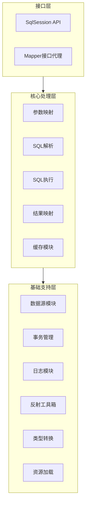

# MyBatis 架构设计与设计模式面试资料

## 1. MyBatis 整体架构

MyBatis 的整体架构分为三层：**接口层**、**核心处理层** 和 **基础支持层**。这种分层设计使得职责清晰，便于扩展和维护。

### 1.1 三层架构概览



### 1.2 各层职责详解

#### 1.2.1 接口层
- **SqlSession**：面向用户的API，提供增删改查方法（如`selectOne()`、`insert()`），是MyBatis与数据库交互的接口。
- **Mapper接口代理**：用户定义的DAO接口，MyBatis通过动态代理生成实现类，无需手动编写实现。

#### 1.2.2 核心处理层
- **参数映射**：将Java对象参数设置到PreparedStatement中。
- **SQL解析**：解析动态SQL标签（如`<if>`、`<where>`），生成可执行的SQL语句。
- **SQL执行**：Executor执行器负责SQL执行和缓存维护。
- **结果映射**：ResultSetHandler将JDBC ResultSet映射为Java对象。
- **缓存模块**：一级缓存和二级缓存的实现。

#### 1.2.3 基础支持层
- **数据源模块**：提供连接池功能（如PooledDataSource）。
- **事务管理**：支持JDBC事务和MANAGED事务。
- **日志模块**：适配各种日志框架（log4j、slf4j等）。
- **反射工具箱**：封装了反射操作，提高性能。
- **类型转换**：TypeHandler实现Java类型与JDBC类型的转换。
- **资源加载**：类加载器封装，加载配置文件。

## 2. MyBatis 中的设计模式

MyBatis 源码中运用了大量设计模式，是学习设计模式实践的绝佳教材。以下是核心设计模式的应用总结：

| 设计模式 | 应用场景 | 核心类/接口 |
|---------|---------|------------|
| **建造者模式** | 配置解析、复杂对象构建 | SqlSessionFactoryBuilder, XMLConfigBuilder, XMLMapperBuilder |
| **工厂模式** | 创建对象实例 | SqlSessionFactory, ObjectFactory, MapperProxyFactory |
| **单例模式** | 全局唯一实例 | ErrorContext, LogFactory |
| **代理模式** | Mapper接口实现、延迟加载 | MapperProxy, ConnectionLogger |
| **组合模式** | 动态SQL节点树 | SqlNode及其子类（IfSqlNode、WhereSqlNode等） |
| **模板方法模式** | 执行器、类型处理器骨架 | BaseExecutor, BaseTypeHandler |
| **适配器模式** | 日志框架适配 | Log接口及其实现（Log4jImpl、Slf4jImpl等） |
| **装饰者模式** | 缓存功能扩展 | Cache接口及其装饰器（BlockingCache、FifoCache等） |
| **迭代器模式** | 属性表达式解析 | PropertyTokenizer |

### 2.1 建造者模式（Builder Pattern）

**定义**：将一个复杂对象的构建与它的表示分离，使得同样的构建过程可以创建不同的表示。

**MyBatis中的应用**：
- **SqlSessionFactoryBuilder**：读取配置文件，构建复杂的Configuration对象，最终创建SqlSessionFactory。
- **XMLConfigBuilder**：解析mybatis-config.xml全局配置文件。
- **XMLMapperBuilder**：解析Mapper.xml映射文件。
- **XMLStatementBuilder**：解析SQL语句配置。

**为什么用建造者模式**：Configuration对象的构建过程非常复杂，需要解析XML、处理XPath、反射生成对象、缓存结果等，远超出构造函数的能力范围。

### 2.2 工厂模式（Factory Pattern）

**定义**：定义一个创建对象的接口，让子类决定实例化哪一个类。

**MyBatis中的应用**：
- **SqlSessionFactory**：根据参数创建不同类型的SqlSession（支持自动提交、Executor类型等）。
- **MapperProxyFactory**：为Mapper接口创建代理对象。
- **ObjectFactory**：创建结果对象实例。

**示例**：DefaultSqlSessionFactory的openSession方法底层会根据配置创建Transaction和Executor，最终构建SqlSession。

### 2.3 单例模式（Singleton Pattern）

**定义**：确保一个类只有一个实例，并提供全局访问点。

**MyBatis中的应用**：
- **ErrorContext**：每个线程独有的单例，记录线程执行环境的错误信息（使用ThreadLocal实现）。
- **LogFactory**：整个MyBatis使用的日志工厂，全局唯一。

**ErrorContext源码片段**：
```java
private static final ThreadLocal<ErrorContext> LOCAL = new ThreadLocal<>();
public static ErrorContext instance() {
    ErrorContext context = LOCAL.get();
    if (context == null) {
        context = new ErrorContext();
        LOCAL.set(context);
    }
    return context;
}
```

### 2.4 代理模式（Proxy Pattern）

**定义**：给目标对象提供一个代理，由代理对象控制对原对象的引用。

**MyBatis中的应用**：
- **MapperProxy**：Mapper接口的动态代理实现。当我们调用`sqlSession.getMapper(XxxMapper.class)`时，返回的是通过JDK动态代理创建的代理对象。
- **ConnectionLogger**：JDBC连接的代理，用于打印SQL日志。
- **延迟加载代理**：通过CGLIB或Javassist为关联对象创建代理，实现按需加载。

**MapperProxy工作原理**：实现了InvocationHandler接口，invoke方法中根据方法名找到对应的MappedStatement，委托给Executor执行SQL。

### 2.5 组合模式（Composite Pattern）

**定义**：将对象组合成树形结构以表示"部分-整体"的层次结构，使得客户对单个对象和组合对象的使用具有一致性。

**MyBatis中的应用**：
- **SqlNode**：动态SQL节点的抽象，所有节点（IfSqlNode、WhereSqlNode、TextSqlNode等）实现同一接口。
- **组合结构**：动态SQL语句被解析成树状的SqlNode结构，通过递归调用apply方法生成最终SQL。

**示例**：
```java
public interface SqlNode {
    boolean apply(DynamicContext context);
}
```
- **TextSqlNode**：叶子节点，直接追加SQL文本
- **IfSqlNode**：组合节点，先判断条件，再调用子节点apply

### 2.6 模板方法模式（Template Method Pattern）

**定义**：定义一个操作中的算法骨架，将一些步骤延迟到子类中实现。

**MyBatis中的应用**：
- **BaseExecutor**：定义了执行SQL的骨架（如查询、更新、提交、回滚等），将`doUpdate`、`doQuery`等基本方法留给子类实现。
- **BaseTypeHandler**：定义了类型转换的骨架，子类实现具体的set/get方法。

**Executor子类**：
- **SimpleExecutor**：每执行一次SQL就创建新的Statement，用完关闭。
- **ReuseExecutor**：复用Statement（以SQL为key缓存）。
- **BatchExecutor**：批量执行SQL（仅update操作）。

### 2.7 适配器模式（Adapter Pattern）

**定义**：将一个类的接口转换成客户希望的另一个接口，使接口不兼容的类可以一起工作。

**MyBatis中的应用**：
- **日志模块**：MyBatis定义了自己的Log接口，通过适配器模式适配各种日志框架（log4j、slf4j、commons-logging等）。

**示例**：Log4jImpl适配器
```java
public class Log4jImpl implements Log {
    private final org.apache.log4j.Logger log;
    
    public Log4jImpl(String clazz) {
        log = org.apache.log4j.Logger.getLogger(clazz);
    }
    
    @Override
    public void debug(String s) {
        log.debug(s);
    }
    // 其他方法...
}
```

### 2.8 装饰者模式（Decorator Pattern）

**定义**：动态地给一个对象增加额外的职责，比生成子类更灵活。

**MyBatis中的应用**：
- **缓存模块**：Cache接口有多个装饰器实现，在基础缓存功能上增加各种特性。

**Cache的装饰器链**：
- **PerpetualCache**：基础缓存实现（HashMap）
- **FifoCache**：装饰器，实现FIFO淘汰策略
- **LruCache**：装饰器，实现LRU淘汰策略
- **BlockingCache**：装饰器，实现阻塞特性（防止缓存击穿）

通过组合这些装饰器，可以灵活构建具有多种特性的缓存。

### 2.9 迭代器模式（Iterator Pattern）

**定义**：提供一种方法顺序访问一个聚合对象中的各个元素，而不暴露其内部表示。

**MyBatis中的应用**：
- **PropertyTokenizer**：用于解析OGNL表达式中的属性表达式，如"order[0].item[0].name"，逐个token迭代解析。

## 3. 核心组件与工作原理

### 3.1 核心组件及其职责

| 组件 | 作用 |
|------|------|
| **Configuration** | 描述MyBatis主配置信息，框架启动时将配置信息转换为Configuration对象 |
| **SqlSessionFactory** | 工厂类，由SqlSessionFactoryBuilder构建，用于生成SqlSession |
| **SqlSession** | 代表与数据库的一次连接，提供CRUD操作的API，线程不安全 |
| **Executor** | SQL执行器，负责SQL解析、参数处理、结果映射和缓存维护 |
| **MappedStatement** | 描述SQL配置信息，XML或注解配置的SQL被转换为MappedStatement |
| **StatementHandler** | 封装对JDBC Statement的操作，包括参数设置、SQL执行 |
| **ParameterHandler** | 处理SQL中的参数占位符，为参数设置值 |
| **ResultSetHandler** | 封装对ResultSet的处理，将结果集转换为Java对象 |
| **TypeHandler** | 类型处理器，用于Java类型与JDBC类型的转换 |

### 3.2 MyBatis 工作原理（执行流程）

1. **加载配置**：SqlSessionFactoryBuilder读取mybatis-config.xml和Mapper.xml，解析后生成Configuration对象，进而创建SqlSessionFactory。

2. **创建会话**：通过SqlSessionFactory.openSession()创建SqlSession（默认不自动提交事务）。

3. **获取代理**：调用sqlSession.getMapper(Mapper接口.class)，通过JDK动态代理生成Mapper接口的代理对象（MapperProxy）。

4. **执行SQL**：
   - 代理对象触发Executor执行
   - Executor通过StatementHandler处理JDBC操作
   - ParameterHandler设置参数
   - Statement执行SQL，获取ResultSet
   - ResultSetHandler将ResultSet映射为Java对象

5. **关闭会话**：执行完成后关闭SqlSession（释放数据库连接）。

### 3.3 缓存机制

#### 一级缓存（SqlSession级别）
- **作用范围**：同一个SqlSession内有效
- **默认状态**：开启（无法关闭）
- **失效场景**：SqlSession关闭/提交/回滚；执行增删改操作

#### 二级缓存（Mapper级别）
- **作用范围**：同一个Mapper接口（跨SqlSession）
- **默认状态**：关闭（需手动开启）
- **启用步骤**：
  1. 全局配置cacheEnabled=true（默认已开启）
  2. Mapper.xml中添加`<cache/>`标签
  3. 实体类实现Serializable接口

**缓存架构设计**：采用装饰者模式，通过组合各种装饰器实现不同的缓存特性。

## 4. 高级特性

### 4.1 插件原理（责任链模式）

MyBatis允许对四大核心对象进行拦截增强：
- Executor
- ParameterHandler
- ResultSetHandler
- StatementHandler

**实现方式**：通过动态代理和责任链模式，将多个插件的拦截器串联起来，依次执行。

**自定义插件步骤**：
1. 实现Interceptor接口
2. 使用@Intercepts注解定义拦截的方法签名
3. 在配置文件中注册插件

### 4.2 延迟加载原理

**实现机制**：通过CGLIB或Javassist创建代理对象，当调用关联对象的方法时，代理对象触发SQL执行。

**配置**：
```xml
<settings>
    <setting name="lazyLoadingEnabled" value="true"/>
    <setting name="aggressiveLazyLoading" value="false"/>
</settings>
```

### 4.3 Spring集成后一级缓存失效的原因

当MyBatis与Spring集成后，如果**没有开启事务**，一级缓存会失效。原因是：
- Spring对SqlSession进行管理，每次调用DAO方法都会创建新的SqlSession并立即关闭
- 一级缓存是SqlSession级别的，SqlSession关闭后缓存失效
- 如果开启了事务，SqlSession会绑定到线程，在整个事务范围内复用，此时一级缓存生效

---

以上是MyBatis架构设计与设计模式的详细面试资料。深入理解这些设计模式的应用，不仅有助于掌握MyBatis原理，更能提升自身的设计能力，写出更优雅、更易扩展的代码。