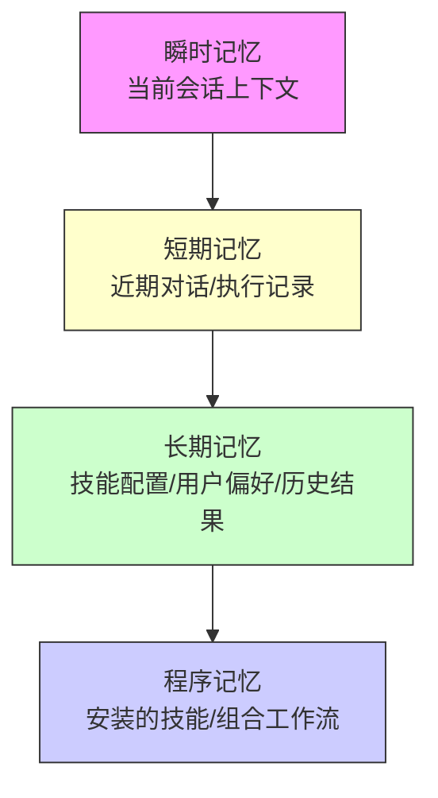

# 从记忆体系分析“养龙虾”：到底在养什么？何谓小有所成？

> 你安装 OpenClaw（龙虾）可能只用了 5 分钟，但把它“养”成真正得力的助手，却是一场关于记忆、技能与工作流融合的修行。本文将深入剖析 OpenClaw 背后的记忆体系，并定义一套可量化的“小有所成”标准，助你从“安装即弃”走向“如臂使指”。

---

## 1. 引言：为什么谈“记忆”？

在之前的文章里，我们讨论了 OpenClaw 的安装、技能生态和典型场景。但一个更深层的问题始终存在：

**OpenClaw 究竟在“养”什么？**

如果它只是一个命令执行器，那和普通的 Shell 脚本没有本质区别。但 OpenClaw 真正独特的地方，在于它围绕 **记忆体系** 构建了一套让 AI 助手持续进化的机制。

所谓记忆体系，并非简单的对话历史存储，而是：
- **技能记忆**：可安装、升级、卸载的模块化能力。
- **上下文记忆**：跨会话保留的用户偏好、环境配置、历史决策。
- **结果记忆**：对历史执行结果的索引与复用，避免重复计算。
- **交互记忆**：用户与技能之间的交互模式，逐渐收敛为高效的工作流。

“养龙虾”的过程，本质上是在喂养这个记忆体系，让它越来越“懂你”。而“小有所成”的时刻，就是这套记忆体系开始自发为你产生价值，而不再需要你手把手指导。

---

## 2. OpenClaw 的记忆体系解剖

### 2.1 四层记忆模型

我们可以将 OpenClaw 的记忆体系抽象为四个层次，类似人类的记忆分层：



#### ① 瞬时记忆（会话级）
- **存储位置**：当前进程的内存
- **内容**：当前命令的参数、管道传递的数据、临时的环境变量
- **生命周期**：命令执行结束即销毁
- **作用**：保证每次调用的隔离性和确定性

#### ② 短期记忆（近期历史）
- **存储位置**：`~/.openclaw/history/`
- **内容**：最近 N 次执行的技能名、输入输出摘要、耗时
- **作用**：支持 `openclaw repeat`、`openclaw undo` 等操作，形成可回溯的操作序列

#### ③ 长期记忆（用户偏好与结果缓存）
- **存储位置**：`~/.openclaw/config/` + 各技能私有目录
- **内容**：全局配置、技能专属配置、用户自定义的提示词模板、常用参数别名
- **关键机制**：技能可以通过配置文件“记住”用户的偏好，无需每次重复输入

#### ④ 程序记忆（技能库与工作流）
- **存储位置**：`~/.openclaw/skills/` + 全局注册表
- **内容**：已安装的技能集合、用户编写的组合脚本（工作流）
- **特点**：这部分记忆是显式的、可版本控制的，可以像代码一样管理

### 2.2 记忆的“喂养”方式

| 记忆类型 | 如何喂养 | 例子 |
| :--- | :--- | :--- |
| 技能记忆 | `openclaw install` | 安装 `code-review` 技能 |
| 配置记忆 | 编辑 YAML 或通过 `--set` | `openclaw config set email.default_recipient me@example.com` |
| 结果记忆 | 技能主动缓存 | 股票查询技能缓存当日价格，避免重复请求 |
| 交互记忆 | 使用 Shell 别名或函数封装 | `alias summarize='openclaw run news-digest'` |

> **比喻**：这就像养一只宠物——初期你要喂它（安装技能）、教它规矩（配置）、带它散步（执行命令）。慢慢地，它会记住你的习惯，甚至主动提醒你该做什么。

---

## 3. 养龙虾到底在养什么？

基于上述记忆体系，我们可以回答这个问题：

**养龙虾 = 构建一个以你为中心的、持续进化的个人自动化平台。**

具体来说，你在养三样东西：

### 3.1 养“技能库”
OpenClaw 的技能不是一次性脚本，而是一个不断扩充的**能力清单**。每安装一个新技能，你的龙虾就多了一样本领。

### 3.2 养“工作流”
技能是原子能力，工作流则是将这些原子组合成复杂的自动化链条。通过 Shell 脚本、Makefile 或 OpenClaw 自己的工作流语法，你逐渐沉淀出解决特定问题的最佳实践。

### 3.3 养“偏好模型”
经过一段时间的使用，OpenClaw 通过配置文件和技能内部的“学习”机制，会越来越了解你的偏好：
- 代码审查时更注重哪些方面？
- 新闻摘要喜欢简短还是详尽？
- 邮件回复的语气是正式还是轻松？

这些偏好不再需要你每次显式指定，而是成为记忆的一部分。

---

## 4. 何谓“小有所成”？—— 量化评估标准

“小有所成”不是一个模糊的感觉，而是一组可验证的指标。我将它们分为三个维度：

### 4.1 技能覆盖度

| 阶段 | 特征 | 标志性事件 |
| :--- | :--- | :--- |
| 萌芽期 | 安装 < 5 个技能，主要靠手动输入 | 第一次用 `openclaw run` 成功完成一个简单任务 |
| 成长期 | 安装 10~20 个技能，覆盖主要工作场景 | 能将日常重复性工作（如日志分析、日报生成）交给龙虾 |
| 成熟期 | 安装 > 30 个技能，形成个人专属技能矩阵 | 遇到新问题，第一反应是“有没有对应的技能”，而不是自己写脚本 |

**建议**：每周检查一次技能列表，删除不再使用的，补充新发现的。

### 4.2 工作流自动化率

用一组关键任务来衡量：

```bash
# 示例：你的“关键任务清单”
- 每天上班：打开邮箱 → 整理待办 → 查看监控告警
- 写代码：commit 前自动运行 lint + test
- 周报：汇总本周 commit、Jira 任务、会议纪要
```

**指标**：这些任务中，有多少比例已经由 OpenClaw 组合技能自动完成？达到 **70%** 以上，可视为小有所成。

### 4.3 记忆复用度

统计以下数据（可以通过 OpenClaw 的日志分析得到）：
- **配置复用率**：执行命令时，使用默认配置的比例（越高说明偏好记忆越有效）
- **结果缓存命中率**：技能返回缓存结果的比例（体现结果记忆的利用）
- **工作流复用次数**：你编写的组合脚本被重复调用的次数

当这三项指标都显著高于手动输入的比例时，说明记忆体系已经成熟。

---

## 5. 实战：从零到小有所成的“喂养”路线图

下面是一个可操作的 30 天养成计划：

### 第 1 周：搭建基础记忆
```bash
# 安装核心技能
openclaw install news-digest code-review email-summary stock-quote

# 配置全局偏好
openclaw config set default_output_format markdown
openclaw config set code-review.max_comments 10

# 创建第一个工作流：每日简报
echo 'openclaw run news-digest --topics ai,programming > ~/daily.md' > ~/bin/daily-brief
chmod +x ~/bin/daily-brief
```

### 第 2 周：喂养偏好与结果
```bash
# 让邮件技能记住常用收件人
openclaw run email-summary --set-default-recipient team@example.com

# 让股票技能缓存每日数据
openclaw run stock-quote --symbol AAPL --cache-ttl 3600
```

### 第 3 周：构建复杂工作流
使用 Makefile 封装多步骤任务：
```makefile
# Makefile
.PHONY: report
report:
	@openclaw run git-log --since "last week" > commits.md
	@openclaw run jira-summary --status done > tasks.md
	@openclaw run meeting-minutes --last > minutes.md
	@openclaw run blog-writer --input commits.md,tasks.md,minutes.md --output weekly.md
	@echo "周报已生成：weekly.md"
```

### 第 4 周：优化与评估
- 运行 `openclaw stats` 查看使用情况（如果实现了统计功能）
- 清理无用的技能：`openclaw list --unused`
- 将最常用的工作流注册为别名：
  ```bash
  alias weekly='make report'
  ```

---

## 6. 对比：养龙虾 vs. 传统脚本管理

| 维度 | 传统脚本管理 | 养龙虾（OpenClaw 记忆体系） |
| :--- | :--- | :--- |
| **能力扩展** | 手动编写脚本，分散在各处 | 统一安装/卸载技能，版本可控 |
| **配置记忆** | 每个脚本自己处理配置文件，格式不统一 | 统一的配置层，技能自动继承 |
| **结果复用** | 需自己实现缓存逻辑 | 技能可声明式指定缓存策略 |
| **工作流组合** | 用管道和脚本拼接，但无统一元数据 | 通过技能注册表发现组合，更易复用 |
| **学习曲线** | 每个新脚本需重新理解参数 | 遵循 OpenClaw 规范，参数风格一致 |

---

## 7. 总结：从“养”到“用”的质变

“养龙虾”的过程，本质上是将你的隐性知识（习惯、偏好、工作流）**显式化**为可执行的记忆体系。当你达到以下状态时，恭喜你，小有所成：

- 你的日常工作有 **超过一半** 的重复性任务由龙虾自动完成。
- 你不再需要手动翻找命令历史，因为龙虾记住了你的常用操作。
- 当你想实现一个新功能时，首先想到的是“找/写一个技能”，而不是“写一个临时脚本”。
- 你开始向同事推荐 OpenClaw，并分享你自己养成的技能组合。

龙虾的成长没有终点，但“小有所成”是一个里程碑：它意味着你从“使用者”变成了“共生者”——你的记忆与龙虾的记忆融为一体，它成为你延伸的“外脑”和“双手”。

从今天起，不妨用上面 30 天计划开始喂养你的龙虾。三个月后回头看，你会惊讶于它给你带来的效率提升。

---

**延伸阅读**：
- OpenClaw 官方技能仓库
- 《Building Skills for CLI Agents》设计模式
- 记忆体系在 AI Agent 中的应用综述

*（本文所有命令和配置基于 OpenClaw 0.9+ 版本，具体细节请参考官方文档。）*