# 外卖平台业务全景文档

> 本文档基于美团内部学城知识库资料整理，系统梳理外卖平台的业务逻辑、业务架构与核心流程，涵盖用户侧、商家侧、骑手侧、核心业务域、平台能力域、数据智能域及基础设施七大层次。

---

## 一、平台概述

美团外卖自 2013 年 11 月正式上线，秉承"帮大家吃得更好，生活更好"的使命，通过科技连接消费者和商家，依托庞大的骑手团队，以"线上 + 线下"的业务模式，为消费者提供品质化、精细化、多样化的餐饮外卖服务。平台已成为全球领先的餐饮外卖服务提供商，覆盖餐饮、闪购、医药等全品类。

外卖平台本质上是一个**三边市场**，连接消费者（C 端）、商家（B 端）和骑手（运力端），通过交易撮合、配送履约、营销赋能三大核心能力创造价值。

---

## 二、整体业务架构

外卖平台的业务架构可以分为七个层次：用户侧、商家侧、骑手侧、核心业务域、平台能力域、数据智能域和基础设施。

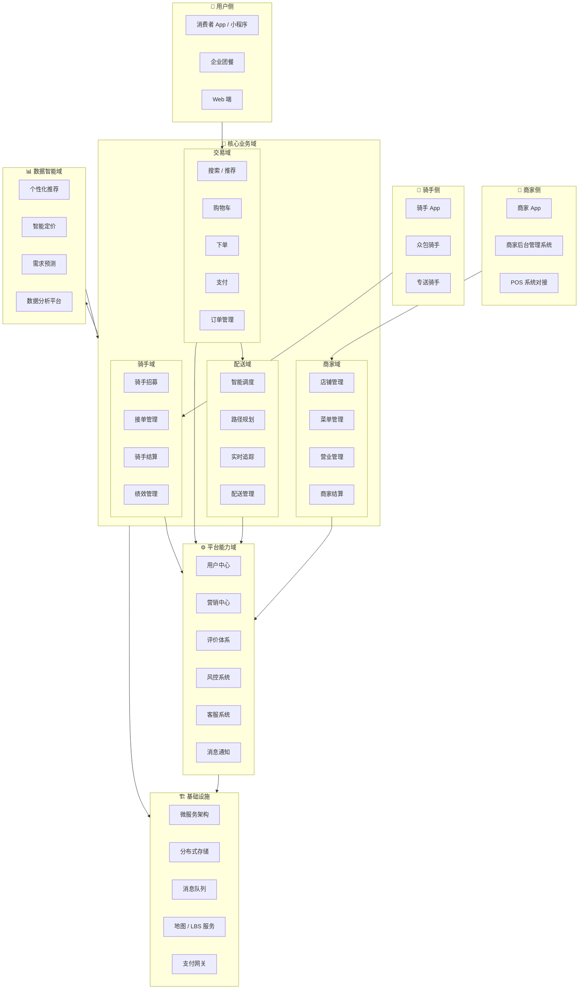

---

## 三、三端角色说明

### 3.1 用户侧（消费者）

外卖平台面向消费者提供多端入口，包括 App、小程序、Web 端，同时支持企业团餐等 B 端场景。消费者通过平台完成从浏览、选餐、下单、支付到收货评价的完整消费链路。

### 3.2 商家侧

商家通过专属 App 和后台管理系统接入平台，支持与商家自有 POS 系统对接，实现订单自动同步。商家在平台上完成店铺开设、菜单维护、订单接收、营业管理和账单结算等全链路经营活动。

商家入驻流程分为四个步骤：注册申请 → 提交资质 → 资料审核 → 开门营业。平台要求商家具备实体门店、合法经营资质，并覆盖餐饮、零售、医药等品类范围。

### 3.3 骑手侧（运力端）

配送体系分为**专送**（平台自营）和**众包**两种模式，骑手通过专属 App 接单、导航、完成配送。专送骑手由平台直接管理，众包骑手则以灵活用工形式参与配送，两种模式共同构成弹性运力体系。

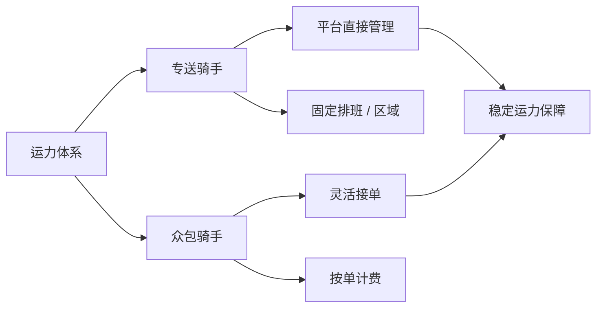

---

## 四、核心业务域详解

### 4.1 交易域

交易域是外卖平台的核心链路，覆盖从用户进入平台到完成支付的全过程。

**功能范围：** 前置流程从下单预览页开始，包括结算预览、提交订单、订单支付、支付成功；后置流程为订单完成、用户评价、订单删除等操作。

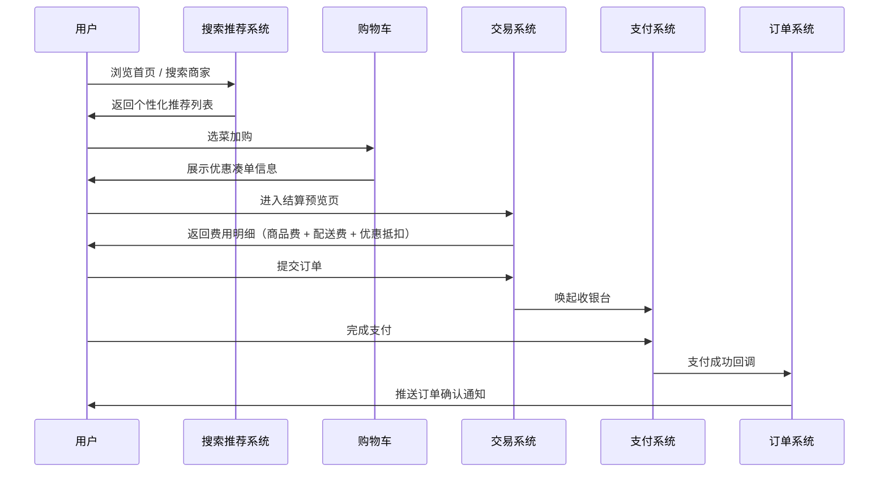

**交易域核心子系统：**

- **搜索 / 推荐系统**：基于用户位置、历史行为、时段偏好等多维度特征，提供个性化的商家和菜品推荐，支持关键词搜索、品类筛选、排序过滤等能力。
- **购物车**：管理用户选品状态，实时计算优惠凑单逻辑，展示到手价和优惠信息。
- **下单 / 结算**：聚合商品费、配送费、优惠抵扣（满减、优惠券、红包）等，生成最终支付金额。
- **支付系统**：对接多种支付渠道（微信支付、支付宝、美团支付等），完成资金流转。
- **订单管理**：维护订单全生命周期状态，支持订单查询、取消、退款等操作。

### 4.2 配送域

配送域负责将商家制作好的餐品安全、准时地送达消费者手中，是外卖平台差异化竞争的核心能力之一。

**智能调度系统目标：** 在合理的计算规模下，合理决策一批配送单由哪些骑手以什么样的顺序进行配送，同时保障用户体验（不超时）、骑手效率（顺路）和平台成本（最优路径）。

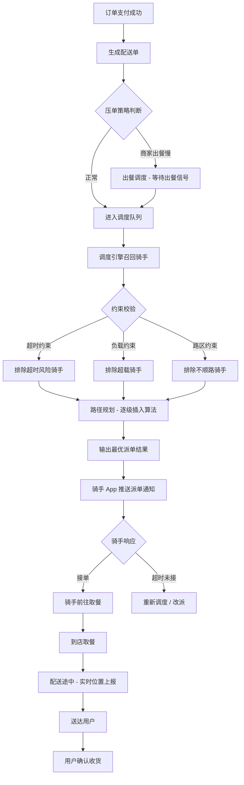

**调度系统关键约束：**

- **实时负载约束**：骑手背单量、重量不能超限，防止骑手过载影响配送质量。
- **任务超时约束**：骑手配送新单不能导致该趟次任一单超过骑手考核时间（ldt），保障用户体验。
- **路区约束**：以站点为顶点，派单后骑手背单不能超过夹角限制，防止骑手送单不顺路，同时避免跨越河流、高架桥等地理障碍。

**配送模式分类：**

| 模式 | 说明 | 适用场景 |
|------|------|----------|
| 专送（C 配） | 平台自营骑手，覆盖商家内圈区域 | 高密度城区，时效要求高 |
| 众包（D 配） | 灵活用工骑手，覆盖外圈区域 | 低密度区域，弹性运力补充 |
| 商家自配 | 商家自有配送团队 | 特定 KA 商家 |

### 4.3 商家域

商家域负责商家在平台上的全链路经营管理，包括店铺开设、菜单维护、订单接收和账单结算。

**商家账号体系：** 外卖商家账号（EPassport）是商家登录外卖商家端的唯一授权密钥，支持账号密码和手机号验证码两种登录方式。账号类型按业务规模分为单店账号（200）、普通连锁账号（300）、品牌连锁总账号（310）、客户连锁总账号（320）等多种类型，满足从个体商家到大型连锁品牌的不同管理需求。

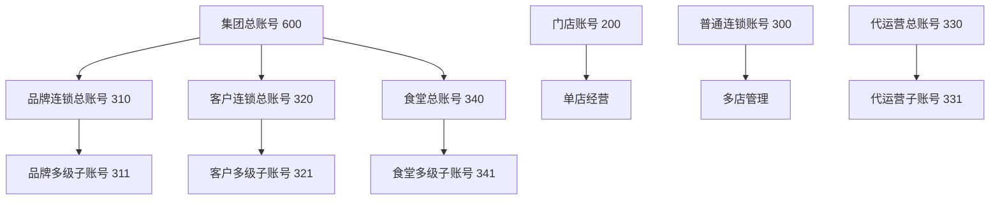

### 4.4 骑手域

骑手域覆盖骑手从招募认证到日常接单、薪资结算和绩效考核的完整生命周期管理。

**骑手生命周期：**

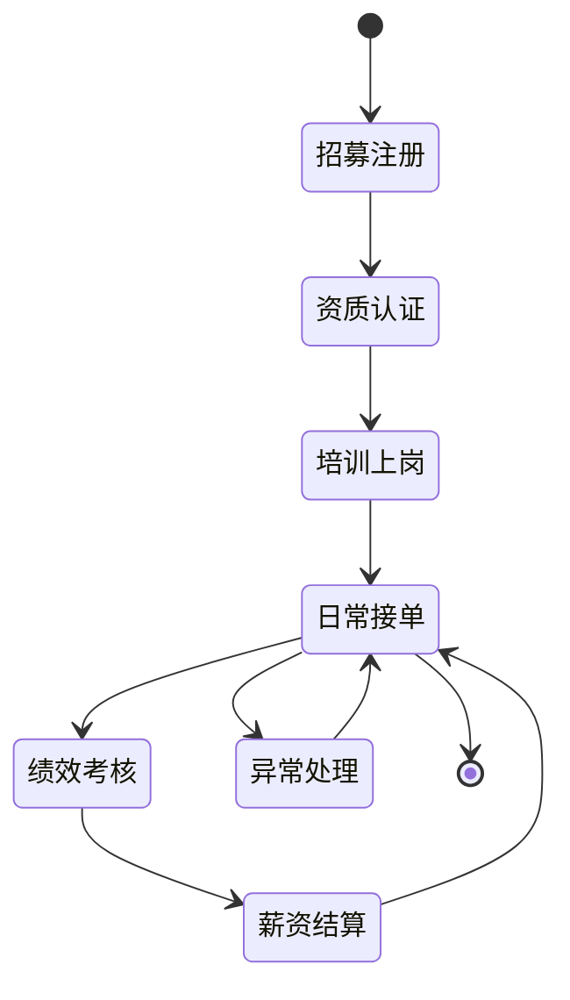

---

## 五、核心业务流程

### 5.1 用户下单全流程

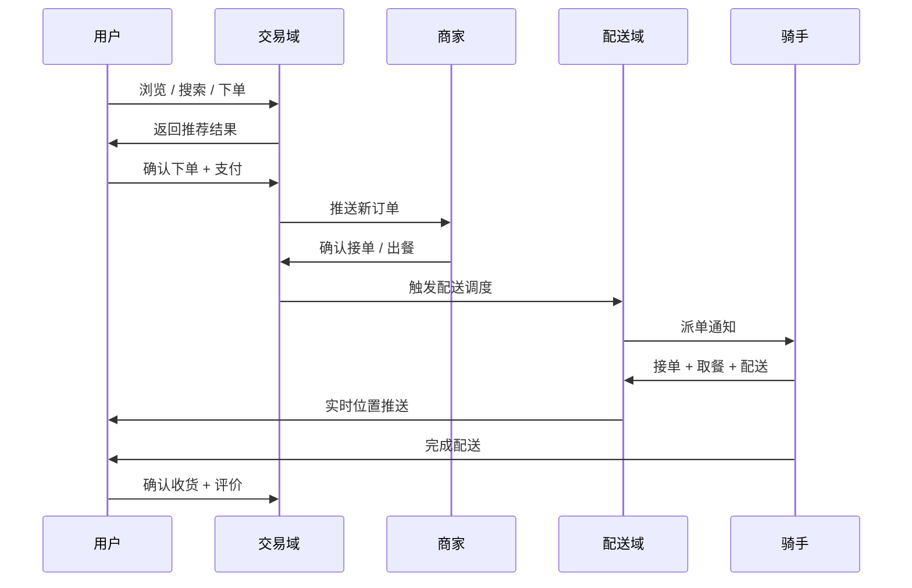

### 5.2 订单状态流转

外卖订单从创建到完成经历多个状态节点，每个状态对应不同的业务处理逻辑。

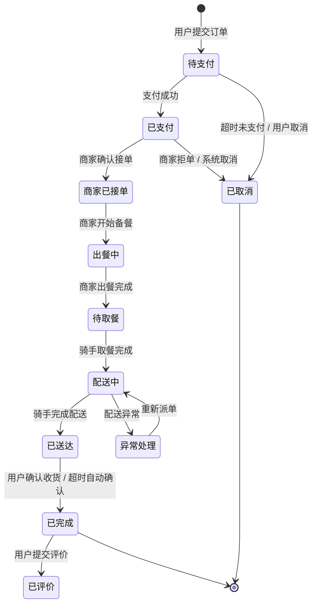

### 5.3 配送调度流程

配送调度是外卖平台技术复杂度最高的环节之一，核心目标是在约束条件下实现最优的骑手-订单匹配。

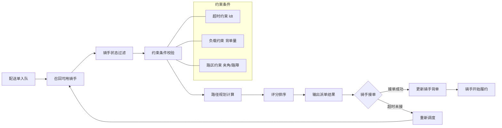

---

## 六、平台能力域

平台能力域提供横向复用的平台级能力，支撑核心业务域的高效运转。

### 6.1 营销体系

外卖平台的营销体系以优惠券、满减活动和红包为核心，覆盖用户拉新、促活、留存全链路。

**主要营销工具：**

- **美团红包**：平台发行的通用购物券，可在多商家通用，与店铺满减活动同享，成本以平台补贴（美补）为主。
- **商家代金券**：商家自发行的店铺专属优惠券，分为满减券（同享 / 互斥）、商品券（折扣券 / 抵用券）等类型。
- **天降红包**：针对特定用户群体在外卖首页弹窗发放的定向红包，是精细化补贴的核心工具。
- **分享红包**：用户完成订单后可发送给好友的拼手气红包，兼具社交裂变属性。

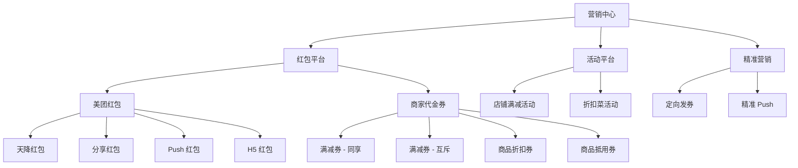

**价格计算逻辑：**

用户最终支付金额 = 商品原价 × 数量 + 配送费 - 折扣菜优惠 - 商品满折满减 - 优惠券抵扣 - 红包抵扣

### 6.2 评价体系

用户完成订单后可对商家、菜品和骑手进行评价，评价数据用于商家口碑展示、搜索排序权重计算和骑手绩效考核。

### 6.3 风控系统

风控系统覆盖交易全链路，防范薅羊毛、刷单、虚假评价等欺诈行为，保障平台资金安全和生态健康。

### 6.4 客服系统

提供用户、商家、骑手三端的在线客服能力，处理订单异常、退款申诉、配送投诉等问题。

---

## 七、数据智能域

数据智能域基于海量订单和用户行为数据，通过 AI 能力反哺核心业务域，提升平台整体效率。

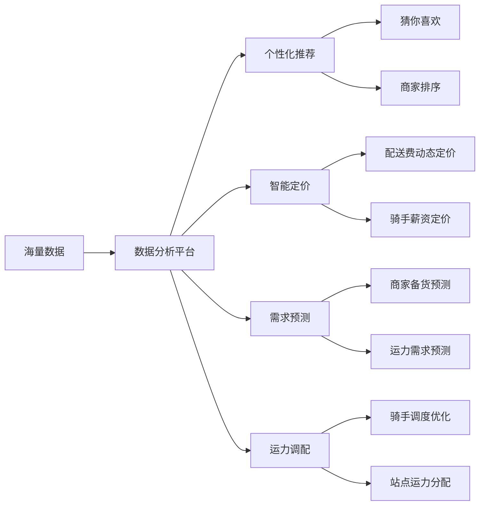

**核心 AI 能力：**

- **个性化推荐**：基于用户历史订单、浏览行为、地理位置、时段偏好等特征，为用户推荐最匹配的商家和菜品（"猜你喜欢"）。
- **智能定价**：配送费根据距离、时段、运力供需关系动态调整；骑手薪资根据城市、时段、单量等因素动态定价，平衡运力供需。
- **需求预测**：预测特定时段、区域的订单量，指导商家备货和运力提前调配，降低超时率。

---

## 八、基础设施

基础设施是支撑整个平台高可用、高性能运行的技术底座。

| 基础能力 | 说明 |
|----------|------|
| 微服务架构 | 各业务域独立部署、独立扩缩容，保障系统高可用和快速迭代 |
| 分布式存储 | 应对海量订单、用户、商家数据的存储和查询需求 |
| 消息队列 | 解耦异步处理，支撑订单状态流转、配送事件通知等高并发场景 |
| 地图 / LBS 服务 | 支撑配送调度的路径规划、实时位置追踪、AOI 地理围栏等能力 |
| 支付网关 | 对接微信支付、支付宝等多种支付渠道，保障资金安全流转 |

---

## 九、商家入驻与运营全链路

商家从入驻到日常运营，经历完整的生命周期管理。

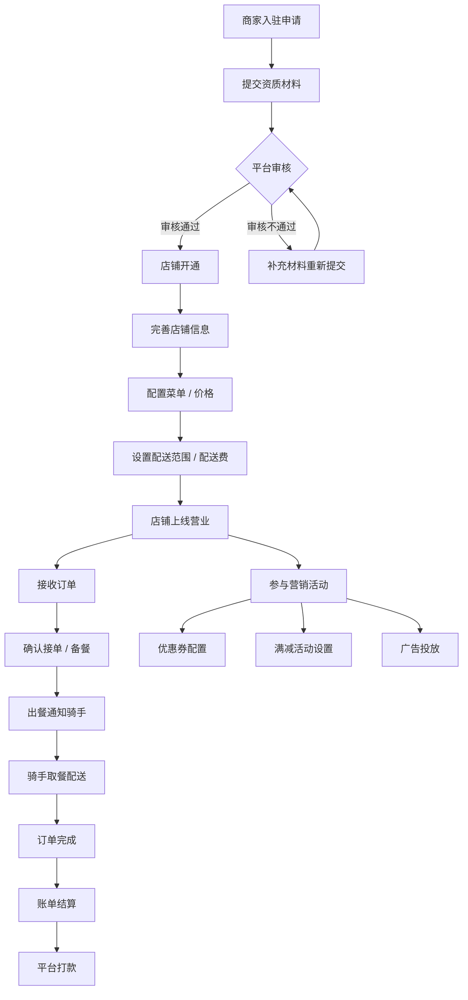

---

## 十、平台生态与合作模式

外卖平台构建了多方参与的生态体系，除直营模式外，还通过区域合作伙伴模式扩大覆盖范围。

**合作伙伴模式：** 合作伙伴独立经营所在合作区域的外卖业务，覆盖餐饮、闪购、医药等全品类，负责从商家入驻、骑手管理到用户增长的全链路运营。平台提供品牌授权、产品技术赋能和运营支持，合作伙伴负责本地化运营落地。

**收入模型：**

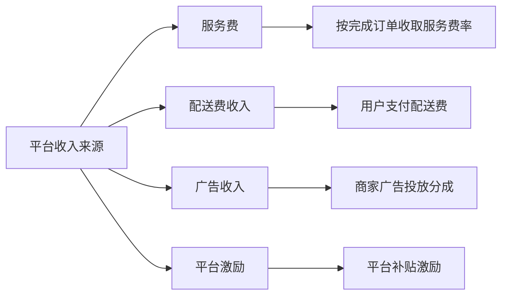

---

## 十一、关键业务指标体系

外卖平台通过多维度指标衡量业务健康度和运营效率。

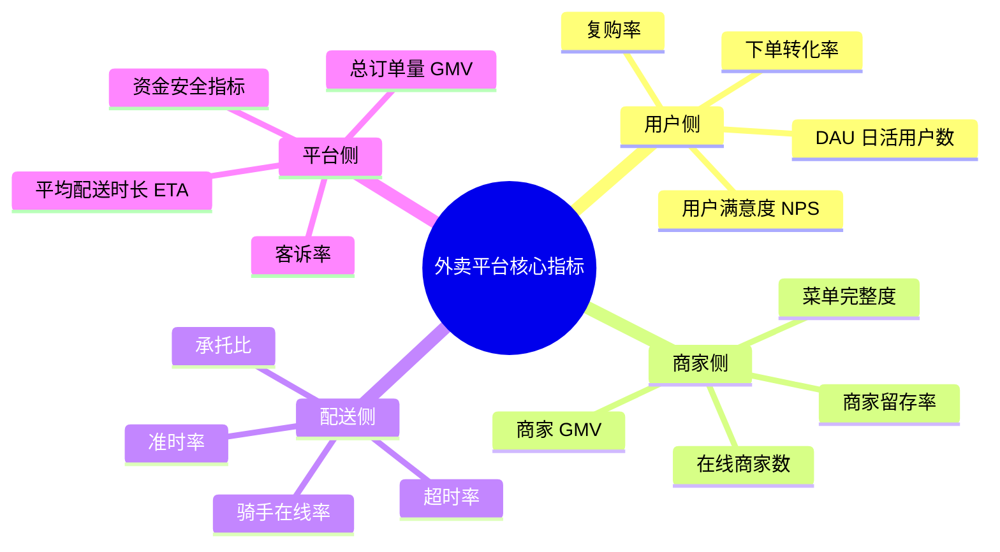

---

## 十二、总结

外卖平台是一个高度复杂的多边市场平台，其核心竞争力体现在三个维度：

**交易效率**：通过个性化推荐、智能搜索和流畅的下单支付链路，最大化用户转化率和复购率。

**配送能力**：通过智能调度算法、实时路径规划和弹性运力体系，在保障用户体验（准时率）的同时控制配送成本。

**生态运营**：通过丰富的营销工具、完善的商家服务体系和数据智能能力，帮助商家提升经营效率，构建平台、商家、用户、骑手四方共赢的生态。

---

*文档整理时间：2026 年 3 月 | 数据来源：美团内部学城知识库*
