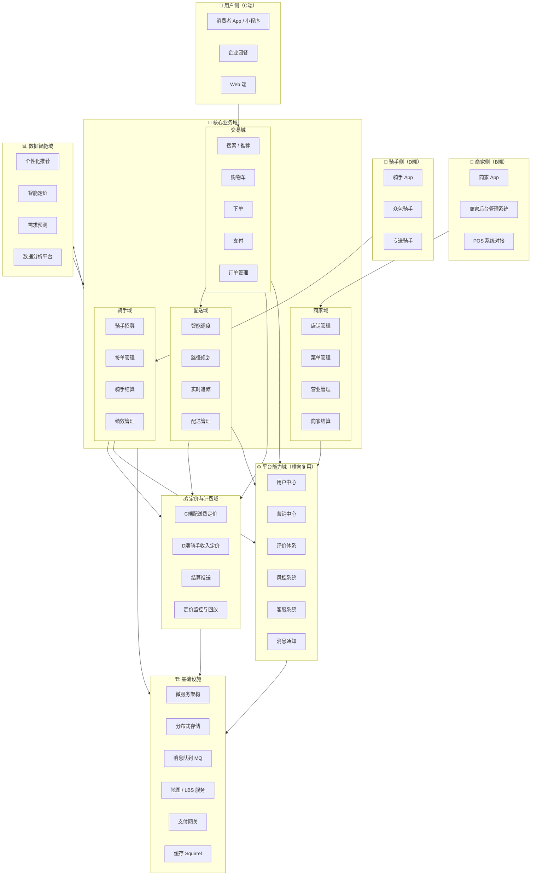
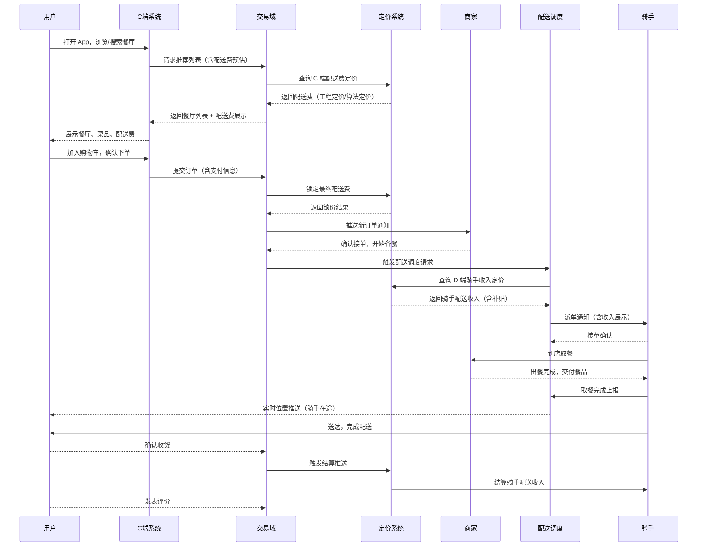
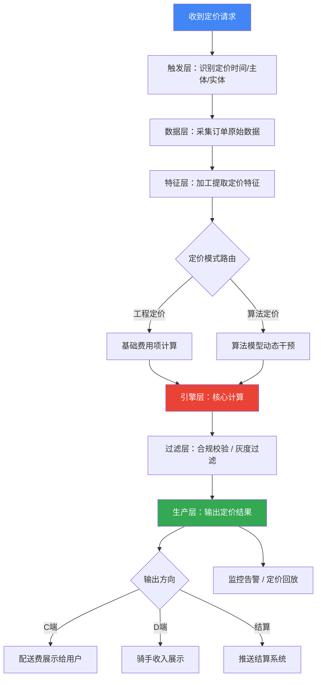
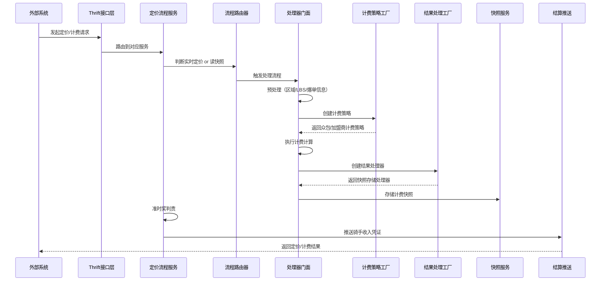
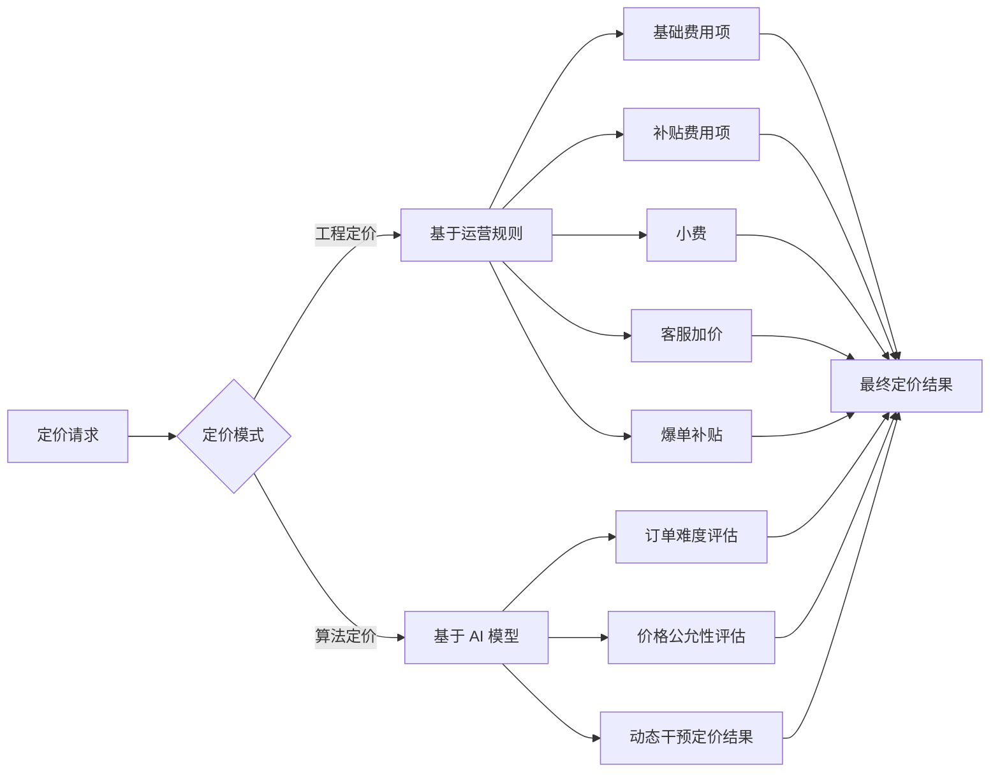
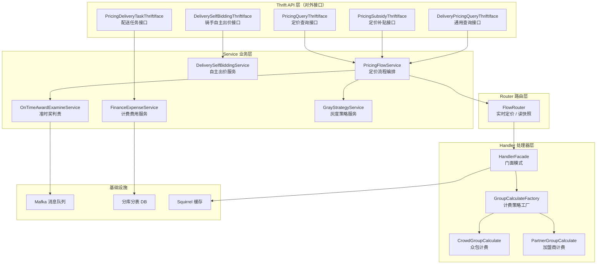

# 外卖平台业务架构全景指南

> 本文档面向新人初学者，系统梳理外卖平台的完整业务架构、核心运行流程及各域技术体系，帮助快速建立全局认知。
>
> 资料来源：学城平台内部文档（外卖行业业务架构图、配送资料、定价系统技术规划、骑手配送在线定价与计费系统架构文档等）

---

## 目录

1. [平台整体定位](#一平台整体定位)
2. [业务架构总览图](#二业务架构总览图)
3. [核心业务运行流程图](#三核心业务运行流程图)
4. [各业务域详解](#四各业务域详解)
5. [定价与计费系统深度解析](#五定价与计费系统深度解析)
6. [技术架构与基础设施](#六技术架构与基础设施)
7. [新人学习路径建议](#七新人学习路径建议)

---

## 一、平台整体定位

外卖平台是一个连接**消费者（C端）**、**商家（B端）** 和**骑手（D端）** 的三边市场平台。平台的核心价值在于：

- 为消费者提供便捷的餐饮配送服务
- 为商家提供线上经营和订单管理能力
- 为骑手提供灵活的接单和收入保障

平台通过**交易域、配送域、商家域、骑手域**四大核心业务域协同运转，并依托**平台能力域**（营销、风控、客服等）和**数据智能域**（推荐、定价、预测等）持续提升效率和体验。

---

## 二、业务架构总览图

**架构分层说明：**

外卖平台整体采用**分层架构**设计，从上到下依次为：接入层（三端入口）→ 核心业务域 → 平台能力域 / 定价计费域 → 数据智能域 → 基础设施层。各层职责清晰，通过标准接口解耦，保障系统的高可用和可扩展性。

---

## 三、核心业务运行流程图

### 3.1 用户下单到配送完成的完整流程

### 3.2 定价系统内部处理流程

### 3.3 骑手配送在线定价与计费系统流程

---

## 四、各业务域详解

### 4.1 用户侧（C端）

外卖平台面向消费者提供多端入口，包括 App、小程序、Web 端，同时支持企业团餐等 B 端场景。C 端系统的核心能力包括：

**搜索与推荐**：基于用户历史行为、地理位置、时段偏好等多维特征，通过个性化推荐算法（"猜你喜欢"）为用户呈现最相关的餐厅和菜品。

**配送费展示**：在列表页、详情页、提单页等多个环节实时展示配送费，要求各页面价格一致性，避免用户产生"看到的价格和实际支付不一致"的负面体验。

**订单全生命周期**：从下单、支付、备餐、配送到收货、评价，C 端系统全程跟踪订单状态，并通过消息通知（Push/短信）保持用户感知。

### 4.2 商家侧（B端）

商家通过专属 App 和后台管理系统接入平台，支持与商家自有 POS 系统对接，实现订单自动同步。商家域的核心能力包括：

**店铺与菜单管理**：商家可在线配置营业时间、菜品信息、价格、库存等，支持实时更新。

**订单接收与处理**：新订单通过消息推送实时到达商家端，商家确认接单后开始备餐，并在出餐完成后通知骑手取餐。

**商家结算**：平台按照约定的结算规则，定期将订单收入结算给商家，扣除平台服务费后打款。

### 4.3 骑手侧（D端）

配送体系分为**专送**（平台自营）和**众包**两种模式，骑手通过专属 App 接单、导航、完成配送。骑手域的核心能力包括：

**接单与派单**：配送调度系统基于骑手位置、运力状态、订单特征进行智能派单，骑手可在 App 上查看收入预估后决定是否接单（众包模式支持自主出价）。

**骑手收入定价**：骑手的每单收入由定价系统实时计算，包含基础配送费、补贴（爆单补贴、等餐费等）、小费等多个费用项，并在接单卡片、抢单页、详情页等多处展示。

**骑手结算**：配送完成后，系统自动生成结算凭证，按照周期（日/周）将收入结算到骑手账户，并支持绩效考核（准时奖/罚）联动。

### 4.4 交易域

交易域是整个外卖平台的核心枢纽，负责连接用户、商家和配送三方。核心能力包括搜索推荐、购物车、下单、支付、订单全生命周期管理。

### 4.5 配送域

配送域负责从订单生成到骑手送达的全过程管理，核心能力包括智能调度算法、路径规划、实时位置追踪、配送异常处理。

### 4.6 平台能力域

提供横向复用的平台级能力，包括：

- **用户中心**：账号注册、登录、身份认证
- **营销中心**：优惠券、满减、红包、会员权益
- **评价体系**：订单评价、商家口碑、骑手评分
- **风控系统**：反欺诈、异常订单识别、账号安全
- **客服系统**：在线客服、退款申诉、投诉处理
- **消息通知**：Push 推送、短信、站内信

---

## 五、定价与计费系统深度解析

定价系统是外卖平台的核心基础设施之一，直接影响用户体验（配送费是否合理）和骑手收入（收入是否公平）。

### 5.1 定价的核心目标

定价系统服务两类对象：

- **C 端（用户）**：计算用户支付的配送费，定位于"收入"
- **D 端（骑手/加盟商）**：计算骑手获得的配送收入，定位于"支出"

核心要求是：**算得对**（计算准确）、**看得懂**（展示清晰）、**觉得值**（用户和骑手都认可）。

### 5.2 定价的两种模式

**工程定价**：基于运营同学制定的规则，汇总正逆向多层数据进行特质化定价，包含基础费用项（按工作量计算）、补贴费用项（供需调节）、小费、客服加价、爆单补贴等。

**算法定价**：根据订单的实际难度、价格公允等因素，对接算法团队模型，动态干预 C 端和 D 端的定价结果，以单维度进行总费用的输出优化。

### 5.3 定价系统分层架构

定价系统采用六层架构设计，职责清晰：

| 层次 | 核心职责 | 通俗理解 |
|------|----------|----------|
| **触发层** | 接收定价请求，识别定价时间、主体、实体 | "为什么要定价？谁来触发？" |
| **数据层** | 采集定价强关联原始数据 | "为谁定价？基础数据是什么？" |
| **特征层** | 加工提取定价所需的核心特征 | "定价需要哪些维度的数据？" |
| **引擎层** | 核心计算层，落地所有定价规则和计算逻辑 | "怎么算出这个价格？" |
| **过滤层** | 对定价结果进行校验、灰度过滤、合规过滤 | "这个价格合规吗？符合灰度规则吗？" |
| **生产层** | 输出定价结果，完成业务活动闭环 | "把价格告诉用户和骑手" |

### 5.4 骑手计费系统技术架构

骑手配送在线定价与计费系统（`sailor_settle_chargingonlinedeliver`）是配送结算域的核心子模块，负责骑手配送任务的**实时定价、费用计算、准时奖判责、结算推送**等核心能力，支持多区域国际化部署（沙特 SA、香港 HK、欧洲 Europe）。

---

## 六、技术架构与基础设施

### 6.1 整体技术栈

外卖平台后端核心技术栈为 **Java + Spring Boot + MyBatis + Thrift + Maven**，采用微服务架构，各域独立部署，通过 Thrift RPC 进行服务间通信。

### 6.2 基础设施组件

**微服务架构**：各业务域独立部署，通过服务注册与发现实现动态路由，保障高可用（单域故障不影响全局）。

**分布式存储**：订单数据量巨大，采用分库分表策略（主库 + 分片库 + 周期库），应对海量数据的读写压力。

**消息队列（Mafka）**：用于解耦异步处理，例如订单状态变更通知、结算推送、骑手收入凭证推送等场景，避免同步调用链过长。

**地图 / LBS 服务**：支撑配送调度的核心基础设施，提供骑手实时位置、路径规划、距离计算等能力。

**缓存（Squirrel）**：对高频读取的定价规则、骑手信息等数据进行缓存，降低数据库压力，提升响应速度。

**支付网关**：对接多种支付渠道（微信支付、支付宝、银行卡等），处理用户支付和骑手/商家结算。

### 6.3 国际化部署

平台支持多区域国际化部署，目前覆盖：

- **香港（HK）**：精细化运营阶段，目标是在 M 值稳定提升的基础上大幅优化经营效率
- **沙特（SA）**：努力实现订单和 GMV 市占第一名，在此基础上稳步改善利润
- **GCC 5 国**：快速迁移复用沙特经营策略落地经验，多国并行发展
- **MEGA 市场**：保障开国开城体验，建立前期竞争优势

---

## 七、新人学习路径建议

如果你是刚加入外卖平台团队的新人，建议按以下顺序建立认知：

**第一步：理解三端关系**。先搞清楚 C 端（用户）、B 端（商家）、D 端（骑手）三者的关系和各自诉求，这是理解所有业务逻辑的基础。

**第二步：跑通一个完整订单**。从用户打开 App 到骑手送达，在脑海中完整走一遍流程（参考第三章的时序图），理解每个环节涉及哪些系统。

**第三步：深入一个业务域**。根据自己所在团队，重点学习对应的业务域（交易域、配送域、定价域、结算域等），理解该域的核心数据模型和业务规则。

**第四步：理解定价与结算**。定价和结算是外卖平台的"钱脉"，直接影响用户体验和骑手收入，建议重点学习定价系统的分层架构和计费逻辑。

**第五步：关注数据智能**。推荐算法、智能定价、需求预测是平台效率提升的核心驱动力，了解数据智能域如何反哺核心业务域，有助于理解平台的长期竞争力来源。

---

## 附录：核心文档索引

以下为学城平台上的相关参考文档（需内网访问）：

- [外卖行业业务架构图](https://km.sankuai.com/page/2751129121) — 外卖平台七大层次架构总览
- [配送资料](https://km.sankuai.com/page/2751553585) — 配送域相关资料汇总
- [定价优化-流程（KO）](https://km.sankuai.com/collabpage/2739261345) — 定价系统流程优化详细设计
- [定价系统技术规划（WIP）](https://km.sankuai.com/collabpage/2734803145) — 定价系统 26 年技术规划
- [sailor_settle_chargingonlinedeliver 项目架构文档](https://km.sankuai.com/page/2751493798) — 骑手配送在线定价与计费系统架构

---

*文档版本：v1.0 | 整理时间：2026-03-24 | 整理人：houzhangbo*
